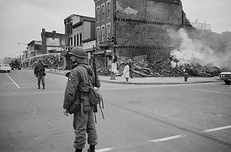
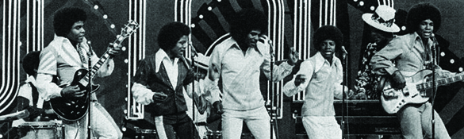
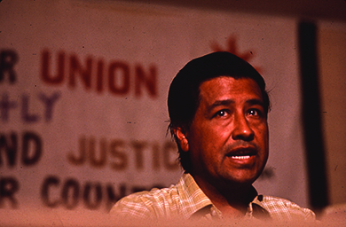

By the end of this section, you will be able to:
* Explain the strategies of the African American civil rights movement in the 1960s
* Discuss the rise and philosophy of Black Power
* Identify achievements of the Mexican American civil rights movement in the 1960s

During the 1960s, the federal government, encouraged by both genuine concern for the dispossessed and the realities of the Cold War, had increased its efforts to protect civil rights and ensure equal economic and educational opportunities for all. However, most of the credit for progress toward racial equality in the Unites States lies with grassroots activists. Indeed, it was campaigns and demonstrations by ordinary people that spurred the federal government to action. Although the African American civil rights movement was the most prominent of the crusades for racial justice, other ethnic minorities also worked to seize their piece of the American dream during the promising years of the 1960s. Many were influenced by the African American cause and often used similar tactics.

### CHANGE FROM THE BOTTOM UP

For many people inspired by the victories of *Brown v. Board of Education* and the Montgomery Bus Boycott, the glacial pace of progress in the segregated South was frustrating if not intolerable. In some places, such as Greensboro, North Carolina, local NAACP chapters had been influenced by whites who provided financing for the organization. This aid, together with the belief that more forceful efforts at reform would only increase white resistance, had persuaded some African American organizations to pursue a “politics of moderation” instead of attempting to radically alter the status quo. Martin Luther King Jr.’s inspirational appeal for peaceful change in the city of Greensboro in 1958, however, planted the seed for a more assertive civil rights movement.

On February 1, 1960, four sophomores at the North Carolina Agricultural &amp; Technical College in Greensboro—Ezell Blair, Jr., Joseph McNeil, David Richmond, and Franklin McCain—entered the local Woolworth’s and sat at the lunch counter. The lunch counter was segregated, and they were refused service as they knew they would be. They had specifically chosen Woolworth’s, because it was a national chain and was thus believed to be especially vulnerable to negative publicity. Over the next few days, more protesters joined the four sophomores. Hostile whites responded with threats and taunted the students by pouring sugar and ketchup on their heads. The successful six-month-long Greensboro sit-in initiated the student phase of the African American civil rights movement and, within two months, the sit-in movement had spread to fifty-four cities in nine states ([\[link\]](#Figure_29_03_WhiteOnly)).

 "){: #Figure_29_03_WhiteOnly}

In the words of grassroots civil rights activist Ella Baker, the students at Woolworth’s wanted more than a hamburger; the movement they helped launch was about empowerment. Baker pushed for a “participatory Democracy” that built on the grassroots campaigns of active citizens instead of deferring to the leadership of educated elites and experts. As a result of her actions, in April 1960, the **Student Nonviolent Coordinating Committee (SNCC)**{: data-type="term" .no-emphasis} formed to carry the battle forward. Within a year, more than one hundred cities had desegregated at least some public accommodations in response to student-led demonstrations. The sit-ins inspired other forms of nonviolent protest intended to desegregate public spaces. “Sleep-ins” occupied motel lobbies, “read-ins” filled public libraries, and churches became the sites of “pray-ins.”

Students also took part in the 1961 “freedom rides” sponsored by the Congress of Racial Equality (CORE) and SNCC. The intent of the African American and white volunteers who undertook these bus rides south was to test enforcement of a U.S. Supreme Court decision prohibiting segregation on interstate transportation and to protest segregated waiting rooms in southern terminals. Departing Washington, DC, on May 4, the volunteers headed south on buses that challenged the seating order of Jim Crow segregation. Whites would ride in the back, African-Americans would sit in the front, and on other occasions, riders of different races would share the same bench seat. The freedom riders encountered little difficulty until they reached Rock Hill, South Carolina, where a mob severely beat John Lewis, a freedom rider who later became chairman of SNCC ([\[link\]](#Figure_29_03_Lewis)). The danger increased as the riders continued through Georgia into Alabama, where one of the two buses was firebombed outside the town of Anniston. The second group continued to Birmingham, where the riders were attacked by the Ku Klux Klan as they attempted to disembark at the city bus station. The remaining volunteers continued to Mississippi, where they were arrested when they attempted to desegregate the waiting rooms in the Jackson bus terminal.

  in a newspaper photograph from 1965."){: #Figure_29_03_Lewis}

### FREE BY ’63 (OR ’64 OR ’65)

The grassroots efforts of people like the Freedom Riders to change discriminatory laws and longstanding racist traditions grew more widely known in the mid-1960s. The approaching centennial of Abraham Lincoln’s Emancipation Proclamation spawned the slogan “Free by ’63” among civil rights activists. As African Americans increased their calls for full rights for all Americans, many civil rights groups changed their tactics to reflect this new urgency.

Perhaps the most famous of the civil rights-era demonstrations was the March on Washington for Jobs and Freedom, held in August 1963, on the one hundredth anniversary of Abraham Lincoln’s Emancipation Proclamation. Its purpose was to pressure President Kennedy to act on his promises regarding civil rights. The date was the eighth anniversary of the brutal racist murder of fourteen-year-old Emmett Till in Money, Mississippi. As the crowd gathered outside the Lincoln Memorial and spilled across the National Mall ([\[link\]](#Figure_29_03_Crowd)), Martin Luther King, Jr. delivered his most famous speech. In “I Have a Dream,” King called for an end to racial injustice in the United States and envisioned a harmonious, integrated society. The speech marked the high point of the civil rights movement and established the legitimacy of its goals. However, it did not prevent white terrorism in the South, nor did it permanently sustain the tactics of nonviolent civil disobedience.

 , a huge crowd gathered on the National Mall (b) to hear the speakers. Although thousands attended, many of the march&#x2019;s organizers had hoped that enough people would come to Washington to shut down the city."){: #Figure_29_03_Crowd}

Other gatherings of civil rights activists ended tragically, and some demonstrations were intended to provoke a hostile response from whites and thus reveal the inhumanity of the Jim Crow laws and their supporters. In 1963, the Southern Christian Leadership Conference (SCLC) led by Martin Luther King, Jr. mounted protests in some 186 cities throughout the South. The campaign in Birmingham that began in April and extended into the fall of 1963 attracted the most notice, however, when a peaceful protest was met with violence by police, who attacked demonstrators, including children, with fire hoses and dogs. The world looked on in horror as innocent people were assaulted and thousands arrested. King himself was jailed on Easter Sunday, 1963, and, in response to the pleas of white clergymen for peace and patience, he penned one of the most significant documents of the struggle—“Letter from a Birmingham Jail.” In the letter, King argued that African Americans had waited patiently for more than three hundred years to be given the rights that all human beings deserved; the time for waiting was over.

Letter from a Birmingham Jail

By 1963, Martin Luther King, Jr. had become one of the most prominent leaders of the civil rights movement, and he continued to espouse nonviolent civil disobedience as a way of registering African American resistance against unfair, discriminatory, and racist laws and behaviors. While the campaign in Birmingham began with an African American boycott of white businesses to end discrimination in employment practices and public segregation, it became a fight over free speech when King was arrested for violating a local injunction against demonstrations. King wrote his “Letter from a Birmingham Jail” in response to an op-ed by eight white Alabama clergymen who complained about the SCLC’s fiery tactics and argued that social change needed to be pursued gradually. The letter criticizes those who did not support the cause of civil rights:

<q>In spite of my shattered dreams of the past, I came to Birmingham with the hope that the white religious leadership in the community would see the justice of our cause and, with deep moral concern, serve as the channel through which our just grievances could get to the power structure. I had hoped that each of you would understand. But again I have been disappointed. I have heard numerous religious leaders of the South call upon their worshippers to comply with a desegregation decision because it is the law, but I have longed to hear white ministers say follow this decree because integration is morally right and the Negro is your brother. In the midst of blatant injustices inflicted upon the Negro, I have watched white churches stand on the sideline and merely mouth pious irrelevancies and sanctimonious trivialities. In the midst of a mighty struggle to rid our nation of racial and economic injustice, I have heard so many ministers say, “Those are social issues with which the Gospel has no real concern,” and I have watched so many churches commit themselves to a completely other-worldly religion which made a strange distinction between body and soul, the sacred and the secular.</q>

Since its publication, the “Letter” has become one of the most cogent, impassioned, and succinct statements of the aspirations of the civil rights movement and the frustration over the glacial pace of progress in achieving justice and equality for all Americans.

What civil rights tactics raised the objections of the white clergymen King addressed in his letter? Why?

Some of the greatest violence during this era was aimed at those who attempted to register African Americans to vote. In 1964, SNCC, working with other civil rights groups, initiated its Mississippi Summer Project, also known as Freedom Summer. The purpose was to register African American voters in one of the most racist states in the nation. Volunteers also built “freedom schools” and community centers. SNCC invited hundreds of white middle-class students, mostly from the North, to help in the task. Many volunteers were harassed, beaten, and arrested, and African American homes and churches were burned. Three civil rights workers, James Chaney, Michael Schwerner, and Andrew Goodman, were killed by the Ku Klux Klan. That summer, civil rights activists Fannie Lou Hamer, Ella Baker, and Robert Parris Moses formally organized the Mississippi Freedom Democratic Party (MFDP) as an alternative to the all-white Mississippi Democratic Party. The Democratic National Convention’s organizers, however, would allow only two MFDP delegates to be seated, and they were confined to the roles of nonvoting observers.

The vision of whites and African Americans working together peacefully to end racial injustice suffered a severe blow with the death of Martin Luther King, Jr. in Memphis, Tennessee, in April 1968. King had gone there to support sanitation workers trying to unionize. In the city, he found a divided civil rights movement; older activists who supported his policy of nonviolence were being challenged by younger African Americans who advocated a more militant approach. On April 4, King was shot and killed while standing on the balcony of his motel. Within hours, the nation’s cities exploded with violence as angry African Americans, shocked by his murder, burned and looted inner-city neighborhoods across the country ([\[link\]](#Figure_29_03_KingRiots)). While whites recoiled from news about the riots in fear and dismay, they also criticized African Americans for destroying their own neighborhoods; they did not realize that most of the violence was directed against businesses that were not owned by blacks and that treated African American customers with suspicion and hostility.

 {: #Figure_29_03_KingRiots}

### BLACK FRUSTRATION, BLACK POWER

The episodes of violence that accompanied Martin Luther King Jr.’s murder were but the latest in a string of urban riots that had shaken the United States since the mid-1960s. Between 1964 and 1968, there were 329 riots in 257 cities across the nation. In 1964, riots broke out in Harlem and other African American neighborhoods. In 1965, a traffic stop set in motion a chain of events that culminated in riots in Watts, an African American neighborhood in Los Angeles. Thousands of businesses were destroyed, and, by the time the violence ended, thirty-four people were dead, most of them African Americans killed by the Los Angeles police and the National Guard. More riots took place in 1966 and 1967.

Frustration and anger lay at the heart of these disruptions. Despite the programs of the Great Society, good healthcare, job opportunities, and safe housing were abysmally lacking in urban African American neighborhoods in cities throughout the country, including in the North and West, where discrimination was less overt but just as crippling. In the eyes of many rioters, the federal government either could not or would not end their suffering, and most existing civil rights groups and their leaders had been unable to achieve significant results toward racial justice and equality. Disillusioned, many African Americans turned to those with more radical ideas about how best to obtain equality and justice.

  
Watch “Troops Patrol L.A.” to see how the [1965 Watts Riots][1] were presented in newsreel footage of the day.

Within the chorus of voices calling for integration and legal equality were many that more stridently demanded empowerment and thus supported **Black Power**{: data-type="term"}. Black Power meant a variety of things. One of the most famous users of the term was Stokely Carmichael, the chairman of SNCC, who later changed his name to Kwame Ture. For Carmichael, Black Power was the power of African Americans to unite as a political force and create their own institutions apart from white-dominated ones, an idea also espoused in the 1920s by political leader and orator Marcus Garvey. Like Garvey, Carmichael became an advocate of **black separatism**{: data-type="term"}, arguing that African Americans should live apart from whites and solve their problems for themselves. In keeping with this philosophy, Carmichael expelled SNCC’s white members. He left SNCC in 1967 and later joined the Black Panthers (see below).

Long before Carmichael began to call for separatism, the Nation of Islam, founded in 1930, had advocated the same thing. In the 1960s, its most famous member was Malcolm X, born Malcolm Little ([\[link\]](#Figure_29_03_MalcolmX)). The Nation of Islam advocated the separation of white Americans and African Americans because of a belief that African Americans could not thrive in an atmosphere of white racism. Indeed, in a 1963 interview, Malcolm X, discussing the teachings of the head of the Nation of Islam in America, Elijah Muhammad, referred to white people as “devils” more than a dozen times. Rejecting the nonviolent strategy of other civil rights activists, he maintained that violence in the face of violence was appropriate.

 , one of the most famous and outspoken advocates of Black Power, is surrounded by members of the media after speaking at Michigan State University in 1967. Malcolm X (b) was raised in a family influenced by Marcus Garvey and persecuted for its outspoken support of civil rights. While serving a stint in prison for armed robbery, he was introduced to and committed himself to the Nation of Islam. (credit b: modification of work by Library of Congress)"){: #Figure_29_03_MalcolmX}

In 1964, after a trip to Africa, Malcolm X left the Nation of Islam to found the Organization of Afro-American Unity with the goal of achieving freedom, justice, and equality “by any means necessary.” His views regarding black-white relations changed somewhat thereafter, but he remained fiercely committed to the cause of African American empowerment. On February 21, 1965, he was killed by members of the Nation of Islam. Stokely Carmichael later recalled that Malcolm X had provided an intellectual basis for Black Nationalism and given legitimacy to the use of violence in achieving the goals of Black Power.

The New Negro

In a roundtable conversation in October 1961, Malcolm X suggested that a “New Negro” was coming to the fore. The term and concept of a “New Negro” arose during the Harlem Renaissance of the 1920s and was revived during the civil rights movements of the 1960s.

<q>“I think there is a new so-called Negro. We don’t recognize the term ‘Negro’ but I really believe that there’s a new so-called Negro here in America. He not only is impatient. Not only is he dissatisfied, not only is he disillusioned, but he’s getting very angry. And whereas the so-called Negro in the past was willing to sit around and wait for someone else to change his condition or correct his condition, there’s a growing tendency on the part of a vast number of so-called Negroes today to take action themselves, not to sit and wait for someone else to correct the situation. This, in my opinion, is primarily what has produced this new Negro. He is not willing to wait. He thinks that what he wants is right, what he wants is just, and since these things are just and right, it’s wrong to sit around and wait for someone else to correct a nasty condition when they get ready.”</q>

In what ways were Martin Luther King, Jr. and the members of SNCC “New Negroes?”

Unlike Stokely Carmichael and the Nation of Islam, most Black Power advocates did not believe African Americans needed to separate themselves from white society. The Black Panther Party, founded in 1966 in Oakland, California, by Bobby Seale and Huey Newton, believed African Americans were as much the victims of capitalism as of white racism. Accordingly, the group espoused Marxist teachings, and called for jobs, housing, and education, as well as protection from police brutality and exemption from military service in their Ten Point Program. The Black Panthers also patrolled the streets of African American neighborhoods to protect residents from police brutality, yet sometimes beat and murdered those who did not agree with their cause and tactics. Their militant attitude and advocacy of armed self-defense attracted many young men but also led to many encounters with the police, which sometimes included arrests and even shootouts, such as those that took place in Los Angeles, Chicago and Carbondale, Illinois.

The self-empowerment philosophy of Black Power influenced mainstream civil rights groups such as the National Economic Growth Reconstruction Organization (NEGRO), which sold bonds and operated a clothing factory and construction company in New York, and the Opportunities Industrialization Center in Philadelphia, which provided job training and placement—by 1969, it had branches in seventy cities. Black Power was also part of a much larger process of cultural change. The 1960s composed a decade not only of Black Power but also of **Black Pride**{: data-type="term"}. African American abolitionist John S. Rock had coined the phrase “Black Is Beautiful” in 1858, but in the 1960s, it became an important part of efforts within the African American community to raise self-esteem and encourage pride in African ancestry. Black Pride urged African Americans to reclaim their African heritage and, to promote group solidarity, to substitute African and African-inspired cultural practices, such as handshakes, hairstyles, and dress, for white practices. One of the many cultural products of this movement was the popular television music program *Soul Train*, created by Don Cornelius in 1969, which celebrated black culture and aesthetics ([\[link\]](#Figure_29_03_SoulTrain)).

 {: #Figure_29_03_SoulTrain}

### THE MEXICAN AMERICAN FIGHT FOR CIVIL RIGHTS

The African American bid for full citizenship was surely the most visible of the battles for civil rights taking place in the United States. However, other minority groups that had been legally discriminated against or otherwise denied access to economic and educational opportunities began to increase efforts to secure their rights in the 1960s. Like the African American movement, the Mexican American civil rights movement won its earliest victories in the federal courts. In 1947, in *Mendez v. Westminster*, the U.S. Court of Appeals for the Ninth Circuit ruled that segregating children of Hispanic descent was unconstitutional. In 1954, the same year as *Brown v. Board of Education*, Mexican Americans prevailed in *Hernandez v. Texas*, when the U.S. Supreme Court extended the protections of the Fourteenth Amendment to all ethnic groups in the United States.

The highest-profile struggle of the Mexican American civil rights movement was the fight that Caesar Chavez ([\[link\]](#Figure_29_03_Chavez)) and Dolores Huerta waged in the fields of California to organize migrant farm workers. In 1962, Chavez and Huerta founded the National Farm Workers Association (NFWA). In 1965, when Filipino grape pickers led by Filipino American Larry Itliong went on strike to call attention to their plight, Chavez lent his support. Workers organized by the NFWA also went on strike, and the two organizations merged to form the United Farm Workers. When Chavez asked American consumers to boycott grapes, politically conscious people around the country heeded his call, and many unionized longshoremen refused to unload grape shipments. In 1966, Chavez led striking workers to the state capitol in Sacramento, further publicizing the cause. Martin Luther King, Jr. telegraphed words of encouragement to Chavez, whom he called a “brother.” The strike ended in 1970 when California farmers recognized the right of farm workers to unionize. However, the farm workers did not gain all they sought, and the larger struggle did not end.

 {: #Figure_29_03_Chavez}

The equivalent of the Black Power movement among Mexican Americans was the Chicano Movement. Proudly adopting a derogatory term for Mexican Americans, Chicano activists demanded increased political power for Mexican Americans, education that recognized their cultural heritage, and the restoration of lands taken from them at the end of the Mexican-American War in 1848. One of the founding members, Rodolfo “Corky” Gonzales, launched the Crusade for Justice in Denver in 1965, to provide jobs, legal services, and healthcare for Mexican Americans. From this movement arose La Raza Unida, a political party that attracted many Mexican American college students. Elsewhere, Reies López Tijerina fought for years to reclaim lost and illegally expropriated ancestral lands in New Mexico; he was one of the co-sponsors of the Poor People’s March on Washington in 1967.

### Section Summary

The African American civil rights movement made significant progress in the 1960s. While Congress played a role by passing the Civil Rights Act of 1964, the Voting Rights Act of 1965, and the Civil Rights Act of 1968, the actions of civil rights groups such as CORE, the SCLC, and SNCC were instrumental in forging new paths, pioneering new techniques and strategies, and achieving breakthrough successes. Civil rights activists engaged in sit-ins, freedom rides, and protest marches, and registered African American voters. Despite the movement’s many achievements, however, many grew frustrated with the slow pace of change, the failure of the Great Society to alleviate poverty, and the persistence of violence against African Americans, particularly the tragic 1968 assassination of Martin Luther King, Jr. Many African Americans in the mid- to late 1960s adopted the ideology of Black Power, which promoted their work within their own communities to redress problems without the aid of whites. The Mexican American civil rights movement, led largely by Cesar Chavez, also made significant progress at this time. The emergence of the Chicano Movement signaled Mexican Americans’ determination to seize their political power, celebrate their cultural heritage, and demand their citizenship rights.

### Review Questions

The new protest tactic against segregation used by students in Greensboro, North Carolina, in 1960 was the \_\_\_\_\_\_\_\_.

1.  boycott
2.  guerilla theater
3.  teach-in
4.  sit-in
{: type="A"}

D

The African American group that advocated the use of violence and espoused a Marxist ideology was called \_\_\_\_\_\_\_\_.

1.  the Black Panthers
2.  the Nation of Islam
3.  SNCC
4.  CORE
{: type="A"}

A

Who founded the Crusade for Justice in Denver, Colorado in 1965?

1.  Reies Lopez Tijerina
2.  Dolores Huerta
3.  Larry Itliong
4.  Rodolfo Gonzales
{: type="A"}

D

How did the message of Black Power advocates differ from that of more mainstream civil rights activists such as Martin Luther King, Jr.?

King and his followers strove for racial integration and the political inclusion of African Americans. They also urged for the use of nonviolent tactics to achieve their goals. Black Power advocates, in contrast, believed that African Americans should seek solutions without the aid of whites. Many also promoted black separatism and accepted the use of violence.

### Glossary
{: data-type="glossary-title"}

black separatism
: an ideology that called upon African Americans to reject integration with the white community and, in some cases, to physically separate themselves from whites in order to create and preserve their self-determination
^

Black Power
: a political ideology encouraging African Americans to create their own institutions and develop their own economic resources independent of whites
^

Black Pride
: a cultural movement among African Americans to encourage pride in their African heritage and to substitute African and African American art forms, behaviors, and cultural products for those of whites

[1]: http://openstaxcollege.org/l/15WattsRiot
