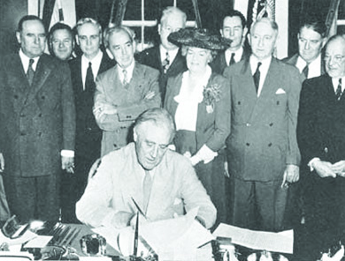

By the end of this section, you will be able to:
* Identify the issues that the nation faced during demobilization
* Explain the goals and objectives of the Truman administration
* Evaluate the actions taken by the U.S. government to address the concerns of returning veterans

 ![A timeline shows important events of the era. In 1946, George Kennan sends the Long Telegram from Moscow. In 1947, the Truman Doctrine is announced, and the first Levittown house is sold; an aerial photograph of Levittown, Pennsylvania, shows many rows of similar houses. In 1948, the Berlin Airlift begins; a photograph shows Berlin residents, watching as a plane above them prepares to land with needed supplies. In 1950, North Korean troops cross the thirty-eighth parallel. In 1952, Dwight D. Eisenhower is elected president; a photograph of Eisenhower is shown. In 1953, Julius and Ethel Rosenberg are executed for espionage; a photograph of the Rosenbergs behind a metal gate is shown. In 1954, the U.S. Supreme Court rules on Brown v. Board of Education, and Bill Haley and His Comets record &#x201C;Rock Around the Clock&#x201D;; a photograph of Bill Haley and His Comets is shown. In 1957, Little Rock&#x2019;s Central High School integrates, and the Union of Soviet Socialist Republics (USSR) launches Sputnik; a photograph of American soldiers escorting the Little Rock Nine up a flight of stairs is shown, and a photograph of a replica of Sputnik is shown.](../resources/CNX_History_28_01_Timeline.jpg "(credit: &#x201C;1953&#x201D;: modification of work by Library of Congress)"){: #CNX_History_28_01_Timeline}

The decade and a half immediately following the end of World War II was one in which middle- and working-class Americans hoped for a better life than the one they lived before the war. These hopes were tainted by fears of economic hardship, as many who experienced the Great Depression feared a return to economic decline. Others clamored for the opportunity to spend the savings they had accumulated through long hours on the job during the war when consumer goods were rarely available.

African Americans who had served in the armed forces and worked in the defense industry did not wish to return to “normal.” Instead, they wanted the same rights and opportunities that other Americans had. Still other citizens were less concerned with the economy or civil rights; instead, they looked with suspicion at the Soviet presence in Eastern Europe. What would happen now that the United States and the Soviet Union were no longer allies, and the other nations that had long helped maintain a balance of power were left seriously damaged by the war? Harry Truman, president for less than a year when the war ended, was charged with addressing all of these concerns and giving the American people a “fair deal.”

# DEMOBILIZATION AND THE RETURN TO CIVILIAN LIFE

The most immediate task to be completed after World War II was demobilizing the military and reintegrating the veterans into civilian life. In response to popular pressure and concerns over the budget, the United States sought to demobilize its armed forces as quickly as possible. Many servicemen, labeled the “Ohio boys” (Over the Hill in October), threatened to vote Republican if they were not home by Christmas 1946. Understandably, this placed a great deal of pressure on the still-inexperienced president to shrink the size of the U.S. military.

Not everyone wanted the government to reduce America’s military might, however. Secretary of the Navy James Forrestal and Secretary of War Robert P. Patterson warned Truman in October 1945 that an overly rapid demobilization jeopardized the nation’s strategic position in the world. While Truman agreed with their assessment, he felt powerless to put a halt to demobilization. In response to mounting political pressure, the government reduced the size of the U.S. military from a high of 12 million in June 1945 to 1.5 million in June 1947—still more troops than the nation ever had in arms during peacetime. Soldiers and sailors were not the only ones dismissed from service. As the war drew to a close, millions of women working the jobs of men who had gone off to fight were dismissed by their employers, often because the demand for war materiel had declined and because government propaganda encouraged them to go home to make way for the returning troops. While most women workers surveyed at the end of the war wished to keep their jobs (75–90 percent, depending on the study), many did in fact leave them. Nevertheless, throughout the late 1940s and the 1950s, women continued to make up approximately one-third of the U.S. labor force.

Readjustment to postwar life was difficult for the returning troops. The U.S. Army estimated that as many of 20 percent of its casualties were psychological. Although many eagerly awaited their return to civilian status, others feared that they would not be able to resume a humdrum existence after the experience of fighting on the front lines. Veterans also worried that they wouldn’t find work and that civilian defense workers were better positioned to take advantage of the new jobs opening up in the peacetime economy. Some felt that their wives and children would not welcome their presence, and some children did indeed resent the return of fathers who threatened to disrupt the mother-child household. Those on the home front worried as well. Doctors warned fiancées, wives, and mothers that soldiers might return with psychological problems that would make them difficult to live with.

## The GI Bill of Rights

Well before the end of the war, Congress had passed one of the most significant and far-reaching pieces of legislation to ease veterans’ transition into civilian life: the Servicemen’s Readjustment Act, also known as the **GI Bill**{: data-type="term"} ([\[link\]](#CNX_History_28_01_GIBill)). Every honorably discharged veteran who had seen active duty, but not necessarily combat, was eligible to receive a year’s worth of unemployment compensation. This provision not only calmed veterans’ fears regarding their ability to support themselves, but it also prevented large numbers of men—as well as some women—from suddenly entering a job market that did not have enough positions for them. Another way that the GI Bill averted a glut in the labor market was by giving returning veterans the opportunity to pursue an education; it paid for tuition at a college or vocational school, and gave them a stipend to live on while they completed their studies.

 {: #CNX_History_28_01_GIBill}

The result was a dramatic increase in the number of students—especially male ones—enrolled in American colleges and universities. In 1940, only 5.5 percent of American men had a college degree. By 1950, that percentage had increased to 7.3 percent, as more than two million servicemen took advantage of the benefits offered by the GI Bill to complete college. The numbers continued to grow throughout the 1950s. Upon graduation, these men were prepared for skilled blue-collar or white-collar jobs that paved the way for many to enter the middle class. The creation of a well-educated, skilled labor force helped the U.S. economy as well. Other benefits offered by the GI Bill included low-interest loans to purchase homes or start small businesses.

However, not all veterans were able to take advantage of the GI Bill. African American veterans could use their educational benefits only to attend schools that accepted black students. The approximately nine thousand servicemen and women who were dishonorably discharged because they were gay or lesbian were ineligible for GI Bill benefits. Benefits for some Mexican American veterans, mainly in Texas, were also denied or delayed.

## The Return of the Japanese

While most veterans received assistance to help in their adjustment to postwar life, others returned home to an uncertain future without the promise of government aid to help them resume their prewar lives. Japanese Americans from the West Coast who had been interned during the war also confronted the task of rebuilding their lives. In December 1944, Franklin Roosevelt had declared an end to the forced relocation of Japanese Americans, and as of January 1945, they were free to return to their homes. In many areas, however, neighbors clung to their prejudices and denounced those of Japanese descent as disloyal and dangerous. These feelings had been worsened by wartime propaganda, which often featured horrific accounts of Japanese mistreatment of prisoners, and by the statements of military officers to the effect that the Japanese were inherently savage. Facing such animosity, many Japanese American families chose to move elsewhere. Those who did return often found that in their absence, “friends” and neighbors had sold possessions that had been left with them for safekeeping. Many homes had been vandalized and farms destroyed. When Japanese Americans reopened their businesses, former customers sometimes boycotted them.

  
For more on the [experiences of Japanese Americans][1] after internment, read about their return to communities in Oregon after World War II.

# THE FAIR DEAL

Early in his presidency, Truman sought to build on the promises of Roosevelt’s New Deal. Besides demobilizing the armed forces and preparing for the homecoming of servicemen and women, he also had to guide the nation through the process of returning to a peacetime economy. To this end, he proposed an ambitious program of social legislation that included establishing a **federal minimum wage**{: data-type="term" .no-emphasis}, expanding Social Security and public housing, and prohibiting child labor. Wartime price controls were retained for some items but removed from others, like meat. In his 1949 inaugural address, Truman referred to his programs as the “**Fair Deal**{: data-type="term"},” a nod to his predecessor’s New Deal. He wanted the Fair Deal to include Americans of color and became the first president to address the National Association for the Advancement of Colored People (NAACP). He also took decisive steps towards extending civil rights to African Americans by establishing, by executive order in December 1946, a Presidential Committee on Civil Rights to investigate racial discrimination in the United States. Truman also desegregated the armed forces, again by executive order, in July 1948, overriding many objections that the military was no place for social experimentation.

Congress, however, which was dominated by Republicans and southern conservative Democrats, refused to pass more “radical” pieces of legislation, such as a bill providing for national healthcare. The American Medical Association spent some $1.5 million to defeat Truman’s healthcare proposal, which it sought to discredit as socialized medicine in order to appeal to Americans’ fear of Communism. The same Congress also refused to make lynching a federal crime or outlaw the poll tax that reduced the access of poor Americans to the ballot box. Congress also rejected a bill that would have made Roosevelt’s Fair Employment Practices Committee, which prohibited racial discrimination by companies doing business with the federal government, permanent. At the same time, they passed many conservative pieces of legislation. For example, the Taft-Hartley Act, which limited the power of unions, became law despite Truman’s veto.

# Section Summary

At the end of World War II, U.S. servicemen and women returned to civilian life, and all hoped the prosperity of the war years would continue. The GI Bill eased many veterans’ return by providing them with unemployment compensation, low-interest loans, and money to further their education; however, African American, Mexican American, and gay veterans were often unable to take advantage of these benefits fully or at all. Meanwhile, Japanese Americans faced an uphill struggle in their attempts to return to normalcy, and many women who had made significant professional gains in wartime found themselves dismissed from their positions. President Harry Truman attempted to extend Roosevelt’s New Deal with his own Fair Deal, which had the goal of improving wages, housing, and healthcare, and protecting the rights of African Americans. Confronted by a Congress dominated by Republicans and southern Democrats, however, Truman was able to achieve only some of his goals.

# Review Questions

Truman referred to his program of economic and social reform as the \_\_\_\_\_\_\_\_.  New Deal Square Deal Fair Deal Straight Deal 

C

Which of the following pieces of Truman’s domestic agenda was rejected by Congress?  the Taft-Hartley Act national healthcare the creation of a civil rights commission funding for schools 

B

How did the GI Bill help veterans return to civilian life? What were its limitations?

The GI Bill provided returning veterans with a year of unemployment compensation, so they did not have to worry about finding jobs immediately. It allowed them to receive low-interest loans to buy homes or start businesses, and it paid for tuition for those who wished to attend college or vocational school. However, African American veterans could use their educational benefits only to attend schools that accepted black students, and some Mexican American veterans had difficulty gaining access to their benefits. Also, because those who had received a dishonorable discharge were not eligible, thousands of gay and lesbian servicemen and women who had been dishonorably discharged for their sexual orientation were unable to receive benefits.

[1]: http://openstaxcollege.org/l/15JapaneseOR
