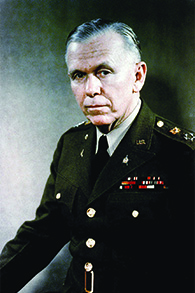

By the end of this section, you will be able to:
* Explain how and why the Cold War emerged in the wake of World War II
* Describe the steps taken by the U.S. government to oppose Communist expansion in Europe and Asia
* Discuss the government’s efforts to root out Communist influences in the United States

As World War II drew to a close, the alliance that had made the United States and the Soviet Union partners in their defeat of the Axis powers—Germany, Italy, and Japan—began to fall apart. Both sides realized that their visions for the future of Europe and the world were incompatible. Joseph Stalin, the premier of the Soviet Union, wished to retain hold of Eastern Europe and establish Communist, pro-Soviet governments there, in an effort to both expand Soviet influence and protect the Soviet Union from future invasions. He also sought to bring Communist revolution to Asia and to developing nations elsewhere in the world. The United States wanted to expand its influence as well by protecting or installing democratic governments throughout the world. It sought to combat the influence of the Soviet Union by forming alliances with Asian, African, and Latin American nations, and by helping these countries to establish or expand prosperous, free-market economies. The end of the war left the industrialized nations of Europe and Asia physically devastated and economically exhausted by years of invasion, battle, and bombardment. With Great Britain, France, Germany, Italy, Japan, and China reduced to shadows of their former selves, the United States and the Soviet Union emerged as the last two superpowers and quickly found themselves locked in a contest for military, economic, social, technological, and ideological supremacy.

### FROM ISOLATIONISM TO ENGAGEMENT

The United States had a long history of avoiding foreign alliances that might require the commitment of its troops abroad. However, in accepting the realities of the post-World War II world, in which traditional powers like Great Britain or France were no longer strong enough to police the globe, the United States realized that it would have to make a permanent change in its foreign policy, shifting from relative isolation to active engagement.

On assuming the office of president upon the death of Franklin Roosevelt, Harry Truman was already troubled by Soviet actions in Europe. He disliked the concessions made by Roosevelt at Yalta, which had allowed the Soviet Union to install a Communist government in Poland. At the Potsdam conference, held from July 17 to August 2, 1945, Truman also opposed Stalin’s plans to demand large reparations from Germany. He feared the burden that this would impose on Germany might lead to another cycle of German rearmament and aggression—a fear based on that nation’s development after World War I ([\[link\]](#CNX_History_28_02_Potsdam)).

  and Clement Atlee (left). Atlee became prime minister of Great Britain, replacing Winston Churchill, while the conference was taking place."){: #CNX_History_28_02_Potsdam}

Although the United States and the Soviet Union did finally reach an agreement at Potsdam, this was the final occasion on which they cooperated for quite some time. Each remained convinced that its own economic and political systems were superior to the other’s, and the two superpowers quickly found themselves drawn into conflict. The decades-long struggle between them for technological and ideological supremacy became known as the **Cold War**{: data-type="term"}. So called because it did not include direct military confrontation between Soviet and U.S. troops, the Cold War was fought with a variety of other weapons: espionage and surveillance, political assassinations, propaganda, and the formation of alliances with other nations. It also became an arms race, as both countries competed to build the greatest stockpile of nuclear weapons, and also competed for influence in poorer nations, supporting opposite sides in wars in some of those nations, such as Korea and Vietnam.

### CONTAINMENT ABROAD

In February 1946, George Kennan, a State Department official stationed at the U.S. embassy in Moscow, sent an eight-thousand-word message to Washington, DC. In what became known as the “**Long Telegram**{: data-type="term" .no-emphasis},” Kennan maintained that Soviet leaders believed that the only way to protect the Soviet Union was to destroy “rival” nations and their influence over weaker nations. According to Kennan, the Soviet Union was not so much a revolutionary regime as a totalitarian bureaucracy that was unable to accept the prospect of a peaceful coexistence of the United States and itself. He advised that the best way to thwart Soviet plans for the world was to contain Soviet influence—primarily through economic policy—to those places where it already existed and prevent its political expansion into new areas. This strategy, which came to be known as the policy of **containment**{: data-type="term"}, formed the basis for U.S. foreign policy and military decision making for more than thirty years.

As Communist governments came to power elsewhere in the world, American policymakers extended their strategy of containment to what became known as the **domino theory**{: data-type="term"} under the Eisenhower administration: Neighbors to Communist nations, so was the assumption, were likely to succumb to the same allegedly dangerous and infectious ideology. Like dominos toppling one another, entire regions would eventually be controlled by the Soviets. The demand for anti-Communist containment appeared as early as March 1946 in a speech by Winston Churchill, in which he referred to an **Iron Curtain**{: data-type="term"} that divided Europe into the “free” West and the Communist East controlled by the Soviet Union.

The commitment to containing Soviet expansion made necessary the ability to mount a strong military offense and defense. In pursuit of this goal, the U.S. military was reorganized under the National Security Act of 1947. This act streamlined the government in matters of security by creating the National Security Council and establishing the Central Intelligence Agency (CIA) to conduct surveillance and espionage in foreign nations. It also created the Department of the Air Force, which was combined with the Departments of the Army and Navy in 1949 to form one Department of Defense.

#### The Truman Doctrine

In Europe, the end of World War II witnessed the rise of a number of internal struggles for control of countries that had been occupied by Nazi Germany. Great Britain occupied Greece as the Nazi regime there collapsed. The British aided the authoritarian government of Greece in its battles against Greek Communists. In March 1947, Great Britain announced that it could no longer afford the cost of supporting government military activities and withdrew from participation in the **Greek civil war**{: data-type="term" .no-emphasis}. Stepping into this power vacuum, the United States announced the Truman Doctrine, which offered support to Greece and Turkey in the form of financial assistance, weaponry, and troops to help train their militaries and bolster their governments against Communism. Eventually, the program was expanded to include any state trying to withstand a Communist takeover. The Truman Doctrine thus became a hallmark of U.S. Cold War policy.

The Truman Doctrine

In 1947, Great Britain, which had assumed responsibility for the disarming of German troops in Greece at the end of World War II, could no longer afford to provide financial support for the authoritarian Greek government, which was attempting to win a civil war against Greek leftist rebels. President Truman, unwilling to allow a Communist government to come to power there, requested Congress to provide funds for the government of Greece to continue its fight against the rebels. Truman also requested aid for the government of Turkey to fight the forces of Communism in that country. He said:

<q>At the present moment in world history nearly every nation must choose between alternative ways of life. The choice is too often not a free one.* * *
{: data-type="newline"}

 Should we fail to aid Greece and Turkey in this fateful hour, the effect will be far reaching to the West as well as to the East.* * *
{: data-type="newline"}

 The seeds of totalitarian regimes are nurtured by misery and want. They spread and grow in the evil soil of poverty and strife. They reach their full growth when the hope of a people for a better life has died. We must keep that hope alive.* * *
{: data-type="newline"}

 The free peoples of the world look to us for support in maintaining their freedoms.* * *
{: data-type="newline"}

 If we falter in our leadership, we may endanger the peace of the world—and we shall surely endanger the welfare of our own nation.* * *
{: data-type="newline"}

 Great responsibilities have been placed upon us by the swift movement of events.* * *
{: data-type="newline"}

 I am confident that the Congress will face these responsibilities squarely.</q>

What role is Truman suggesting that the United States assume in the postwar world? Does the United States still assume this role?

#### The Marshall Plan

By 1946, the American economy was growing significantly. At the same time, the economic situation in Europe was disastrous. The war had turned much of Western Europe into a battlefield, and the rebuilding of factories, public transportation systems, and power stations progressed exceedingly slowly. Starvation loomed as a real possibility for many. As a result of these conditions, Communism was making significant inroads in both Italy and France. These concerns led Truman, along with Secretary of State George C. Marshall, to propose to Congress the European Recovery Program, popularly known as the **Marshall Plan**{: data-type="term"}. Between its implantation in April 1948 and its termination in 1951, this program gave $13 billion in economic aid to European nations.

Truman’s motivation was economic and political, as well as humanitarian. The plan stipulated that the European nations had to work together in order to receive aid, thus enforcing unity through enticement, while seeking to undercut the political popularity of French and Italian Communists and dissuading moderates from forming coalition governments with them. Likewise, much of the money had to be spent on American goods, boosting the postwar economy of the United States as well as the American cultural presence in Europe. Stalin regarded the program as a form of bribery. The Soviet Union refused to accept aid from the Marshall Plan, even though it could have done so, and forbade the Communist states of Eastern Europe to accept U.S. funds as well. Those states that did accept aid began to experience an economic recovery.

George C. Marshall and the Nobel Peace Prize

The youngest child of a Pennsylvania businessman and Democrat, George C. Marshall ([\[link\]](#CNX_History_28_02_Marshall)) chose a military career. He attended the Virginia Military Institute, was a veteran of World War I, and spent the rest of his life either in the military or otherwise in the service of his country, including as President Truman’s Secretary of State. He was awarded the Nobel Peace Prize in 1953, the only soldier to ever receive that honor. Below is an excerpt of his remarks as he accepted the award.

{: #CNX_History_28_02_Marshall}

<q>There has been considerable comment over the awarding of the Nobel Peace Prize to a soldier. I am afraid this does not seem as remarkable to me as it quite evidently appears to others. I know a great deal of the horrors and tragedies of war. Today, as chairman of the American Battle Monuments Commission, it is my duty to supervise the construction and maintenance of military cemeteries in many countries overseas, particularly in Western Europe. The cost of war in human lives is constantly spread before me, written neatly in many ledgers whose columns are gravestones. I am deeply moved to find some means or method of avoiding another calamity of war. Almost daily I hear from the wives, or mothers, or families of the fallen. The tragedy of the aftermath is almost constantly before me.* * *
{: data-type="newline"}

 I share with you an active concern for some practical method for avoiding war. . . . A very strong military posture is vitally necessary today. How long it must continue I am not prepared to estimate, but I am sure that it is too narrow a basis on which to build a dependable, long-enduring peace. The guarantee for a long continued peace will depend on other factors in addition to a moderated military strength, and no less important. Perhaps the most important single factor will be a spiritual regeneration to develop goodwill, faith, and understanding among nations. Economic factors will undoubtedly play an important part. Agreements to secure a balance of power, however disagreeable they may seem, must likewise be considered. And with all these there must be wisdom and the will to act on that wisdom.</q>

What steps did Marshall recommend be taken to maintain a lasting peace? To what extent have today’s nations heeded his advice?

#### Showdown in Europe

The lack of consensus with the Soviets on the future of Germany led the United States, Great Britain, and France to support joining their respective occupation zones into a single, independent state. In December 1946, they took steps to do so, but the Soviet Union did not wish the western zones of the country to unify under a democratic, pro-capitalist government. The Soviet Union also feared the possibility of a unified West Berlin, located entirely within the Soviet sector. Three days after the western allies authorized the introduction of a new currency in Western Germany—the Deutsche Mark—Stalin ordered all land and water routes to the western zones of the city Berlin to be cut off in June 1948. Hoping to starve the western parts of the city into submission, the Berlin blockade was also a test of the emerging U.S. policy of containment.

Unwilling to abandon Berlin, the United States, Great Britain, and France began to deliver all needed supplies to West Berlin by air ([\[link\]](#CNX_History_28_02_Airlift)). In April 1949, the three countries joined Canada and eight Western European nations to form the North Atlantic Treaty Organization (NATO), an alliance pledging its members to mutual defense in the event of attack. On May 12, 1949, a year and approximately two million tons of supplies later, the Soviets admitted defeat and ended the blockade of Berlin. On May 23, the Federal Republic of Germany (FRG), consisting of the unified western zones and commonly referred to as West Germany, was formed. The Soviets responded by creating the German Democratic Republic, or East Germany, in October 1949.

  are loaded with staged supplies at a French airport before taking off for Berlin. Residents of Berlin wait for a U.S. plane (b) carrying needed supplies to land at Templehof Airport in the American sector of the city."){: #CNX_History_28_02_Airlift}

### CONTAINMENT AT HOME

In 1949, two incidents severely disrupted American confidence in the ability of the United States to contain the spread of Communism and limit Soviet power in the world. First, on August 29, 1949, the Soviet Union exploded its first atomic bomb—no longer did the United States have a monopoly on nuclear power. A few months later, on October 1, 1949, Chinese Communist Party leader Mao Zedong announced the triumph of the Chinese Communists over their Nationalist foes in a civil war that had been raging since 1927. The Nationalist forces, under their leader Chiang Kai-shek, departed for Taiwan in December 1949.

Immediately, there were suspicions that spies had passed bomb-making secrets to the Soviets and that Communist sympathizers in the U.S. State Department had hidden information that might have enabled the United States to ward off the Communist victory in China. Indeed, in February 1950, Wisconsin senator Joseph McCarthy, a Republican, charged in a speech that the State Department was filled with Communists. Also in 1950, the imprisonment in Great Britain of Klaus Fuchs, a German-born physicist who had worked on the Manhattan Project and was then convicted of passing nuclear secrets to the Soviets, increased American fears. Information given by Fuchs to the British implicated a number of American citizens as well. The most infamous trial of suspected American spies was that of Julius and Ethel Rosenberg, who were executed in June 1953 despite a lack of evidence against them. Several decades later, evidence was found that Julius, but not Ethel, had in fact given information to the Soviet Union.

Fears that Communists within the United States were jeopardizing the country’s security had existed even before the victory of Mao Zedong and the arrest and conviction of the atomic spies. Roosevelt’s New Deal and Truman’s Fair Deal were often criticized as “socialist,” which many mistakenly associated with Communism, and Democrats were often branded Communists by Republicans. In response, on March 21, 1947, Truman signed Executive Order 9835, which provided the Federal Bureau of Investigation with broad powers to investigate federal employees and identify potential security risks. State and municipal governments instituted their own loyalty boards to find and dismiss potentially disloyal workers.

In addition to loyalty review boards, the House Committee on Un-American Activities (HUAC), established in 1938 to investigate suspected Nazi sympathizers, after World War II also sought to root out suspected Communists in business, academia, and the media. HUAC was particularly interested in Hollywood because it feared that Communist sympathizers might use motion pictures as pro-Soviet propaganda. Witnesses were subpoenaed and required to testify before the committee; refusal could result in imprisonment. Those who invoked Fifth Amendment protections, or were otherwise suspected of Communist sympathies, often lost their jobs or found themselves on a **blacklist**{: data-type="term"}, which prevented them from securing employment. Notable artists who were blacklisted in the 1940s and 1950s include composer Leonard Bernstein, novelist Dashiell Hammett, playwright and screenwriter Lillian Hellman, actor and singer Paul Robeson, and musician Artie Shaw.

### TO THE TRENCHES AGAIN

Just as the U.S. government feared the possibility of Communist infiltration of the United States, so too was it alert for signs that Communist forces were on the move elsewhere. The Soviet Union had been granted control of the northern half of the Korean peninsula at the end of World War II, and the United States had control of the southern portion. The Soviets displayed little interest in extending its power into South Korea, and Stalin did not wish to risk confrontation with the United States over Korea. North Korea’s leaders, however, wished to reunify the peninsula under Communist rule. In April 1950, Stalin finally gave permission to North Korea’s leader Kim Il Sung to invade South Korea and provided the North Koreans with weapons and military advisors.

On June 25, 1950, troops of the North Korean People’s Democratic Army crossed the thirty-eighth parallel, the border between North and South Korea. The first major test of the U.S. policy of containment in Asia had begun, for the domino theory held that a victory by North Korea might lead to further Communist expansion in Asia, in the virtual backyard of the United States’ chief new ally in East Asia—Japan. The United Nations (UN), which had been established in 1945, was quick to react. On June 27, the UN Security Council denounced North Korea’s actions and called upon UN members to help South Korea defeat the invading forces. As a permanent member of the Security Council, the Soviet Union could have vetoed the action, but it had boycotted UN meetings following the awarding of China’s seat on the Security Council to Taiwan instead of to Mao Zedong’s People’s Republic of China.

On June 27, Truman ordered U.S. military forces into South Korea. They established a defensive line on the far southern part of the Korean peninsula near the town of Pusan. A U.S.-led invasion at Inchon on September 15 halted the North Korean advance and turned it into a retreat ([\[link\]](#CNX_History_28_02_KoreaMap)). As North Korean forces moved back across the thirty-eighth parallel, UN forces under the command of U.S. General Douglas MacArthur followed. MacArthur’s goal was not only to drive the North Korean army out of South Korea but to destroy Communist North Korea as well. At this stage, he had the support of President Truman; however, as UN forces approached the Yalu River, the border between China and North Korea, MacArthur’s and Truman’s objectives diverged. Chinese premier Zhou Enlai, who had provided supplies and military advisors for North Korea before the conflict began, sent troops into battle to support North Korea and caught U.S. troops by surprise. Following a costly retreat from North Korea’s Chosin Reservoir, a swift advance of Chinese and North Korean forces and another invasion of Seoul, MacArthur urged Truman to deploy nuclear weapons against China. Truman, however, did not wish to risk a broader war in Asia. MacArthur criticized Truman’s decision and voiced his disagreement in a letter to a Republican congressman, who subsequently allowed the letter to become public. In April 1951, Truman accused MacArthur of insubordination and relieved him of his command. The Joint Chiefs of Staff agreed, calling the escalation MacArthur had called for “the wrong war, at the wrong place, at the wrong time, and with the wrong enemy.” Nonetheless, the public gave MacArthur a hero’s welcome in New York with the largest ticker tape parade in the nation’s history.

 ![A map of North and South Korea, bordered by China to the north, the Yellow Sea to the west, the Sea of Japan to the east, and Japan to the southeast, is shown. Purple arrows show the North Korean invasion of South Korea in 1950; green arrows show the UN offensive response and the site of the landing at Inchon on September 15, 1950, and orange arrows should the Communist Chinese offensive. A dotted orange line shows the truce line of 1953. A grey dotted line shows the UN defensive line in September 1950, and a dotted green line shows the northern-most UN advance in November 1950.](../resources/CNX_History_28_02_KoreaMap.jpg "After the initial invasion of South Korea by the North Korean People&#x2019;s Democratic Army, the United Nations established a defensive line in the southern part of the country. The landing at Inchon in September reversed the tide of the war and allowed UN forces under General Douglas MacArthur to retake the city of Seoul, which had fallen to North Korean troops in the early days of the war."){: #CNX_History_28_02_KoreaMap}

By July 1951, the UN forces had recovered from the setbacks earlier in the year and pushed North Korean and Chinese forces back across the thirty-eighth parallel, and peace talks began. However, combat raged on for more than two additional years. The primary source of contention was the fate of prisoners of war. The Chinese and North Koreans insisted that their prisoners be returned to them, but many of these men did not wish to be repatriated. Finally, an armistice agreement was signed on July 27, 1953. A border between North and South Korea, one quite close to the original thirty-eighth parallel line, was agreed upon. A demilitarized zone between the two nations was established, and both sides agreed that prisoners of war would be allowed to choose whether to be returned to their homelands. Five million people died in the three-year conflict. Of these, around 36,500 were U.S. soldiers; a majority were Korean civilians.

  
Read [firsthand accounts][1] of U.S. soldiers who served in Korea, including prisoners of war.

As the war in Korea came to an end, so did one of the most frightening anti-Communist campaigns in the United States. After charging the U.S. State Department with harboring Communists, Senator Joseph McCarthy had continued to make similar accusations against other government agencies. Prominent Republicans like Senator Robert Taft and Congressman Richard Nixon regarded McCarthy as an asset who targeted Democratic politicians, and they supported his actions. In 1953, as chair of the Senate Committee on Government Operations, McCarthy investigated the Voice of America, which broadcast news and pro-U.S. propaganda to foreign countries, and the State Department’s overseas libraries. After an aborted effort to investigate Protestant clergy, McCarthy turned his attention to the U.S. Army. This proved to be the end of the senator’s political career. From April to June 1954, the Army-McCarthy Hearings were televised, and the American public, able to witness his use of intimidation and innuendo firsthand, rejected McCarthy’s approach to rooting out Communism in the United States ([\[link\]](#CNX_History_28_02_McCarthy)). In December 1954, the U.S. Senate officially condemned his actions with a censure, ending his prospects for political leadership.

  consults with Roy Cohn (right) during the Army-McCarthy hearings. Cohn, a lawyer who worked for McCarthy, was responsible for investigating State Department libraries overseas for &#x201C;subversive&#x201D; books."){: #CNX_History_28_02_McCarthy}

One particularly heinous aspect of the hunt for Communists in the United States, likened by playwright Arthur Miller to the witch hunts of old, was its effort to root out gay men and lesbians employed by the government. Many anti-Communists, including McCarthy, believed that gay men, referred to by Senator Everett Dirksen as “lavender lads,” were morally weak and thus were particularly likely to betray their country. Many also believed that lesbians and gay men were prone to being blackmailed by Soviet agents because of their sexual orientation, which at the time was regarded by psychiatrists as a form of mental illness.

### Section Summary

Joy at the ending of World War II was quickly replaced by fears of conflict with the Soviet Union. The Cold War heated up as both the United States and Soviet Union struggled for world dominance. Fearing Soviet expansion, the United States committed itself to assisting countries whose governments faced overthrow by Communist forces and gave billions of dollars to war-torn Europe to help it rebuild. While the United States achieved victory in its thwarting of Soviet attempts to cut Berlin off from the West, the nation was less successful in its attempts to prevent Communist expansion in Korea. The development of atomic weapons by the Soviet Union and the arrest of Soviet spies in the United States and Britain roused fears in the United States that Communist agents were seeking to destroy the nation from within. Loyalty board investigations and hearings before House and Senate committees attempted to root out Soviet sympathizers in the federal government and in other sectors of American society, including Hollywood and the military.

### Review Questions

What was the policy of trying to limit the expansion of Soviet influence abroad?

1.  restraint
2.  containment
3.  isolationism
4.  quarantine
{: type="A"}

B

The Truman administration tried to help Europe recover from the devastation of World War II with the \_\_\_\_\_\_\_\_.

1.  Economic Development Bank
2.  Atlantic Free Trade Zone
3.  Byrnes Budget
4.  Marshall Plan
{: type="A"}

D

What was agreed to at the armistice talks between North and South Korea?

The border between North and South Korea was established close to the original line along the thirty-eighth parallel, with a demilitarized zone serving as a buffer. Prisoners of war were free to decide whether they wanted to be returned home.

### Glossary
{: data-type="glossary-title"}

blacklist
: a list of people suspected of having Communist sympathies who were denied work as a result
^

Cold War
: the prolonged period of tension between the United States and the Soviet Union, based on ideological conflicts and competition for military, economic, social, and technological superiority, and marked by surveillance and espionage, political assassinations, an arms race, attempts to secure alliances with developing nations, and proxy wars
^

containment
: the U.S. policy that sought to limit the expansion of Communism abroad
^

domino theory
: the theory that if Communism made inroads in one nation, surrounding nations would also succumb one by one, like a chain of dominos toppling one another
^

Iron Curtain
: a term coined by Winston Churchill to refer to portions of Eastern Europe that the Soviet Union had incorporated into its sphere of influence and that no longer were free to manage their own affairs
^

Marshall Plan
: a program giving billions of dollars of U.S. aid to European countries to prevent them from turning to Communism

[1]: http://openstaxcollege.org/l/15KOWar
