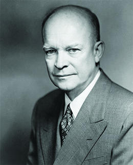
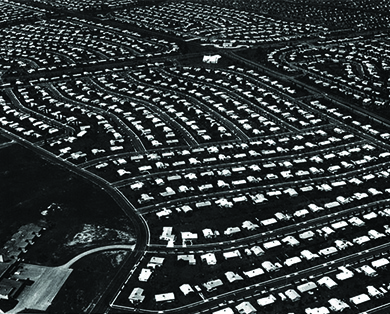
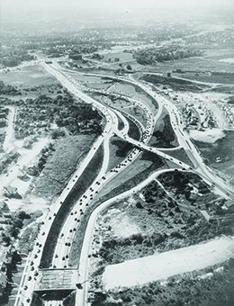

By the end of this section, you will be able to:
* Describe President Dwight D. Eisenhower’s domestic and foreign policies
* Discuss gender roles in the 1950s
* Discuss the growth of the suburbs and the effect of suburbanization on American society

Against the backdrop of the Cold War, Americans dedicated themselves to building a peaceful and prosperous society after the deprivation and instability of the Great Depression and World War II. Dwight D. Eisenhower, the general who led the United States to victory in Europe in 1945, proved to be the perfect president for the new era. Lacking strong conservative positions, he steered a middle path between conservatism and liberalism, and presided over a peacetime decade of economic growth and social conformity. In foreign affairs, Eisenhower’s New Look policy simultaneously expanded the nation’s nuclear arsenal and prevented the expansion of the defense budget for conventional forces.

# WE LIKE IKE

After Harry Truman declined to run again for the presidency, the election of 1952 emerged as a contest between the Democratic nominee, Illinois governor Adlai Stevenson, and Republican Dwight D. Eisenhower, who had directed American forces in Europe during World War II ([\[link\]](#CNX_History_28_03_Eisenhower)). Eisenhower campaigned largely on a promise to end the war in Korea, a conflict the public had grown weary of fighting. He also vowed to fight Communism both at home and abroad, a commitment he demonstrated by choosing as his running mate Richard M. Nixon, a congressman who had made a name for himself by pursuing Communists, notably former State Department employee and suspected Soviet agent Alger Hiss.

 {: #CNX_History_28_03_Eisenhower}

In 1952, Eisenhower supporters enthusiastically proclaimed “We Like Ike,” and Eisenhower defeated Stevenson by winning 54 percent of the popular vote and 87 percent of the electoral vote ([\[link\]](#CNX_History_28_03_Vote)). When he assumed office in 1953, Eisenhower employed a leadership style he had developed during his years of military service. He was calm and willing to delegate authority regarding domestic affairs to his cabinet members, allowing him to focus his own efforts on foreign policy. Unlike many earlier presidents, such as Harry Truman, Eisenhower was largely nonpartisan and consistently sought a middle ground between liberalism and conservatism. He strove to balance the federal budget, which appealed to conservative Republicans, but retained much of the New Deal and even expanded Social Security. He maintained high levels of defense spending but, in his farewell speech in 1961, warned about the growth of the **military-industrial complex**{: data-type="term"}, the matrix of relationships between officials in the Department of Defense and executives in the defense industry who all benefited from increases in defense spending. He disliked the tactics of Joseph McCarthy but did not oppose him directly, preferring to remain above the fray. He saw himself as a leader called upon to do his best for his country, not as a politician engaged in a contest for advantage over rivals.

 ![A map entitled &#x201C;1952 Presidential Election&#x201D; shows the number of electoral votes cast by each state and indicates which candidate won that state. Republican Eisenhower won Washington (9), Oregon (6), California (32), Idaho (4), Nevada (3), Montana (4), Utah (4), Arizona (4), Wyoming (3), Colorado (6), New Mexico (4), North Dakota (4), South Dakota (4), Nebraska (6), Kansas (8), Oklahoma (8), Texas (24), Minnesota (11), Iowa (10), Missouri (13), Wisconsin (12), Illinois (27), Michigan (20), Indiana (13), Ohio (25), Tennessee (11), Florida (10), Maine (5), New Hampshire (4), Vermont (3), Massachusetts (16), Rhode Island (4), Connecticut (8), New York (45), New Jersey (16), Pennsylvania (32), Delaware (3), Maryland (9), and Virginia (12). Democrat Stevenson won Kentucky (10), West Virginia (8), Arkansas (8), Louisiana (10), Mississippi (8), Alabama (11), Georgia (12), South Carolina (8), and North Carolina (14). A pie chart beside the map indicates that Eisenhower won 442 electoral votes (83%) and Stevenson 89 (17%), for a total of 531 electoral votes. A second pie chart indicates that Eisenhower won 33,937,252 (55%) popular votes and Stevenson 27,314,992 (44.5%), with minor candidates winning 299,675 (0.5%).](../resources/CNX_History_28_03_Vote.jpg "The above map shows the resounding victory of Dwight D. Eisenhower over Adlai Stevenson in the 1952 election. Stevenson carried only the South, where whites had voted for Democratic Party candidates since the time of the Civil War."){: #CNX_History_28_03_Vote}

In keeping with his goal of a balanced budget, Eisenhower switched the emphasis in defense from larger conventional forces to greater stockpiles of nuclear weapons. His New Look strategy embraced nuclear “**massive retaliation**{: data-type="term"},” a plan for nuclear response to a first Soviet strike so devastating that the attackers would not be able to respond. Some labeled this approach “**Mutually Assured Destruction**{: data-type="term" .no-emphasis}” or MAD.

Part of preparing for a possible war with the Soviet Union was informing the American public what to do in the event of a nuclear attack. The government provided instructions for building and equipping bomb shelters in the basement or backyard, and some cities constructed municipal shelters. Schools purchased dog tags to help identify students in the aftermath of an attack and showed children instructional films telling them what to do if atomic bombs were dropped on the city where they lived.

“A Guide for Surviving Nuclear War”

To prepare its citizens for the possibility of nuclear war, in 1950, the U.S. government published and distributed informative pamphlets such as “A Guide for Surviving Nuclear War” excerpted here.

\> Just like fire bombs and ordinary high explosives, atomic weapons cause most of their death and damage by blast and heat. So first let’s look at a few things you can do to escape these two dangers.
> * * *
> {: data-type="newline"}
> 
> Even if you have only a second’s warning, there is one important thing you can do to lessen your chances of injury by blast: Fall flat on your face.
> * * *
> {: data-type="newline"}
> 
> More than half of all wounds are the result of being bodily tossed about or being struck by falling and flying objects. If you lie down flat, you are least likely to be thrown about. If you have time to pick a good spot, there is less chance of your being struck by flying glass and other things.
> * * *
> {: data-type="newline"}
> 
> If you are inside a building, the best place to flatten out is close against the cellar wall. If you haven’t time to get down there, lie down along an inside wall, or duck under a bed or table. . . .
> * * *
> {: data-type="newline"}
> 
> If caught out-of-doors, either drop down alongside the base of a good substantial building—avoid flimsy, wooden ones likely to be blown over on top of you—or else jump in any handy ditch or gutter.
> * * *
> {: data-type="newline"}
> 
> When you fall flat to protect yourself from a bombing, don’t look up to see what is coming. Even during the daylight hours, the flash from a bursting A-bomb can cause several moments of blindness, if you’re facing that way. To prevent it, bury your face in your arms and hold it there for 10 to 12 seconds after the explosion. . . .
> * * *
> {: data-type="newline"}
> 
> If you work in the open, always wear full-length, loose-fitting, light-colored clothes in time of emergency. Never go around with your sleeves rolled up. Always wear a hat—the brim could save you a serious face burn.

What do you think was the purpose of these directions? Do you think they could actually help people survive an atomic bomb blast? If not, why publish such booklets?

  
View this [short instructional film][1] made in 1951 that teaches elementary school children what to do in the event an atomic bomb is dropped. Why do you think officials tried to convey the message that a nuclear attack was survivable?

Government and industry allocated enormous amounts of money to the research and development of more powerful weapons. This investment generated rapid strides in missile technology as well as increasingly sensitive radar. Computers that could react more quickly than humans and thereby shoot down speeding missiles were also investigated. Many scientists on both sides of the Cold War, including captured Germans such as rocket engineer Werner von Braun, worked on these devices. An early success for the West came in 1950, when Alan Turing, a British mathematician who had broken Germany’s Enigma code during World War II, created a machine that mimicked human thought. His discoveries led scientists to consider the possibility of developing true artificial intelligence.

However, the United States often feared that the Soviets were making greater strides in developing technology with potential military applications. This was especially true following the Soviet Union’s launch of ***Sputnik***{: data-type="term"} ([\[link\]](#CNX_History_28_03_Sputnik)), the first manmade satellite, in October 1957. In September 1958, Congress passed the National Defense Education Act, which pumped over $775 million into educational programs over four years, especially those programs that focused on math and science. Congressional appropriations to the National Science Foundation also increased by $100 million in a single year, from $34 million in 1958 to $134 million in 1959. One consequence of this increased funding was the growth of science and engineering programs at American universities.

 {: #CNX_History_28_03_Sputnik}

In the diplomatic sphere, Eisenhower pushed Secretary of State John Foster Dulles to take a firmer stance against the Soviets to reassure European allies of continued American support. At the same time, keenly sensing that the stalemate in Korea had cost Truman his popularity, Eisenhower worked to avoid being drawn into foreign wars. Thus, when the French found themselves fighting Vietnamese Communists for control of France’s former colony of Indochina, Eisenhower provided money but not troops. Likewise, the United States took no steps when Hungary attempted to break away from Soviet domination in 1956. The United States also refused to be drawn in when Great Britain, France, and Israel invaded the Suez Canal Zone following Egypt’s nationalization of the canal in 1956. Indeed, Eisenhower, wishing to avoid conflict with the Soviet Union, threatened to impose economic sanctions on the invading countries if they did not withdraw.

# SUBURBANIZATION

Although the Eisenhower years were marked by fear of the Soviet Union and its military might, they were also a time of peace and prosperity. Even as many Americans remained mired in poverty, many others with limited economic opportunities, like African Americans or union workers, were better off financially in the 1950s and rose into the ranks of the middle class. Wishing to build the secure life that the Great Depression had deprived their parents of, young men and women married in record numbers and purchased homes where they could start families of their own. In 1940, the rate of homeownership in the United States was 43.6 percent. By 1960, it was almost 62 percent. Many of these newly purchased homes had been built in the new suburban areas that began to encircle American cities after the war. Although middle-class families had begun to move to the suburbs beginning in the nineteenth century, suburban growth accelerated rapidly after World War II.

Several factors contributed to this development. During World War II, the United States had suffered from a housing shortage, especially in cities with shipyards or large defense plants. Now that the war was over, real estate developers and contractors rushed to alleviate the scarcity. Unused land on the fringes of American cities provided the perfect place for new housing, which attracted not only the middle class, which had long sought homes outside the crowded cities, but also blue-collar workers who took advantage of the low-interest mortgages offered by the GI Bill.

An additional factor was the use of prefabricated construction techniques pioneered during World War II, which allowed houses complete with plumbing, electrical wiring, and appliances to be built and painted in a day. Employing these methods, developers built acres of inexpensive tract housing throughout the country. One of the first developers to take advantage of this method was William Levitt, who purchased farmland in Nassau County, Long Island, in 1947 and built thousands of prefabricated houses. The new community was named **Levittown**{: data-type="term"}.

Levitt’s houses cost only $8,000 and could be bought with little or no down payment. The first day they were offered for sale, more than one thousand were purchased. Levitt went on to build similar developments, also called Levittown, in New Jersey and Pennsylvania ([\[link\]](#CNX_History_28_03_Levittown)). As developers around the country rushed to emulate him, the name Levittown became synonymous with suburban tract housing, in which entire neighborhoods were built to either a single plan or a mere handful of designs. The houses were so similar that workers told of coming home late at night and walking into the wrong one. Levittown homes were similar in other ways as well; most were owned by white families. Levitt used restrictive language in his agreements with potential homeowners to ensure that only whites would live in his communities.

 {: #CNX_History_28_03_Levittown}

In the decade between 1950 and 1960, the suburbs grew by 46 percent. The transition from urban to suburban life exerted profound effects on both the economy and society. For example, fifteen of the largest U.S. cities saw their tax bases shrink significantly in the postwar period, and the apportionment of seats in the House of Representatives shifted to the suburbs and away from urban areas.

The development of the suburbs also increased reliance on the automobile for transportation. Suburban men drove to work in nearby cities or, when possible, were driven to commuter rail stations by their wives. In the early years of suburban development, before schools, parks, and supermarkets were built, access to an automobile was crucial, and the pressure on families to purchase a second one was strong. As families rushed to purchase them, the annual production of passenger cars leaped from 2.2 million to 8 million between 1946 and 1955, and by 1960, about 20 percent of suburban families owned two cars. The growing number of cars on the road changed consumption patterns, and drive-in and drive-through convenience stores, restaurants, and movie theaters began to dot the landscape. The first **McDonalds**{: data-type="term" .no-emphasis} opened in San Bernardino, California, in 1954 to cater to drivers in a hurry.

As drivers jammed highways and small streets in record numbers, cities and states rushed to build additional roadways and ease congestion. To help finance these massive construction efforts, states began taxing gasoline, and the federal government provided hundreds of thousands of dollars for the construction of the interstate highway system ([\[link\]](#CNX_History_28_03_Highway)). The resulting construction projects, designed to make it easier for suburbanites to commute to and from cities, often destroyed urban working-class neighborhoods. Increased funding for highway construction also left less money for public transportation, making it impossible for those who could not afford automobiles to live in the suburbs.

 {: #CNX_History_28_03_Highway}

# THE ORGANIZATION MAN

As the government poured money into the defense industry and into universities that conducted research for the government, the economy boomed. The construction and automobile industries employed thousands, as did the industries they relied upon: steel, oil and gasoline refining, rubber, and lumber. As people moved into new homes, their purchases of appliances, carpeting, furniture, and home decorations spurred growth in other industries. The building of miles of roads also employed thousands. Unemployment was low, and wages for members of both the working and middle classes were high.

Following World War II, the majority of white Americans were members of the middle class, based on such criteria as education, income, and home ownership. Even most blue-collar families could afford such elements of a middle-class lifestyle as new cars, suburban homes, and regular vacations. Most African Americans, however, were not members of the middle class. In 1950, the median income for white families was $20,656, whereas for black families it was $11,203. By 1960, when the average white family earned $28,485 a year, blacks still lagged behind at $15,786; nevertheless, this represented a more than 40 percent increase in African American income in the space of a decade.

While working-class men found jobs in factories and on construction crews, those in the middle class often worked for corporations that, as a result of government spending, had grown substantially during World War II and were still getting larger. Such corporations, far too large to allow managers to form personal relationships with all of their subordinates, valued conformity to company rules and standards above all else. In his best-selling book *The Organization Man*, however, William H. Whyte criticized the notion that conformity was the best path to success and self-fulfillment.

Conformity was still the watchword of suburban life: Many neighborhoods had rules mandating what types of clotheslines could be used and prohibited residents from parking their cars on the street. Above all, conforming to societal norms meant marrying young and having children. In the post-World War II period, marriage rates rose; the average age at first marriage dropped to twenty-three for men and twenty for women. Between 1946 and 1964, married couples also gave birth to the largest generation in U.S. history to date; this **baby boom**{: data-type="term"} resulted in the cohort known as the baby boomers. Conformity also required that the wives of both working- and middle-class men stay home and raise children instead of working for wages outside the home. Most conformed to this norm, at least while their children were young. Nevertheless, 40 percent of women with young children and half of women with older children sought at least part-time employment. They did so partly out of necessity and partly to pay for the new elements of “the good life”—second cars, vacations, and college education for their children.

The children born during the baby boom were members of a more privileged generation than their parents had been. Entire industries sprang up to cater to their need for clothing, toys, games, books, and breakfast cereals. For the first time in U.S. history, attending high school was an experience shared by the majority, regardless of race or region. As the baby boomers grew into adolescence, marketers realized that they not only controlled large amounts of disposable income earned at part-time jobs, but they exerted a great deal of influence over their parents’ purchases as well. Madison Avenue began to appeal to teenage interests. Boys yearned for cars, and girls of all ethnicities wanted boyfriends who had them. New fashion magazines for adolescent girls, such as *Seventeen*, advertised the latest clothing and cosmetics, and teen romance magazines, like *Copper Romance*, a publication for young African American women, filled drugstore racks. The music and movie industries also altered their products to appeal to affluent adolescents who were growing tired of parental constraints.

# Section Summary

In 1953, Dwight D. Eisenhower became president of the United States. Fiscally conservative but ideologically moderate, he sought to balance the budget while building a strong system of national defense. This defense policy led to a greater emphasis on the possible use of nuclear weapons in any confrontation with the Soviet Union. Committed to maintaining peace, however, Eisenhower avoided engaging the United States in foreign conflicts; during his presidency, the economy boomed. Young Americans married in record numbers, moved to the growing suburbs, and gave birth to the largest generation to date in U.S. history. As middle-class adults, they conformed to the requirements of corporate jobs and suburban life, while their privileged children enjoyed a consumer culture tailored to their desires.

# Review Questions

The name of the first manmade satellite, launched by the Soviet Union in 1957, was \_\_\_\_\_\_\_\_.  *Triton* *Cosmolskaya* *Pravda* *Sputnik* 

D

The first Levittown was built \_\_\_\_\_\_\_\_.  in Bucks County, Pennsylvania in Nassau County, New York near Newark, New Jersey near Pittsburgh, Pennsylvania 

B

How did suburbanization help the economy?

The construction of houses meant more work for people in the construction trades, including plumbers and electricians, and for those who worked in the lumber and appliance industries. The growth of the suburbs also led to a boom in the manufacture and sale of automobiles, which, in turn, created jobs for those in the steel, rubber, and oil industries.

[1]: http://openstaxcollege.org/l/15DuckCover
