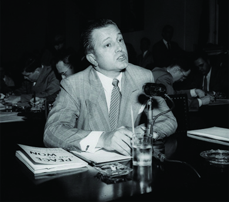
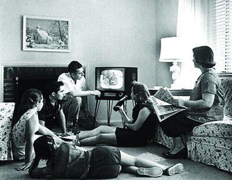

By the end of this section, you will be able to:
* Describe Americans’ different responses to rock and roll music
* Discuss the way contemporary movies and television reflected postwar American society

With a greater generational consciousness than previous generations, the baby boomers sought to define and redefine their identities in numerous ways. Music, especially rock and roll, reflected their desire to rebel against adult authority. Other forms of popular culture, such as movies and television, sought to entertain, while reinforcing values such as religious faith, patriotism, and conformity to societal norms.

# ROCKING AROUND THE CLOCK

In the late 1940s, some white country musicians began to experiment with the rhythms of the blues, a decades-old musical genre of rural southern blacks. This experimentation led to the creation of a new musical form known as rockabilly, and by the 1950s, rockabilly had developed into **rock and roll**{: data-type="term"}. Rock and roll music celebrated themes such as young love and freedom from the oppression of middle-class society. It quickly grew in favor among American teens, thanks largely to the efforts of disc jockey Alan Freed, who named and popularized the music by playing it on the radio in Cleveland, where he also organized the first rock and roll concert, and later in New York.

The theme of rebellion against authority, present in many rock and roll songs, appealed to teens. In 1954, Bill Haley and His Comets provided youth with an anthem for their rebellion—”Rock Around the Clock” ([\[link\]](#CNX_History_28_04_Haley)). The song, used in the 1955 movie *Blackboard Jungle* about a white teacher at a troubled inner-city high school, seemed to be calling for teens to declare their independence from adult control.

  was among the first to launch the new genre of rock and roll. Their hit song &#x201C;Rock Around the Clock&#x201D; supposedly caused some teens to break into violent behavior when they heard it. Chuck Berry (b) was a performer who combined rhythm and blues and rock and roll. He dazzled crowds with guitar solos and electrifying performances."){: #CNX_History_28_04_Haley}

Haley illustrated how white artists could take musical motifs from the African American community and achieve mainstream success. Teen heartthrob Elvis Presley rose to stardom doing the same. Thus, besides encouraging a feeling of youthful rebellion, rock and roll also began to tear down color barriers, as white youths sought out African American musicians such as Chuck Berry and Little Richard ([\[link\]](#CNX_History_28_04_Haley)).

While youth had found an outlet for their feelings and concerns, parents were much less enthused about rock and roll and the values it seemed to promote. Many regarded the music as a threat to American values. When Elvis Presley appeared on *The Ed Sullivan Show*, a popular television variety program, the camera deliberately focused on his torso and did not show his swiveling hips or legs shaking in time to the music. Despite adults’ dislike of the genre, or perhaps because of it, more than 68 percent of the music played on the radio in 1956 was rock and roll.

# HOLLYWOOD ON THE DEFENSIVE

At first, Hollywood encountered difficulties in adjusting to the post-World War II environment. Although domestic audiences reached a record high in 1946 and the war’s end meant expanding international markets too, the groundwork for the eventual dismantling of the traditional studio system was laid in 1948, with a landmark decision by the U.S. Supreme Court. Previously, film studios had owned their own movie theater chains in which they exhibited the films they produced; however, in *United States v. Paramount Pictures, Inc.*, this vertical integration of the industry—the complete control by one firm of the production, distribution, and exhibition of motion pictures—was deemed a violation of antitrust laws.

The HUAC hearings also targeted Hollywood. When Senator McCarthy called eleven “unfriendly witnesses” to testify before Congress about Communism in the film industry in October 1947, only playwright Bertolt Brecht answered questions. The other ten, who refused to testify, were cited for contempt of Congress on November 24. The next day, film executives declared that the so-called “Hollywood Ten” would no longer be employed in the industry until they had sworn they were not Communists ([\[link\]](#CNX_History_28_04_Dmytryk)). Eventually, more than three hundred actors, screenwriters, directors, musicians, and other entertainment professionals were placed on the industry blacklist. Some never worked in Hollywood again; others directed films or wrote screenplays under assumed names.

 {: #CNX_History_28_04_Dmytryk}

  
Watch a [1953 episode of a popular television show][1] from the 1950s, *I Led Three Lives*, the highly fictionalized story of a member of a Communist organization who is also an FBI informant.

Hollywood reacted aggressively to these various challenges. Filmmakers tried new techniques, like CinemaScope and Cinerama, which allowed movies to be shown on large screens and in 3-D. Audiences were drawn to movies not because of gimmicks, however, but because of the stories they told. Dramas and romantic comedies continued to be popular fare for adults, and, to appeal to teens, studios produced large numbers of horror films and movies starring music idols such as Elvis. Many films took espionage, a timely topic, as their subject matter, and science fiction hits such as *Invasion of the Body Snatchers*, about a small town whose inhabitants fall prey to space aliens, played on audience fears of both Communist invasion and nuclear technology.

# THE TRIUMPH OF TELEVISION

By far the greatest challenge to Hollywood, however, came from the relatively new medium of television. Although the technology had been developed in the late 1920s, through much of the 1940s, only a fairly small audience of the wealthy had access to it. As a result, programming was limited. With the post-World War II economic boom, all this changed. Where there had been only 178,000 televisions in homes in 1948, by 1955, over three-quarters of a million U.S. households, about half of all homes, had television ([\[link\]](#CNX_History_28_04_Television)).

 {: #CNX_History_28_04_Television}

Various types of programs were broadcast on the handful of major networks: situation comedies, variety programs, game shows, soap operas, talk shows, medical dramas, adventure series, cartoons, and police procedurals. Many comedies presented an idealized image of white suburban family life: Happy housewife mothers, wise fathers, and mischievous but not dangerously rebellious children were constants on shows like *Leave It to Beaver* and *Father Knows Best* in the late 1950s. These shows also reinforced certain perspectives on the values of individualism and family—values that came to be redefined as “American” in opposition to alleged Communist collectivism. Westerns, which stressed unity in the face of danger and the ability to survive in hostile environments, were popular too. Programming designed specifically for children began to emerge with shows such as *Captain Kangaroo*, *Romper Room*, and *The Mickey Mouse Club* designed to appeal to members of the baby boom.

# Section Summary

Young Americans in the postwar period had more disposable income and enjoyed greater material comfort than their forebears. These factors allowed them to devote more time and money to leisure activities and the consumption of popular culture. Rock and roll, which drew from African American roots in the blues, embraced themes popular among teenagers, such as young love and rebellion against authority. At the same time, traditional forms of entertainment, such as motion pictures, came under increasing competition from a relatively new technology, television.

# Review Questions

The disc jockey who popularized rock and roll was \_\_\_\_\_\_\_\_. 

Bill Haley

Elvis Presley

Alan Freed

Ed Sullivan

C

What challenges did Hollywood face in the 1950s?

Antitrust lawsuits deprived studios of their theaters, and the careers of many actors, directors, and screenwriters were destroyed by Senator McCarthy’s blacklist of suspected Communists. Meanwhile, the new technology of television drew audiences away from the movies by providing convenient at-home entertainment.

## Glossary
{: data-type="glossary-title"}

rock and roll
: a musical form popular among the baby boomers that encompassed styles ranging from county to blues, and embraced themes such as youthful rebellion and love
{: .definition}

[1]: http://openstaxcollege.org/l/15ThreeLives
