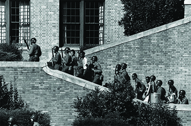

By the end of this section, you will be able to:
* Explain how Presidents Truman and Eisenhower addressed civil rights issues
* Discuss efforts by African Americans to end discrimination and segregation
* Describe southern whites’ response to the civil rights movement

In the aftermath of World War II, African Americans began to mount organized resistance to racially discriminatory policies in force throughout much of the United States. In the South, they used a combination of legal challenges and grassroots activism to begin dismantling the racial segregation that had stood for nearly a century following the end of Reconstruction. Community activists and civil rights leaders targeted racially discriminatory housing practices, segregated transportation, and legal requirements that African Americans and whites be educated separately. While many of these challenges were successful, life did not necessarily improve for African Americans. Hostile whites fought these changes in any way they could, including by resorting to violence.

### EARLY VICTORIES

During World War II, many African Americans had supported the “Double V Campaign,” which called on them to defeat foreign enemies while simultaneously fighting against segregation and discrimination at home. After World War II ended, many returned home to discover that, despite their sacrifices, the United States was not willing to extend them any greater rights than they had enjoyed before the war. Particularly rankling was the fact that although African American veterans were legally entitled to draw benefits under the GI Bill, discriminatory practices prevented them from doing so. For example, many banks would not give them mortgages if they wished to buy homes in predominantly African American neighborhoods, which banks often considered too risky an investment. However, African Americans who attempted to purchase homes in white neighborhoods often found themselves unable to do so because of real estate covenants that prevented owners from selling their property to blacks. Indeed, when a black family purchased a Levittown house in 1957, they were subjected to harassment and threats of violence.

  
For a look at the [experiences of an African American family][1] that tried to move to a white suburban community, view the 1957 documentary *Crisis in Levittown*.

The postwar era, however, saw African Americans make greater use of the courts to defend their rights. In 1944, an African American woman, Irene Morgan, was arrested in Virginia for refusing to give up her seat on an interstate bus and sued to have her conviction overturned. In *Morgan v. the Commonwealth of Virginia* in 1946, the U.S. Supreme Court ruled that the conviction should be overturned because it violated the interstate commerce clause of the Constitution. This victory emboldened some civil rights activists to launch the Journey of Reconciliation, a bus trip taken by eight African American men and eight white men through the states of the Upper South to test the South’s enforcement of the *Morgan* decision.

Other victories followed. In 1948, in *Shelley v. Kraemer*, the U.S. Supreme Court held that courts could not enforce real estate covenants that restricted the purchase or sale of property based on race. In 1950, the NAACP brought a case before the U.S. Supreme Court that they hoped would help to undermine the concept of “separate but equal” as espoused in the 1896 decision in *Plessy v. Ferguson*, which gave legal sanction to segregated school systems. *Sweatt v. Painter* was a case brought by Herman Marion Sweatt, who sued the University of Texas for denying him admission to its law school because state law prohibited integrated education. Texas attempted to form a separate law school for African Americans only, but in its decision on the case, the U.S. Supreme Court rejected this solution, holding that the separate school provided neither equal facilities nor “intangibles,” such as the ability to form relationships with other future lawyers, that a professional school should provide.

Not all efforts to enact desegregation required the use of the courts, however. On April 15, 1947, **Jackie Robinson**{: data-type="term" .no-emphasis} started for the Brooklyn Dodgers, playing first base. He was the first African American to play baseball in the National League, breaking the color barrier. Although African Americans had their own baseball teams in the Negro Leagues, Robinson opened the gates for them to play in direct competition with white players in the major leagues. Other African American athletes also began to challenge the segregation of American sports. At the 1948 Summer Olympics, Alice Coachman, an African American, was the only American woman to take a gold medal in the games ([\[link\]](#CNX_History_28_05_Athletes)). These changes, while symbolically significant, were mere cracks in the wall of segregation.

  was active in the civil rights movement. He served on the NAACP&#x2019;s board of directors and helped to found an African American-owned bank. Alice Coachman (b), who competed in track and field at Tuskegee University, was the first black woman to win an Olympic gold medal."){: #CNX_History_28_05_Athletes}

### DESEGREGATION AND INTEGRATION

Until 1954, racial segregation in education was not only legal but was required in seventeen states and permissible in several others ([\[link\]](#CNX_History_28_05_Brown)). Utilizing evidence provided in sociological studies conducted by Kenneth Clark and Gunnar Myrdal, however, Thurgood Marshall, then chief counsel for the NAACP, successfully argued the landmark case *Brown v. Board of Education of Topeka, Kansas* before the U.S. Supreme Court led by Chief Justice Earl Warren. Marshall showed that the practice of segregation in public schools made African American students feel inferior. Even if the facilities provided were equal in nature, the Court noted in its decision, the very fact that some students were separated from others on the basis of their race made segregation unconstitutional.

 ![A map entitled &#x201C;U.S. School Segregation prior to Brown v. Board of Education&#x201D; shows the states in which school segregation was mandatory; the states in which school segregation was optional; the states in which school segregation was forbidden; and the states in which school segregation legislation did not exist. States with mandatory school segregation included Texas, Oklahoma, Missouri, Arkansas, Louisiana, Kentucky, Tennessee, Mississippi, West Virginia, Alabama, Virginia and Maryland (including Washington, D.C.), Delaware, North Carolina, South Carolina, Georgia, and Florida. States with optional school segregation included Arizona, Wyoming, New Mexico, and Kansas. States forbidding school segregation included Washington, Idaho, Colorado, Minnesota, Iowa, Wisconsin, Illinois, Michigan, Indiana, Ohio, Pennsylvania, New York, Massachusetts, Rhode Island, Connecticut, and New Jersey. States with no school segregation legislation included Oregon, California, Nevada, Utah, Montana, North Dakota, South Dakota, Nebraska, Maine, New Hampshire, and Vermont.](../resources/CNX_History_28_05_Brown.jpg "This map shows those states in which racial segregation in public education was required by law before the 1954 Brown v. Board of Education decision. In 1960, four years later, fewer than 10 percent of southern African American students attended the same schools as white students."){: #CNX_History_28_05_Brown}

Thurgood Marshall on Fighting Racism

As a law student in 1933, Thurgood Marshall ([\[link\]](#CNX_History_28_05_TMarshall)) was recruited by his mentor Charles Hamilton Houston to assist in gathering information for the defense of a black man in Virginia accused of killing two white women. His continued close association with Houston led Marshall to aggressively defend blacks in the court system and to use the courts as the weapon by which equal rights might be extracted from the U.S. Constitution and a white racist system. Houston also suggested that it would be important to establish legal precedents regarding the *Plessy v. Ferguson* ruling of separate but equal.

 Henry L. Moon, Roy Wilkins, Herbert Hill, and Thurgood Marshall present a new poster in the campaign against southern white racism. Marshall successfully argued the landmark case Brown v. Board of Education (1954) before the U.S. Supreme Court and later became the court&#x2019;s first African American justice."){: #CNX_History_28_05_TMarshall}

By 1938, Marshall had become “Mr. Civil Rights” and formally organized the NAACP’s Legal Defense and Education Fund in 1940 to garner the resources to take on cases to break the racist justice system of America. A direct result of Marshall’s energies and commitment was his 1940 victory in a Supreme Court case, *Chambers v. Florida*, which held that confessions obtained by violence and torture were inadmissible in a court of law. His most well-known case was *Brown v. Board of Education* in 1954, which held that state laws establishing separate public schools for black and white students were unconstitutional.

Later in life, Marshall reflected on his career fighting racism in a speech at Howard Law School in 1978:

<q>Be aware of that myth, that everything is going to be all right. Don’t give in. I add that, because it seems to me, that what we need to do today is to refocus. Back in the 30s and 40s, we could go no place but to court. We knew then, the court was not the final solution. Many of us knew the final solution would have to be politics, if for no other reason, politics is cheaper than lawsuits. So now we have both. We have our legal arm, and we have our political arm. Let’s use them both. And don’t listen to this myth that it can be solved by either or that it has already been solved. Take it from me, it has not been solved.</q>

When Marshall says that the problems of racism have not been solved, to what was he referring?

*Plessy v. Fergusson* had been overturned. The challenge now was to integrate schools. A year later, the U.S. Supreme Court ordered southern school systems to begin **desegregation**{: data-type="term"} “with all deliberate speed.” Some school districts voluntarily integrated their schools. For many other districts, however, “deliberate speed” was very, very slow.

It soon became clear that enforcing *Brown v. the Board of Education* would require presidential intervention. Eisenhower did not agree with the U.S. Supreme Court’s decision and did not wish to force southern states to integrate their schools. However, as president, he was responsible for doing so. In 1957, Central High School in Little Rock, Arkansas, was forced to accept its first nine African American students, who became known as the **Little Rock Nine**{: data-type="term"}. In response, Arkansas governor Orval Faubus called out the state National Guard to prevent the students from attending classes, removing the troops only after Eisenhower told him to do so. A subsequent attempt by the nine students to attend school resulted in mob violence. Eisenhower then placed the Arkansas National Guard under federal control and sent the U.S. Army’s 101st airborne unit to escort the students to and from school as well as from class to class ([\[link\]](#CNX_History_28_05_LittleRock)). This was the first time since the end of Reconstruction that federal troops once more protected the rights of African Americans in the South.

 {: #CNX_History_28_05_LittleRock}

Throughout the course of the school year, the Little Rock Nine were insulted, harassed, and physically assaulted; nevertheless, they returned to school each day. At the end of the school year, the first African American student graduated from Central High. At the beginning of the 1958–1959 school year, Orval Faubus ordered all Little Rock’s public schools closed. In the opinion of white segregationists, keeping all students out of school was preferable to having them attend integrated schools. In 1959, the U.S. Supreme Court ruled that the school had to be reopened and that the process of desegregation had to proceed.

### WHITE RESPONSES

Efforts to desegregate public schools led to a backlash among most southern whites. Many greeted the *Brown* decision with horror; some World War II veterans questioned how the government they had fought for could betray them in such a fashion. Some white parents promptly withdrew their children from public schools and enrolled them in all-white private academies, many newly created for the sole purpose of keeping white children from attending integrated schools. Often, these “academies” held classes in neighbors’ basements or living rooms.

Other white southerners turned to state legislatures or courts to solve the problem of school integration. Orders to integrate school districts were routinely challenged in court. When the lawsuits proved unsuccessful, many southern school districts responded by closing all public schools, as Orval Faubus had done after Central High School was integrated. One county in Virginia closed its public schools for five years rather than see them integrated. Besides suing school districts, many southern segregationists filed lawsuits against the NAACP, trying to bankrupt the organization. Many national politicians supported the segregationist efforts. In 1956, ninety-six members of Congress signed “The Southern Manifesto,” in which they accused the U.S. Supreme Court of misusing its power and violating the principle of **states’ rights**{: data-type="term"}, which maintained that states had rights equal to those of the federal government.

Unfortunately, many white southern racists, frightened by challenges to the social order, responded with violence. When Little Rock’s Central High School desegregated, an irate Ku Klux Klansman from a neighboring community sent a letter to the members of the city’s school board in which he denounced them as Communists and threatened to kill them. White rage sometimes erupted into murder. In August 1955, both white and black Americans were shocked by the brutality of the murder of Emmett Till. Till, a fourteen-year-old boy from Chicago, had been vacationing with relatives in Mississippi. While visiting a white-owned store, he had made a remark to the white woman behind the counter. A few days later, the husband and brother-in-law of the woman came to the home of Till’s relatives in the middle of the night and abducted the boy. Till’s beaten and mutilated body was found in a nearby river three days later. Till’s mother insisted on an open-casket funeral; she wished to use her son’s body to reveal the brutality of southern racism. The murder of a child who had been guilty of no more than a casual remark captured the nation’s attention, as did the acquittal of the two men who admitted killing him.

### THE MONTGOMERY BUS BOYCOTT

One of those inspired by Till’s death was Rosa Parks, an NAACP member from Montgomery, Alabama, who became the face of the 1955–1956 Montgomery Bus Boycott. City ordinances in Montgomery segregated the city’s buses, forcing African American passengers to ride in the back section. They had to enter through the rear of the bus, could not share seats with white passengers, and, if the front of the bus was full and a white passenger requested an African American’s seat, had to relinquish their place to the white rider. The bus company also refused to hire African American drivers even though most of the people who rode the buses were black.

On December 1, 1955, Rosa Parks refused to give her seat to a white man, and the Montgomery police arrested her. After being bailed out of jail, she decided to fight the laws requiring segregation in court. To support her, the Women’s Political Council, a group of African American female activists, organized a boycott of Montgomery’s buses. News of the boycott spread through newspaper notices and by word of mouth; ministers rallied their congregations to support the Women’s Political Council. Their efforts were successful, and forty thousand African American riders did not take the bus on December 5, the first day of the boycott.

Other African American leaders within the city embraced the boycott and maintained it beyond December 5, Rosa Parks’ court date. Among them was a young minister named Martin Luther King, Jr. For the next year, black Montgomery residents avoided the city’s buses. Some organized carpools. Others paid for rides in African American-owned taxis, whose drivers reduced their fees. Most walked to and from school, work, and church for 381 days, the duration of the boycott. In June 1956, an Alabama federal court found the segregation ordinance unconstitutional. The city appealed, but the U.S. Supreme Court upheld the decision. The city’s buses were desegregated.

### Section Summary

After World War II, African American efforts to secure greater civil rights increased across the United States. African American lawyers such as Thurgood Marshall championed cases intended to destroy the Jim Crow system of segregation that had dominated the American South since Reconstruction. The landmark Supreme Court case *Brown v. Board of Education* prohibited segregation in public schools, but not all school districts integrated willingly, and President Eisenhower had to use the military to desegregate Little Rock’s Central High School. The courts and the federal government did not assist African Americans in asserting their rights in other cases. In Montgomery, Alabama, it was the grassroots efforts of African American citizens who boycotted the city’s bus system that brought about change. Throughout the region, many white southerners made their opposition to these efforts known. Too often, this opposition manifested itself in violence and tragedy, as in the murder of Emmett Till.

### Review Questions

The NAACP lawyer who became known as “Mr. Civil Rights” was \_\_\_\_\_\_\_\_.

1.  Earl Warren
2.  Jackie Robinson
3.  Orval Faubus
4.  Thurgood Marshall
{: type="A"}

D

The Arkansas governor who tried to prevent the integration of Little Rock High School was \_\_\_\_\_\_\_\_.

1.  Charles Hamilton Houston
2.  Kenneth Clark
3.  OrvalFaubus
4.  Clark Clifford
{: type="A"}

C

What was the significance of *Shelley v. Kraemer*?

*Shelley v. Kraemer* held that state courts could not enforce agreements that prevented homeowners from selling to members of particular races. The ruling made it easier for African Americans to purchase houses in neighborhoods of their choosing.

### Critical Thinking Questions

How did some Americans turn their wartime experiences into lasting personal gains (i.e. better employment, a new home, or an education) after the war was over? Why did others miss out on these opportunities?

What was the reason for the breakdown in friendly relations between the United States and the Soviet Union after World War II? What were the results of this conflict?

How did fear of the Soviet Union and Communism affect American culture and society?

What social changes took place in the United States after World War II? What role did the war play in those changes?

How did the wartime experiences of African Americans contribute to the drive for greater civil rights after the war?

### Glossary
{: data-type="glossary-title"}

desegregation
: the removal of laws and policies requiring the separation of different racial or ethnic groups
^

Little Rock Nine
: the nickname for the nine African American high school students who first integrated Little Rock’s Central High School
^

states’ rights
: the political belief that states possess authority beyond federal law, which is usually seen as the supreme law of the land, and thus can act in opposition to federal law

[1]: http://openstaxcollege.org/l/15Levittown
