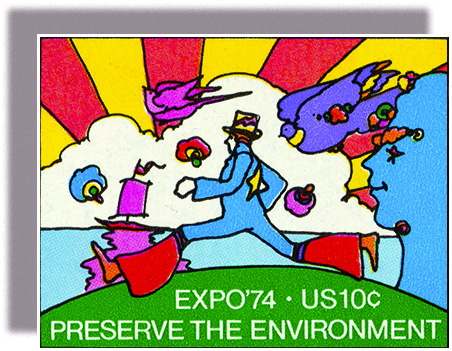

<cnx-pi data-type="cnx.flag.introduction"> class="introduction" </cnx-pi>

* Identity Politics in a Fractured Society
* Coming Apart, Coming Together
* Vietnam: The Downward Spiral
* Watergate: Nixon’s Domestic Nightmare
* Jimmy Carter in the Aftermath of the Storm

<cnx-pi data-type="cnx.eoc">class="summary" title="Summary"</cnx-pi>

<cnx-pi data-type="cnx.eoc">class="review-questions" title="Review Questions"</cnx-pi>

<cnx-pi data-type="cnx.eoc">class="critical-thinking" title="Critical Thinking Questions"</cnx-pi>

 {: #CNX_History_30_00_MaxStamp}

From May 4 to November 4, 1974, a universal exposition was held in the city of Spokane, Washington. This world’s fair, Expo ‘74, and the postage stamp issued to commemorate it, reflected many of the issues and interests of the 1970s ([\[link\]](#CNX_History_30_00_MaxStamp)). The stamp features psychedelic colors, and the character of the Cosmic Runner in the center wears bellbottoms, a popular fashion at the time. The theme of the fair was the environment, a subject beginning to be of great concern to people in the United States, especially the younger generation and those in the hippie counterculture. In the 1970s, the environment, social justice, distrust of the government, and a desire to end the war in Vietnam—the concerns and attitudes of younger people, women, gays and lesbians, and people of color—began to draw the attention of the mainstream as well.

