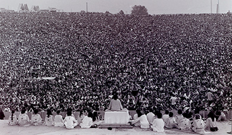

By the end of this section, you will be able to:
* Describe the counterculture of the 1960s
* Explain the origins of the American Indian Movement and its major activities
* Assess the significance of the gay rights and women’s liberation movements

 ![A timeline shows important events of the era. In 1968, Vietnamese are massacred at My Lai, and Richard Nixon is elected president; a photograph of My Lai victims is shown. In 1969, the Woodstock festival is held; a photograph of Swami Satchidananda and his followers on stage before a massive crowd at the Woodstock opening ceremony is shown. In 1970, the National Guard fires on students at Kent State University. In 1972, Nixon goes to China; a photograph of Richard and Pat Nixon standing before the Great Wall with Chinese officials is shown. In 1973, Roe v. Wade legalizes abortion nationally, the Paris Peace Accords end the U.S. role in Vietnam, and OAPEC proclaims an oil embargo. In 1974, Nixon resigns due to the Watergate scandal; a photograph of Nixon&#x2019;s departure from the White House is shown. In 1976, Jimmy Carter is elected president; a photograph of Jimmy Carter is shown. In 1978, the Camp David Accords are signed; a photograph of Menachem Begin, Jimmy Carter, and Anwar Sadat is shown. In 1979, Iranian protestors storm the U.S. Embassy in Tehran and take hostages.](../resources/CNX_History_30_01_Timeline.jpg){: #CNX_History_30_01_Timeline}

The political divisions that plagued the United States in the 1960s were reflected in the rise of **identity politics**{: data-type="term"} in the 1970s. As people lost hope of reuniting as a society with common interests and goals, many focused on issues of significance to the subgroups to which they belonged, based on culture, ethnicity, sexual orientation, gender, and religion.

### HIPPIES AND THE COUNTERCULTURE

In the late 1960s and early 1970s, many young people came to embrace a new wave of cultural dissent. The **counterculture**{: data-type="term"} offered an alternative to the bland homogeneity of American middle-class life, patriarchal family structures, self-discipline, unquestioning patriotism, and the acquisition of property. In fact, there were many alternative cultures.

“**Hippies**{: data-type="term" .no-emphasis}” rejected the conventions of traditional society. Men sported beards and grew their hair long; both men and women wore clothing from non-Western cultures, defied their parents, rejected social etiquettes and manners, and turned to music as an expression of their sense of self. Casual sex between unmarried men and women was acceptable. Drug use, especially of marijuana and psychedelic drugs like LSD and peyote, was common. Most hippies were also deeply attracted to the ideas of peace and freedom. They protested the war in Vietnam and preached a doctrine of personal freedom to be and act as one wished.

Some hippies dropped out of mainstream society altogether and expressed their disillusionment with the cultural and spiritual limitations of American freedom. They joined communes, usually in rural areas, to share a desire to live closer to nature, respect for the earth, a dislike of modern life, and a disdain for wealth and material goods. Many communes grew their own organic food. Others abolished the concept of private property, and all members shared willingly with one another. Some sought to abolish traditional ideas regarding love and marriage, and free love was practiced openly. One of the most famous communes was The Farm, established in Tennessee in 1971. Residents adopted a blend of Christian and Asian beliefs. They shared housing, owned no private property except tools and clothing, advocated nonviolence, and tried to live as one with nature, becoming vegetarians and avoiding the use of animal products. They smoked marijuana in an effort to reach a higher state of consciousness and to achieve a feeling of oneness and harmony.

Music, especially rock and folk music, occupied an important place in the counterculture. Concerts provided the opportunity to form seemingly impromptu communities to celebrate youth, rebellion, and individuality. In mid-August 1969, nearly 400,000 people attended a music festival in rural Bethel, New York, many for free ([\[link\]](#CNX_History_30_01_Woodstock)). They jammed roads throughout the state, and thousands had to be turned around and sent home. Thirty-two acts performed for a crowd that partook freely of marijuana, LSD, and alcohol during the rainy three-day event that became known as Woodstock (after the nearby town) and became the cultural touchstone of a generation. No other event better symbolized the cultural independence and freedom of Americans coming of age in the 1960s.

 {: #CNX_History_30_01_Woodstock}

Glenn Weiser on Attending Woodstock

On the way to Woodstock, Glenn Weiser remembers that the crowds were so large they essentially turned it into a free concert:

<q>As we got closer to the site \[on Thursday, August 14, 1969\] we heard that so many people had already arrived that the crowd had torn down the fences enclosing the festival grounds (in fact they were never put up to begin with). Everyone was being allowed in for free. . . .</q> <q>Early on Friday afternoon about a dozen of us got together and spread out some blankets on the grass at a spot about a third of the way up the hill on stage right and then dropped LSD. I took Orange Sunshine, a strong, clean dose in an orange tab that was perhaps the best street acid ever. Underground chemists in southern California had made millions of doses, and the nation was flooded with it that summer. We smoked some tasty black hashish to amuse ourselves while waiting for the acid to hit, and sat back to groove along with Richie Havens.</q> <q>In two hours we were all soaring, and everything was just fine. In fact, it couldn’t have been better—there I was with my beautiful hometown friends, higher than a church steeple and listening to wonderful music in the cool summer weather of the Catskills. After all, the dirty little secret of the late ‘60s was that psychedelic drugs taken in a pleasant setting could be completely exhilarating.* * *
{: data-type="newline"}

 —Glenn Weiser, “Woodstock 1969 Remembered”</q>

In this account, Glenn Weiser describes both the music and his drug use. What social trends did Woodstock reflect? How might the festival have influenced American culture and society, both aesthetically and behaviorally?

### AMERICAN INDIAN PROTEST

As the young, primarily white men and women who became hippies strove to create new identities for themselves, they borrowed liberally from other cultures, including that of Native Americans. At the same time, many Indians were themselves seeking to maintain their culture or retrieve elements that had been lost. In 1968, a group of Indian activists, including Dennis Banks, George Mitchell, and Clyde Bellecourt, convened a gathering of two hundred people in Minneapolis, Minnesota, and formed the American Indian Movement (AIM) ([\[link\]](#CNX_History_30_01_AIMTeepee)). The organizers were urban dwellers frustrated by decades of poverty and discrimination. In 1970, the average life expectancy of Indians was forty-six years compared to the national average of sixty-nine. The suicide rate was twice that of the general population, and the infant mortality rate was the highest in the country. Half of all Indians lived on reservations, where unemployment reached 50 percent. Among those in cities, 20 percent lived below the poverty line.

 . Note that the AIM flag (b) combines an Indian silhouette with the peace sign, the ubiquitous symbol of the 1960s and &#x2018;70s."){: #CNX_History_30_01_AIMTeepee}

On November 20, 1969, a small group of Indian activists landed on Alcatraz Island (the former site of a notorious federal prison) in San Francisco Bay. They announced plans to build an American Indian cultural center, including a history museum, an ecology center, and a spiritual sanctuary. People on the mainland provided supplies by boat, and celebrities visited Alcatraz to publicize the cause. More people joined the occupiers until, at one point, they numbered about four hundred. From the beginning, the federal government negotiated with them to persuade them to leave. They were reluctant to accede, but over time, the occupiers began to drift away of their own accord. Government forces removed the final holdouts on June 11, 1971, nineteen months after the occupation began.

Proclamation to the Great White Father and All His People

In occupying Alcatraz Island, Indian activists sought to call attention to their grievances and expectations about what America should mean. At the beginning of the nineteen-month occupation, Mohawk Richard Oakes delivered the following proclamation:

<q>We, the native Americans, re-claim the land known as Alcatraz Island in the name of all American Indians by right of discovery.</q> <q>We wish to be fair and honorable in our dealings with the Caucasian inhabitants of this land, and hereby offer the following treaty:</q> <q>We will purchase said Alcatraz Island for twenty-four dollars ($24) in glass beads and red cloth, a precedent set by the white man’s purchase of a similar island about 300 years ago. . . .</q> <q>We feel that this so-called Alcatraz Island is more than suitable for an Indian Reservation, as determined by the white man’s own standards. By this we mean that this place resembles most Indian reservations in that:</q> <q>1. It is isolated from modern facilities, and without adequate means of transportation.</q> <q>2. It has no fresh running water.</q> <q>3. It has inadequate sanitation facilities.</q> <q>4. There are no oil or mineral rights.</q> <q>5. There is no industry and so unemployment is very great.</q> <q>6. There are no health care facilities.</q> <q>7. The soil is rocky and non-productive; and the land does not support game.</q> <q>8. There are no educational facilities.</q> <q>9. The population has always exceeded the land base.</q> <q>10. The population has always been held as prisoners and kept dependent upon others.</q> <q>Further, it would be fitting and symbolic that ships from all over the world, entering the Golden Gate, would first see Indian land, and thus be reminded of the true history of this nation. This tiny island would be a symbol of the great lands once ruled by free and noble Indians.</q>

What does the Alcatraz Proclamation reveal about the Indian view of U.S. history?

  
Listen to Richard Oakes, one of the leaders of the Alcatraz Island occupation, as he reads the [Alcatraz Proclamation][1] aloud.

The next major demonstration came in 1972 when AIM members and others marched on Washington, DC—a journey they called the “Trail of Broken Treaties”—and occupied the offices of the Bureau of Indian Affairs (BIA). The group presented a list of demands, which included improved housing, education, and economic opportunities in Indian communities; the drafting of new treaties; the return of Indian lands; and protections for native religions and culture.

The most dramatic event staged by AIM was the occupation of the Indian community of Wounded Knee, South Dakota, in February 1973. Wounded Knee, on the Pine Ridge Indian Reservation, had historical significance: It was the site of an 1890 massacre of members of the Lakota tribe by the U.S. Army. AIM went to the reservation following the failure of a group of Oglala to impeach the tribal president Dick Wilson, whom they accused of corruption and the use of strong-arm tactics to silence critics. AIM used the occasion to criticize the U.S. government for failing to live up to its treaties with native peoples.

The federal government surrounded the area with U.S. marshals, FBI agents, and other law enforcement forces. A siege ensued that lasted seventy-one days, with frequent gunfire from both sides, wounding a U.S. marshal as well as an FBI agent, and killing two Indians. The government did very little to meet the protesters’ demands. Two AIM leaders, Dennis Banks and Russell Means, were arrested, but charges were later dismissed. The Nixon administration had already halted the federal policy of termination and restored millions of acres to tribes. Increased funding for Indian education, healthcare, legal services, housing, and economic development followed, along with the hiring of more Indian employees in the BIA.

### GAY RIGHTS 

Combined with the sexual revolution and the feminist movement of the 1960s, the counterculture helped establish a climate that fostered the struggle for gay and lesbian rights. Many gay rights groups were founded in Los Angeles and San Francisco, cities that were administrative centers in the network of U.S. military installations and the places where many gay men suffered dishonorable discharges. The first postwar organization for homosexual civil rights, the Mattachine Society, was launched in Los Angeles in 1950. The first national organization for lesbians, the Daughters of Bilitis, was founded in San Francisco five years later. In 1966, the city became home to the world’s first organization for transsexual people, the National Transsexual Counseling Unit, and in 1967, the Sexual Freedom League of San Francisco was born.

Through these organizations and others, gay and lesbian activists fought against the criminalization and discrimination of their sexual identities on a number of occasions throughout the 1960s, employing strategies of both protests and litigation. However, the most famous event in the gay rights movement took place not in San Francisco but in New York City. Early in the morning of June 28, 1969, police raided a Greenwich Village gay bar called the Stonewall Inn. Although such raids were common, the response of the Stonewall patrons was anything but. As the police prepared to arrest many of the customers, especially transsexuals and cross-dressers, who were particular targets for police harassment, a crowd began to gather. Angered by the brutal treatment of the prisoners, the crowd attacked. Beer bottles and bricks were thrown. The police barricaded themselves inside the bar and waited for reinforcements. The riot continued for several hours and resumed the following night. Shortly thereafter, the Gay Liberation Front and Gay Activists’ Alliance were formed, and began to protest discrimination, homophobia, and violence against gay people, promoting gay liberation and gay pride.

With a call for gay men and women to “come out”—a consciousness-raising campaign that shared many principles with the counterculture, gay and lesbian communities moved from the urban underground into the political sphere. Gay rights activists protested strongly against the official position of the American Psychiatric Association (APA), which categorized homosexuality as a mental illness and often resulted in job loss, loss of custody, and other serious personal consequences. By 1974, the APA had ceased to classify homosexuality as a form of mental illness but continued to consider it a “sexual orientation disturbance.” Nevertheless, in 1974, Kathy Kozachenko became the first openly lesbian woman voted into office in Ann Arbor, Michigan. In 1977, Harvey Milk became California’s first openly gay man elected to public office, although his service on San Francisco’s board of supervisors, along with that of San Francisco mayor George Moscone, was cut short by the bullet of disgruntled former city supervisor Dan White.

### MAYBE NOT NOW

The feminist push for greater rights continued through the 1970s ([\[link\]](#CNX_History_30_01_Women)). The media often ridiculed feminists as “women’s libbers” and focused on more radical organizations like W.I.T.C.H. (Women’s International Terrorist Conspiracy from Hell), a loose association of activist groups. Many reporters stressed the most unusual goals of the most radical women—calls for the abolition of marriage and demands that manholes be renamed “personholes.”

 {: #CNX_History_30_01_Women}

The majority of feminists, however, sought meaningful accomplishments. In the 1970s, they opened battered women’s shelters and successfully fought for protection from employment discrimination for pregnant women, reform of rape laws (such as the abolition of laws requiring a witness to corroborate a woman’s report of rape), criminalization of domestic violence, and funding for schools that sought to counter sexist stereotypes of women. In 1973, the U.S. Supreme Court in *Roe v. Wade* affirmed a number of state laws under which abortions obtained during the first three months of pregnancy were legal. This made a nontherapeutic abortion a legal medical procedure nationwide.

Many advances in women’s rights were the result of women’s greater engagement in politics. For example, Patsy Mink, the first Asian American woman elected to Congress, was the co-author of the Education Amendments Act of 1972, Title IX of which prohibits sex discrimination in education. Mink had been interested in fighting discrimination in education since her youth, when she opposed racial segregation in campus housing while a student at the University of Nebraska. She went to law school after being denied admission to medical school because of her gender. Like Mink, many other women sought and won political office, many with the help of the National Women’s Political Caucus (NWPC). In 1971, the NWPC was formed by Bella Abzug, Gloria Steinem, Shirley Chisholm, and other leading feminists to encourage women’s participation in political parties, elect women to office, and raise money for their campaigns ([\[link\]](#CNX_History_30_01_Mink)).

 , a Japanese American from Hawaii, was the first Asian American woman elected to the House of Representatives. In her successful 1970 congressional campaign, Bella Abzug (b) declared, &#x201C;This woman&#x2019;s place is in the House... the House of Representatives!&#x201D;"){: #CNX_History_30_01_Mink}

The ultimate political goal of the **National Organization for Women**{: data-type="term" .no-emphasis} (NOW) was the passage of an Equal Rights Amendment (ERA). The amendment passed Congress in March 1972, and was sent to the states for ratification with a deadline of seven years for passage; if the amendment was not ratified by thirty-eight states by 1979, it would die. Twenty-two states ratified the ERA in 1972, and eight more in 1973. In the next two years, only four states voted for the amendment. In 1979, still four votes short, the amendment received a brief reprieve when Congress agreed to a three-year extension, but it never passed, as the result of the well-organized opposition of Christian and other socially conservative, grassroots organizations.

### Section Summary

In the late 1960s and 1970s, Indians, gays and lesbians, and women organized to change discriminatory laws and pursue government support for their interests, a strategy known as identity politics. Others, disenchanted with the status quo, distanced themselves from white, middle-class America by forming their own countercultures centered on a desire for peace, the rejection of material goods and traditional morality, concern for the environment, and drug use in pursuit of spiritual revelations. These groups, whose aims and tactics posed a challenge to the existing state of affairs, often met with hostility from individuals, local officials, and the U.S. government alike. Still, they persisted, determined to further their goals and secure for themselves the rights and privileges to which they were entitled as American citizens.

### Review Questions

One of the original founders of AIM was \_\_\_\_\_\_\_\_.

1.  Patsy Mink
2.  Dennis Banks
3.  Jerry Rubin
4.  Glenn Weiser
{: type="A"}

B

The Supreme Court’s 1973 decision in *Roe v. Wade* established that \_\_\_\_\_\_\_\_.

1.  abortions obtained during the first three months of pregnancy were legal
2.  witnesses were not required to corroborate a charge of rape
3.  marriage could not be abolished
4.  homosexuality was a mental illness
{: type="A"}

A

What kinds of values did hippies adopt?

Although hippie culture was not entirely homogenous, many hippies desired peace, rejected traditional social values, and sought to live a nonmaterialistic existence close to nature. Many also used drugs both recreationally and as a way to achieve greater spiritual insight.

### Glossary
{: data-type="glossary-title"}

counterculture
: a culture that develops in opposition to the dominant culture of a society
^

identity politics
: political movements or actions intended to further the interests of a particular group membership, based on culture, race, ethnicity, religion, sex, gender, or sexual orientation

[1]: http://openstaxcollege.org/l/15PHStatement1
