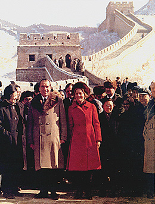

By the end of this section, you will be able to:
* Explain the factors responsible for Richard Nixon’s election in 1968
* Describe the splintering of the Democratic Party in 1968
* Discuss Richard Nixon’s economic policies
* Discuss the major successes of Richard Nixon’s foreign policy

The presidential election of 1968 revealed a rupture of the New Deal coalition that had come together under Franklin Roosevelt in the 1930s. The Democrats were divided by internal dissension over the Vietnam War, the civil rights movement, and the challenges of the New Left. Meanwhile, the Republican candidate, Richard Nixon, won voters in the South, Southwest, and northern suburbs by appealing to their anxieties about civil rights, women’s rights, antiwar protests, and the counterculture taking place around them. Nixon spent his first term in office pushing measures that slowed the progress of civil rights and sought to restore economic stability. His greatest triumphs were in foreign policy. But his largest priority throughout his first term was his reelection in 1972.

# THE “NEW NIXON”

The Republicans held their 1968 national convention from August 5–8 in Miami, Florida. Richard Nixon quickly emerged as the frontrunner for the nomination, ahead of Nelson Rockefeller and Ronald Reagan. This success was not accidental: From 1962, when he lost his bid for the governorship of California, to 1968, Nixon had been collecting political credits by branding himself as a candidate who could appeal to mainstream voters and by tirelessly working for other Republican candidates. In 1964, for example, he vigorously supported Barry Goldwater’s presidential bid and thus built good relationships with the new conservative movement in the Republican Party.

Although Goldwater lost the 1964 election, his vigorous rejection of New Deal state and social legislation, along with his support of states’ rights, proved popular in the Deep South, which had resisted federal efforts at racial integration. Taking a lesson from Goldwater’s experience, Nixon also employed a **southern strategy**{: data-type="term"} in 1968. Denouncing segregation and the denial of the vote to African Americans, he nevertheless maintained that southern states be allowed to pursue racial equality at their own pace and criticized forced integration. Nixon thus garnered the support of South Carolina’s senior senator and avid segregationist Strom Thurmond, which helped him win the Republican nomination on the first ballot.

Nixon also courted northern, blue-collar workers, whom he later called the **silent majority**{: data-type="term"}, to acknowledge their belief that their voices were seldom heard. These voters feared the social changes taking place in the country: Antiwar protests challenged their own sense of patriotism and civic duty, whereas the recreational use of new drugs threatened their cherished principles of self-discipline, and urban riots invoked the specter of a racial reckoning. Government action on behalf of the marginalized raised the question of whether its traditional constituency—the white middle class—would lose its privileged place in American politics. Some felt left behind as the government turned to the problems of African Americans. Nixon’s promises of stability and his emphasis on law and order appealed to them. He portrayed himself as a fervent patriot who would take a strong stand against racial unrest and antiwar protests. Nixon harshly critiqued Lyndon Johnson’s Great Society, and he promised a secret plan to end the war in Vietnam honorably and bring home the troops. He also promised to reform the Supreme Court, which he contended had gone too far in “coddling criminals.” Under Chief Justice Earl Warren, the court had used the due process and equal protection clauses of the Fourteenth Amendment to grant those accused under state law the ability to defend themselves and secure protections against unlawful search and seizure, cruel and unusual punishment, and self-incrimination.

Nixon had found the political capital that would ensure his victory in the suburbs, which produced more votes than either urban or rural areas. He championed “middle America,” which was fed up with social convulsions, and called upon the country to come together. His running mate, Spiro T. Agnew, a former governor of Maryland, blasted the Democratic ticket as fiscally irresponsible and “soft on communism.” Nixon and Agnew’s message thus appealed to northern middle-class and blue-collar whites as well as southern whites who had fled to the suburbs in the wake of the Supreme Court’s pro-integration decision in *Brown v. Board of Education* ([\[link\]](#CNX_History_30_02_Bowling)).

 . Nixon&#x2019;s strategy was to appeal to working- and middle-class suburbanites. This image of him in the White House bowling alley seems calculated to appeal to his core constituency (b)."){: #CNX_History_30_02_Bowling}

# DEMOCRATS IN DISARRAY

By contrast, in early 1968, the political constituency that Lyndon Johnson had cobbled together to win the presidency in 1964 seemed to be falling apart. When Eugene McCarthy, the Democratic senator from Minnesota, announced that he would challenge Johnson in the primaries in an explicitly antiwar campaign, Johnson was overwhelmingly favored by Democratic voters. But then the Tet Offensive in Vietnam exploded on American television screens on January 31, playing out on the nightly news for weeks. On February 27, Walter Cronkite, a highly respected television journalist, offered his opinion that the war in Vietnam was unwinnable. When the votes were counted in New Hampshire on March 12, McCarthy had won twenty of the state’s twenty-four delegates.

McCarthy’s popularity encouraged Robert (Bobby) Kennedy to also enter the race. Realizing that his war policies could unleash a divisive fight within his own party for the nomination, Johnson announced his withdrawal on March 31, fracturing the Democratic Party. One faction consisted of the traditional party leaders who appealed to unionized, blue-collar constituents and white ethnics (Americans with recent European immigrant backgrounds). This group fell in behind Johnson’s vice president, Hubert H. Humphrey, who took up the mainstream party’s torch almost immediately after Johnson’s announcement. The second group consisted of idealistic young activists who had slogged through the snows of New Hampshire to give McCarthy a boost and saw themselves as the future of the Democratic Party. The third group, composed of Catholics, African Americans and other minorities, and some of the young, antiwar element, galvanized around Robert Kennedy ([\[link\]](#CNX_History_30_02_RKennedy)). Finally, there were the southern Democrats, the **Dixiecrats**{: data-type="term"}, who opposed the advances made by the civil rights movement. Some found themselves attracted to the Republican candidate Richard Nixon. Many others, however, supported the third-party candidacy of segregationist George C. Wallace, the former governor of Alabama. Wallace won close to ten million votes, which was 13.5 percent of all votes cast. He was particularly popular in the South, where he carried five states and received forty-six Electoral College votes.

  administration, Robert (Bobby) Kennedy had served as attorney general and had spoken out about racial equality."){: #CNX_History_30_02_RKennedy}

Kennedy and McCarthy fiercely contested the remaining primaries of the 1968 season. There were only fifteen at that time. McCarthy beat Kennedy handily in Wisconsin, Pennsylvania, and Massachusetts. Kennedy took Indiana and Nebraska before losing Oregon to McCarthy. Kennedy’s only hope was that a strong enough showing in the California primary on June 4 might swing uncommitted delegates his way. He did manage to beat McCarthy, winning 46 percent of the vote to McCarthy’s 42 percent, but it was a fruitless victory. As he attempted to exit the Ambassador Hotel in Los Angeles after his victory speech, Kennedy was shot; he died twenty-six hours later. His killer, Sirhan B. Sirhan, a Jordanian immigrant, had allegedly targeted him for advocating military support for Israel in its conflict with neighboring Arab states.

Going into the nominating convention in Chicago in 1968, Humphrey, who promised to pursue the “Politics of Joy,” seemed clearly in command of the regular party apparatus. But the national debates over civil rights, student protests, and the Vietnam War had made 1968 a particularly anguished year, and many people felt anything but joyful. Some party factions hoped to make their voices heard; others wished to disrupt the convention altogether. Among them were antiwar protestors, hippies, and **Yippies**{: data-type="term"}—members of the leftist, anarchistic Youth International Party organized by Jerry Rubin and Abbie Hoffman—who called for the establishment of a new nation consisting of cooperative institutions to replace those currently in existence. To demonstrate their contempt for “the establishment” and the proceedings inside the hall, the Yippies nominated a pig named Pigasus for president.

A chaotic scene developed inside the convention hall and outside at Grant Park, where the protesters camped. Chicago’s mayor, Richard J. Daley, was anxious to demonstrate that he could maintain law and order, especially because several days of destructive rioting had followed the murder of Martin Luther King, Jr. earlier that year. He thus let loose a force of twelve thousand police officers, six thousand members of the Illinois National Guard, and six thousand U.S. Army soldiers. Television cameras caught what later became known as a “police riot”: Armed officers made their way into crowds of law-abiding protesters, clubbing anyone they encountered and setting off tear gas canisters. The protesters fought back. Inside the convention hall, a Democratic senator from Connecticut called for adjournment, whereas other delegates insisted on proceeding. Ironically, Hubert Humphrey received the nomination and gave an acceptance speech in which he spoke in support of “law and order.” When the convention ended, Rubin, Hoffman, and five other protesters (called the “Chicago Seven”) were placed on trial for inciting a riot ([\[link\]](#CNX_History_30_02_Yippies)).

  at the University of Oklahoma. Jerry Rubin (b) visited the campus of the University of Buffalo in March 1970, just one month after his conviction in the Chicago Seven trial. (credit a: modification of work by Richard O. Barry)"){: #CNX_History_30_02_Yippies}

  
Listen to Yippie activist [Jerry Rubin’s 1970 interview][1] with Cleveland news journalist Dorothy Fuldheim.

# THE DOMESTIC NIXON

The images of violence and the impression of things spinning out of control seriously damaged Humphrey’s chances for victory. Many liberals and young antiwar activists, disappointed by his selection over McCarthy and still shocked by the death of Robert Kennedy, did not vote for Humphrey. Others turned against him because of his failure to chastise the Chicago police for their violence. Some resented the fact that Humphrey had received 1,759 delegates on the first ballot at the convention, nearly three times the number won by McCarthy, even though in the primaries, he had received only 2 percent of the popular vote. Many loyal Democratic voters at home, shocked by the violence they saw on television, turned away from their party, which seemed to have attracted dangerous “radicals,” and began to consider Nixon’s promises of law and order.

As the Democratic Party collapsed, Nixon successfully campaigned for the votes of both working- and middle-class white Americans, winning the 1968 election. Although Humphrey received nearly the same percentage of the popular vote, Nixon easily won the Electoral College, gaining 301 votes to Humphrey’s 191 and Wallace’s 46.

Once elected, Nixon began to pursue a policy of deliberate neglect of the civil rights movement and the needs of ethnic minorities. For example, in 1969, for the first time in fifteen years, federal lawyers sided with the state of Mississippi when it sought to slow the pace of school desegregation. Similarly, Nixon consistently showed his opposition to busing to achieve racial desegregation. He saw that restricting African American activity was a way of undercutting a source of votes for the Democratic Party and sought to overhaul the provisions of the Voting Rights Act of 1965. In March 1970, he commented that he did not believe an “open” America had to be homogeneous or fully integrated, maintaining that it was “natural” for members of ethnic groups to live together in their own enclaves. In other policy areas, especially economic ones, Nixon was either moderate or supportive of the progress of African Americans; for example, he expanded affirmative action, a program begun during the Johnson administration to improve employment and educational opportunities for racial minorities.

Although Nixon always kept his eye on the political environment, the economy required attention. The nation had enjoyed seven years of expansion since 1961, but inflation (a general rise in prices) was threatening to constrict the purchasing power of the American consumer and therefore curtail economic expansion. Nixon tried to appeal to fiscal conservatives in the Republican Party, reach out to disaffected Democrats, and, at the same time, work with a Democratic Party-controlled Congress. As a result, Nixon’s approach to the economy seemed erratic. Despite the heavy criticisms he had leveled against the Great Society, he embraced and expanded many of its features. In 1969, he signed a tax bill that eliminated the investment tax credit and moved some two million of the poorest people off the tax rolls altogether. He federalized the food stamp program and established national eligibility requirements, and signed into law the automatic adjustments for inflation of Social Security payments. On the other hand, he won the praise of conservatives with his “New Federalism”—drastically expanding the use of federal “block grants” to states to spend as they wished without strings attached.

By mid-1970, a recession was beginning and unemployment was 6.2 percent, twice the level under Johnson. After earlier efforts at controlling inflation with controlled federal spending—economists assumed that reduced federal spending and borrowing would curb the amount of money in circulation and stabilize prices—Nixon proposed a budget with an $11 billion deficit in 1971. The hope was that more federal funds in the economy would stimulate investment and job creation. When the unemployment rate refused to budge the following year, he proposed a budget with a $25 billion deficit. At the same time, he tried to fight continuing inflation by freezing wages and prices for ninety days, which proved to be only a temporary fix. The combination of unemployment and rising prices posed an unfamiliar challenge to economists whose fiscal policies of either expanding or contracting federal spending could only address one side of the problem at the cost of the other. This phenomenon of “**stagflation**{: data-type="term"}”—a term that combined the economic conditions of stagnation and inflation—outlived the Nixon administration, enduring into the early 1980s.

The origins of the nation’s new economic troubles were not just a matter of policy. Postwar industrial development in Asia and Western Europe—especially in Germany and Japan—had created serious competition to American businesses. By 1971, American appetites for imports left foreign central banks with billions of U.S. currency, which had been fixed to gold in the international monetary and trade agreement of Bretton Woods back in 1944. When foreign dollar holdings exceeded U.S. gold reserves in 1971, President Nixon allowed the dollar to flow freely against the price of gold. This caused an immediate 8 percent devaluation of the dollar, made American goods cheaper abroad, and stimulated exports. Nixon’s move also marked the beginning of the end of the dollar’s dominance in international trade.

The situation was made worse in October 1973, when Syria and Egypt jointly attacked Israel to recover territory that had been lost in 1967, starting the **Yom Kippur War**{: data-type="term" .no-emphasis}. The Soviet Union significantly aided its allies, Egypt and Syria, and the United States supported Israel, earning the enmity of Arab nations. In retaliation, the Organization of Arab Petroleum Exporting Countries (OAPEC) imposed an embargo on oil shipments to the United States from October 1973 to March 1974. The ensuing shortage of oil pushed its price from three dollars a barrel to twelve dollars a barrel. The average price of gasoline in the United States shot from thirty-eight cents a gallon before the embargo to fifty-five cents a gallon in June 1974, and the prices of other goods whose manufacture and transportation relied on oil or gas also rose and did not come down. The oil embargo had a lasting impact on the economy and underscored the nation’s interdependency with international political and economic developments.

Faced with high fuel prices, American consumers panicked. Gas stations limited the amount customers could purchase and closed on Sundays as supplies ran low ([\[link\]](#CNX_History_30_02_GasLine)). To conserve oil, Congress reduced the speed limit on interstate highways to fifty-five miles per hour. People were asked to turn down their thermostats, and automobile manufacturers in Detroit explored the possibility of building more fuel-efficient cars. Even after the embargo ended, prices continued to rise, and by the end of the Nixon years in 1974, inflation had soared to 12.2 percent.

 ![Photograph (a) shows a man standing beside a gas station reading a newspaper article with the headline &#x201C;Gas Rationing Set Monday.&#x201D; A sign that reads &#x201C;Sorry No Gasoline&#x201D; is visible in the background. Photograph (b) shows a sign with three stripes of color. The uppermost stripe, which is green, bears the message &#x201C;Green Flag/Everyone Welcome.&#x201D; The middle stripe, which is yellow, bears the message &#x201C;Yellow Flag/Commercial/Trucks, Cars/Burden of Proof on Customer.&#x201D; The bottom stripe, which is red, bears the message &#x201C;Red Flag/Closed/No Gas.&#x201D;](../resources/CNX_History_30_02_GasLine.jpg "The oil shortage triggered a rush to purchase gasoline, and gas stations around the country were choked with cars waiting to fill up. Eventually, fuel shortages caused gas stations to develop various ways to ration gasoline to their customers (a), such as the &#x201C;flag policy&#x201D; used by gas dealers in Oregon (b)."){: #CNX_History_30_02_GasLine}

Although Nixon’s economic and civil rights policies differed from those of his predecessors, in other areas, he followed their lead. President Kennedy had committed the nation to putting a man on the moon before the end of the decade. Nixon, like Johnson before him, supported significant budget allocations to the National Aeronautics and Space Administration (NASA) to achieve this goal. On July 20, 1969, hundreds of millions of people around the world watched as astronauts Neil Armstrong and Edwin “Buzz” Aldrin walked on the surface of the moon and planted the U.S. flag. Watching from the White House, President Nixon spoke to the astronauts via satellite phone. The entire project cost the American taxpayer some $25 billion, approximately 4 percent of the nation’s gross national product, and was such a source of pride for the nation that the Soviet Union and China refused to televise it. Coming amid all the struggles and crises that the country was enduring, the moon landing gave citizens a sense of accomplishment that stood in stark contrast to the foreign policy failures, growing economic challenges, and escalating divisions at home.

# NIXON THE DIPLOMAT

Despite the many domestic issues on Nixon’s agenda, he prioritized foreign policy and clearly preferred bold and dramatic actions in that arena. Realizing that five major economic powers—the United States, Western Europe, the Soviet Union, China, and Japan—dominated world affairs, he sought opportunities for the United States to pit the others against each other. In 1969, he announced a new Cold War principle known as the Nixon Doctrine, a policy whereby the United States would continue to assist its allies but would not assume the responsibility of defending the entire non-Communist world. Other nations, like Japan, needed to assume more of the burden of defending themselves.

Playing what was later referred to as “the China card,” Nixon abruptly reversed two decades of U.S. diplomatic sanctions and hostility to the Communist regime in the People’s Republic of China, when he announced, in August 1971, that he would personally travel to Beijing and meet with China’s leader, Chairman Mao Zedong, in February 1972 ([\[link\]](#CNX_History_30_02_NixonWall)). Nixon hoped that opening up to the Chinese government would prompt its bitter rival, the Soviet Union, to compete for global influence and seek a more productive relationship with the United States. He also hoped that establishing a friendly relationship with China would isolate North Vietnam and ease a peace settlement, allowing the United States to extract its troops from the war honorably. Concurring that the Soviet Union should be restrained from making advances in Asia, Nixon and Chinese premier Zhou Enlai agreed to disagree on several issues and ended up signing a friendship treaty. They promised to work towards establishing trade between the two nations and to eventually establishing full diplomatic relations with each other.

 {: #CNX_History_30_02_NixonWall}

Continuing his strategy of pitting one Communist nation against another, in May 1972, Nixon made another newsworthy trip, traveling to Moscow to meet with the Soviet leader Leonid Brezhnev. The two discussed a policy of **détente**{: data-type="term"}, a relaxation of tensions between their nations, and signed the Strategic Arms Limitation Treaty (SALT), which limited each side to deploying only two antiballistic missile systems. It also limited the number of nuclear missiles maintained by each country. In 1974, a protocol was signed that reduced antiballistic missile sites to one per country, since neither country had yet begun to build its second system. Moreover, the two sides signed agreements to allow scientific and technological exchanges, and promised to work towards a joint space mission.

# Section Summary

When a new Republican constituency of moderate southerners and northern, blue-collar workers voted Richard Nixon into the White House in 1968, many were hopeful. In the wake of antiwar and civil rights protests, and the chaos of the 1968 Democratic National Convention, many Americans welcomed Nixon’s promise to uphold law and order. During his first term, Nixon strode a moderate, middle path in domestic affairs, attempting with little success to solve the problems of inflation and unemployment through a combination of austerity and deficit spending. He made substantial progress in foreign policy, however, establishing diplomatic relations with China for the first time since the Communist Revolution and entering into a policy of détente with the Soviet Union.

# Review Questions

President Nixon took a bold diplomatic step in early 1972 when he \_\_\_\_\_\_\_\_.

1.  went to Vienna
2.  declared the Vietnam War over
3.  met with Chinese leaders in Beijing
4.  signed the Glasgow Accords
{: data-number-style="upper-alpha"}

C

The blue-collar workers who Nixon called “the silent majority” \_\_\_\_\_\_\_\_.

1.  fled to the suburbs to avoid integration
2.  wanted to replace existing social institutions with cooperatives
3.  opposed the war in Vietnam
4.  believed their opinions were overlooked in the political process
{: data-number-style="upper-alpha"}

D

What caused the rifts in the Democratic Party in the 1968 election?

Many Democrats disliked the fact that Hubert Humphrey had won the Party’s nomination, even though he had done poorly in all the primaries. In November, many who had supported antiwar candidates Eugene McCarthy and the late Robert Kennedy refused to vote. Others voted for segregationist George Wallace. Some working-class Democrats also voted for Richard Nixon.

## Glossary
{: data-type="glossary-title"}

détente
: the relaxation of tensions between the United States and the Soviet Union
{: .definition}

Dixiecrats
: conservative southern Democrats who opposed integration and the other goals of the African American civil rights movement
{: .definition}

silent majority
: a majority whose political will is usually not heard—in this case, northern, white, blue-collar voters
{: .definition}

southern strategy
: a political strategy that called for appealing to southern whites by resisting calls for greater advancements in civil rights
{: .definition}

stagflation
: high inflation combined with high unemployment and slow economic growth
{: .definition}

Yippies
: the Youth International Party, a political party formed in 1967, which called for the establishment of a New Nation consisting of cooperative institutions that would replace those currently in existence
{: .definition}

[1]: http://openstaxcollege.org/l/15JerryRubin
