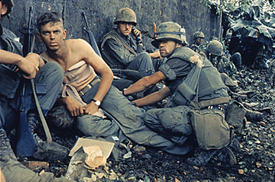
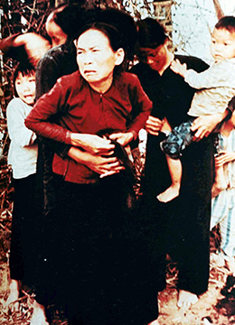

By the end of this section, you will be able to:
* Describe the events that fueled antiwar sentiment in the Vietnam era
* Explain Nixon’s steps to withdraw the United States from the conflict in South Vietnam

As early as 1967, critics of the war in Vietnam had begun to call for the repeal of the Gulf of Tonkin Resolution, which gave President Johnson the authority to conduct military operations in Vietnam in defense of an ally, South Vietnam. Nixon initially opposed the repeal efforts, claiming that doing so might have consequences that reached far beyond Vietnam. Nevertheless, by 1969, he was beginning troop withdrawals from Vietnam while simultaneously looking for a “knockout blow” against the North Vietnamese. In sum, the Nixon administration was in need of an exit strategy.

The escalation of the war, however, made an easy withdrawal increasingly difficult. Officially, the United States was the ally and partner of the South Vietnamese, whose “hearts and minds” it was trying to win through a combination of military assistance and economic development. In reality, however, U.S. soldiers, who found themselves fighting in an inhospitable environment thousands of miles from home to protect people who often resented their presence and aided their enemies, came to regard the Vietnamese as backward, cowardly people and the government of South Vietnam as hopelessly inefficient and corrupt. Instead of winning “hearts and minds,” U.S. warfare in Vietnam cost the lives and limbs of U.S. troops and millions of Vietnamese combatants and civilians ([\[link\]](#CNX_History_30_03_Vietnam)).

 {: #CNX_History_30_03_Vietnam}

For their part, the North Vietnamese forces and the National Liberation Front in South Vietnam also used brutal tactics to terrorize and kill their opponents or effectively control their territory. Political assassinations and forced indoctrination were common. Captured U.S. soldiers frequently endured torture and imprisonment.

### MY LAI

Racism on the part of some U.S. soldiers and a desire to retaliate against those they perceived to be responsible for harming U.S. troops affected the conduct of the war. A war correspondent who served in Vietnam noted, “In motivating the GI to fight by appealing to his racist feelings, the United States military discovered that it had liberated an emotion over which it was to lose control.” It was not unusual for U.S. soldiers to evacuate and burn villages suspected of shielding Viet Cong fighters, both to deprive the enemy of potential support and to enact revenge for enemy brutality. Troops shot at farmers’ water buffalo for target practice. American and South Vietnamese use of napalm, a jellied gasoline that sticks to the objects it burns, was common. Originally developed to burn down structures during World War II, in Vietnam, it was directed against human beings as well, as had occurred during the Korean War.

Vietnam Veterans against the War Statement

Many U.S. soldiers disapproved of the actions of their fellow troops. Indeed, a group of Vietnam veterans formed the organization Vietnam Veterans Against the War (VVAW). Small at first, it grew to perhaps as many as twenty thousand members. In April 1971, John Kerry, a former lieutenant in the U.S. Navy and a member of VVAW, testified before the U.S. Senate Committee on Foreign Relations about conditions in Vietnam based on his personal observations:

<q>I would like to talk on behalf of all those veterans and say that several months ago in Detroit we had an investigation at which over 150 honorably discharged, and many very highly decorated, veterans testified to war crimes committed in Southeast Asia. These were not isolated incidents but crimes committed on a day-to-day basis with the full awareness of officers at all levels of command. . . . They relived the absolute horror of what this country, in a sense, made them do.</q> <q>They told stories that at times they had personally raped, cut off ears, cut off heads . . . randomly shot at civilians, razed villages . . . and generally ravaged the countryside of South Vietnam in addition to the normal ravage of war and the normal and very particular ravaging which is done by the applied bombing power of this country. . . .</q> <q>We could come back to this country, we could be quiet, we could hold our silence, we could not tell what went on in Vietnam, but we feel because of what threatens this country, not the reds \[Communists\], but the crimes which we are committing that threaten it, that we have to speak out. * * *
{: data-type="newline"}

 —John Kerry, April 23, 1971</q>

In what way did the actions of U.S. soldiers in Vietnam threaten the United States?

On March 16, 1968, men from the U.S. Army’s Twenty-Third Infantry Division committed one of the most notorious atrocities of the war. About one hundred soldiers commanded by Captain Ernest Medina were sent to destroy the village of My Lai, which was suspected of hiding Viet Cong fighters. Although there was later disagreement regarding the captain’s exact words, the platoon leaders believed the order to destroy the enemy included killing women and children. Having suffered twenty-eight casualties in the past three months, the men of Charlie Company were under severe stress and extremely apprehensive as they approached the village. Two platoons entered it, shooting randomly. A group of seventy to eighty unarmed people, including children and infants, were forced into an irrigation ditch by members of the First Platoon under the command of Lt. William L. Calley, Jr. Despite their proclamations of innocence, the villagers were shot ([\[link\]](#CNX_History_30_03_MyLai)). Houses were set on fire, and as the inhabitants tried to flee, they were killed with rifles, machine guns, and grenades. The U.S. troops were never fired upon, and one soldier later testified that he did not see any man who looked like a Viet Cong fighter.

 {: #CNX_History_30_03_MyLai}

The precise number of civilians killed that day is unclear: The numbers range from 347 to 504. None were armed. Although not all the soldiers in My Lai took part in the killings, no one attempted to stop the massacre before the arrival by helicopter of Warrant Officer Hugh Thompson, who, along with his crew, attempted to evacuate women and children. Upon returning to his base, Thompson immediately reported the events taking place at My Lai. Shortly thereafter, Medina ordered Charlie Company to cease fire. Although Thompson’s crewmembers confirmed his account, none of the men from Charlie Company gave a report, and a cover-up began almost immediately. The army first claimed that 150 people, the majority of them Viet Cong, had been killed during a firefight with Charlie Company.

Hearing details from friends in Charlie Company, a helicopter gunner by the name of Ron Ridenhour began to conduct his own investigation and, in April 1969, wrote to thirty members of Congress, demanding an investigation. By September 1969, the army charged Lt. Calley with premeditated murder. Many Americans were horrified at the graphic footage of the massacre; the incident confirmed their belief that the war was unjust and not being fought on behalf of the Vietnamese people. However, nearly half of the respondents to a Minnesota poll did not believe that the incident at My Lai had actually happened. U.S. soldiers could not possibly do such horrible things, they felt; they were certain that American goals in Vietnam were honorable and speculated that the antiwar movement had concocted the story to generate sympathy for the enemy.

Calley was found guilty in March 1971, and sentenced to life in prison. Nationwide, hundreds of thousands of Americans joined a “Free Calley” campaign. Two days later, President Nixon released him from custody and placed him under him house arrest at Fort Benning, Georgia. In August of that same year, Calley’s sentence was reduced to twenty years, and in September 1974, he was paroled. The only soldier convicted in the massacre, he spent a total of three-and-a-half years under house arrest for his crimes.

### BATTLES AT HOME

As the conflict wore on and reports of brutalities increased, the antiwar movement grew in strength. To take the political pressure off himself and his administration, and find a way to exit Vietnam “with honor,” Nixon began the process of **Vietnamization**{: data-type="term"}, turning more responsibility for the war over to South Vietnamese forces by training them and providing American weaponry, while withdrawing U.S. troops from the field. At the same time, however, Nixon authorized the bombing of neighboring Cambodia, which had declared its neutrality, in an effort to destroy North Vietnamese and Viet Cong bases within that country and cut off supply routes between North and South Vietnam. The bombing was kept secret from both Congress and the American public. In April 1970, Nixon decided to follow up with an invasion of Cambodia.

The invasion could not be kept secret, and when Nixon announced it on television on April 30, 1970, protests sprang up across the country. The most tragic and politically damaging occurred on May 1, 1970, at Kent State University in Ohio. Violence erupted in the town of Kent after an initial student demonstration on campus, and the next day, the mayor asked Ohio’s governor to send in the National Guard. Troops were sent to the university’s campus, where students had set fire to the ROTC building and were fighting off firemen and policemen trying to extinguish it. The National Guard used teargas to break up the demonstration, and several students were arrested ([\[link\]](#CNX_History_30_03_KentState)).

 , provoking protests on college campuses across the country. Within days, the governor of Ohio had called in the National Guard in response to student demonstrations at Kent State University. Bill Whitbeck, who was a student majoring in photo illustration at Kent State University in May 1970, captured this image (b) on campus on May 3, one day before the shootings that would result in four student deaths. (credit b: modification of work by Bill Whitbeck)"){: #CNX_History_30_03_KentState}

Tensions came to a head on May 4. Although campus officials had called off a planned demonstration, some fifteen hundred to two thousand students assembled, throwing rocks at a security officer who ordered them to leave. Seventy-seven members of the National Guard, with bayonets attached to their rifles, approached the students. After forcing most of them to retreat, the troops seemed to depart. Then, for reasons that are still unknown, they halted and turned; many began to fire at the students. Nine students were wounded; four were killed. Two of the dead had simply been crossing campus on their way to class. Peace was finally restored when a faculty member pleaded with the remaining students to leave.

  
Read the *New York Times* account of the [shootings at Kent State University][1] and view (under the headline) one of the most iconic photographs in American history.

News of the Kent State shootings shocked students around the country. Millions refused to attend class, as strikes were held at hundreds of colleges and high schools across the United States. On May 8, an antiwar protest took place in New York City, and the next day, 100,000 protesters assembled in Washington, DC. Not everyone sympathized with the slain students, however. Nixon had earlier referred to student demonstrators as “bums,” and construction workers attacked the New York City protestors. A Gallup poll revealed that most Americans blamed the students for the tragic events at Kent State.

On May 15, a similar tragedy took place at Jackson State College, an African American college in Jackson, Mississippi. Once again, students gathered on campus to protest the invasion of Cambodia, setting fires and throwing rocks. The police arrived to disperse the protesters, who had gathered outside a women’s dormitory. Shortly after midnight, the police opened fire with shotguns. The dormitory windows shattered, showering people with broken glass. Twelve were wounded, and two young men, one a student at the college and the other a local high school student, were killed.

### PULLING OUT OF THE QUAGMIRE

Ongoing protests, campus violence, and the expansion of the war into Cambodia deeply disillusioned Americans about their role in Vietnam. Understanding the nation’s mood, Nixon dropped his opposition to a repeal of the Gulf of Tonkin Resolution of 1964. In January 1971, he signed Congress’s revocation of the notorious blanket military authorization. Gallup polls taken in May of that year revealed that only 28 percent of the respondents supported the war; many felt it was not only a mistake but also immoral.

Just as influential as antiwar protests and campus violence in turning people against the war was the publication of documents the media dubbed the **Pentagon Papers**{: data-type="term"} in June 1971. These were excerpts from a study prepared during the Johnson administration that revealed the true nature of the conflict in Vietnam. The public learned for the first time that the United States had been planning to oust Ngo Dinh Diem from the South Vietnamese government, that Johnson meant to expand the U.S. role in Vietnam and bomb North Vietnam even as he stated publicly that he had no intentions of doing so, and that his administration had sought to deliberately provoke North Vietnamese attacks in order to justify escalating American involvement. Copies of the study had been given to the *New York Times* and other newspapers by Daniel Ellsberg, one of the military analysts who had contributed to it. To avoid setting a precedent by allowing the press to publish confidential documents, Nixon’s attorney general, John Mitchell, sought an injunction against the *New York Times* to prevent its publication of future articles based on the Pentagon Papers. The newspaper appealed. On June 30, 1971, the U.S. Supreme Court held that the government could not prevent the publication of the articles.

Realizing that he must end the war but reluctant to make it look as though the United States was admitting its failure to subdue a small Asian nation, Nixon began maneuvering to secure favorable peace terms from the North Vietnamese. Thanks to his diplomatic efforts in China and the Soviet Union, those two nations cautioned North Vietnam to use restraint. The loss of strong support by their patrons, together with intensive bombing of Hanoi and the mining of crucial North Vietnamese harbors by U.S. forces, made the North Vietnamese more willing to negotiate.

Nixon’s actions had also won him popular support at home. By the 1972 election, voters again favored his Vietnam policy by a ratio of two to one. On January 27, 1973, Secretary of State Henry Kissinger signed an accord with Le Duc Tho, the chief negotiator for the North Vietnamese, ending American participation in the war. The United States was given sixty days to withdraw its troops, and North Vietnam was allowed to keep its forces in places it currently occupied. This meant that over 100,000 northern soldiers would remain in the South—ideally situated to continue the war with South Vietnam. The United States left behind a small number of military advisors as well as equipment, and Congress continued to approve funds for South Vietnam, but considerably less than in earlier years. So the war continued, but it was clear the South could not hope to defeat the North.

As the end was nearing, the United States conducted several operations to evacuate children from the South. On the morning of April 29, 1975, as North Vietnamese and Viet Cong forces moved through the outskirts of Saigon, orders were given to evacuate Americans and South Vietnamese who had supported the United States. Unable to use the airport, helicopters ferried Americans and Vietnamese refugees who had fled to the American embassy to ships off the coast. North Vietnamese forces entered Saigon the next day, and the South surrendered.

The war had cost the lives of more than 1.5 million Vietnamese combatants and civilians, as well as over 58,000 U.S. troops. But the war had caused another, more intangible casualty: the loss of consensus, confidence, and a sense of moral high ground in the American political culture.

### Section Summary

As the war in Vietnam raged on, Americans were horrified to hear of atrocities committed by U.S. soldiers, such as the 1968 massacre of villagers at My Lai. To try to end the conflict, Nixon escalated it by bombing Hanoi and invading Cambodia; his actions provoked massive antiwar demonstrations in the United States that often ended in violence, such as the tragic shooting of unarmed student protestors at Kent State University in 1970. The 1971 release of the Pentagon Papers revealed the true nature of the war to an increasingly disapproving and disenchanted public. Secretary of State Henry Kissinger eventually drafted a peace treaty with North Vietnam, and, after handing over responsibility for the war to South Vietnam, the United States withdrew its troops in 1973. South Vietnam surrendered to the North two years later.

### Review Questions

The demonstrations at Kent State University in May 1970 were held to protest what event?

1.  the My Lai massacre
2.  the North Vietnamese invasion of Saigon
3.  the invasion of Cambodia by U.S. forces
4.  the signing of a peace agreement with North Vietnam
{: type="A"}

C

Recognizing that ongoing protests and campus violence reflected a sea change in public opinion about the war, in 1971 Nixon \_\_\_\_\_\_\_\_.

1.  repealed the Gulf of Tonkin Resolution
2.  postponed the invasion of Cambodia
3.  released the Pentagon Papers
4.  covered up the My Lai massacre
{: type="A"}

A

According to John Kerry, how did many U.S. soldiers treat Vietnamese civilians?

According to John Kerry’s testimony, Vietnamese civilians were often subjected to shocking violence. Soldiers raped, mutilated, shot at, and brutally murdered civilians. Troops also intentionally destroyed Vietnamese villages, well beyond the destruction typically wrought by war.

### Glossary
{: data-type="glossary-title"}

Pentagon Papers
: government documents leaked to the *New York Times* that revealed the true nature of the conflict in Vietnam and turned many definitively against the war
^

Vietnamization
: the Nixon administration’s policy of turning over responsibility for the defense of South Vietnam to Vietnamese forces

[1]: http://openstaxcollege.org/l/15KentState
