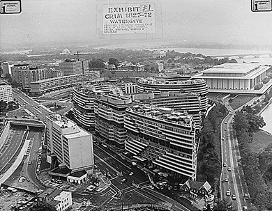
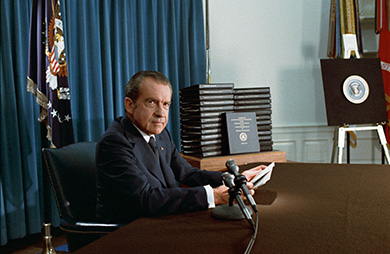
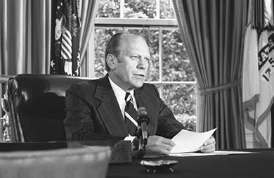

By the end of this section, you will be able to:
* Describe the actions that Nixon and his confederates took to ensure his reelection in 1972
* Explain the significance of the Watergate crisis
* Describe Gerald Ford’s domestic policies and achievements in foreign affairs

Feeling the pressure of domestic antiwar sentiment and desiring a decisive victory, Nixon went into the 1972 reelection season having attempted to fashion a “new majority” of moderate southerners and northern, working-class whites. The Democrats, responding to the chaos and failings of the Chicago convention, had instituted new rules on how delegates were chosen, which they hoped would broaden participation and the appeal of the party. Nixon proved unbeatable, however. Even evidence that his administration had broken the law failed to keep him from winning the White House.

### THE ELECTION OF 1972

Following the 1968 nominating convention in Chicago, the process of selecting delegates for the Democratic National Convention was redesigned. The new rules, set by a commission led by George McGovern, awarded delegates based on candidates’ performance in state primaries ([\[link\]](#CNX_History_30_04_1968Elect)). As a result, a candidate who won no primaries could not receive the party’s nomination, as Hubert Humphrey had done in Chicago. This system gave a greater voice to people who voted in the primaries and reduced the influence of party leaders and power brokers.

  became the first African American woman to be elected to the House of Representatives. In January 1972, she announced her intention to run for the Democratic presidential nomination. The nomination eventually went to George McGovern (b), an outspoken opponent of the war in Vietnam. "){: #CNX_History_30_04_1968Elect}

It also led to a more inclusive political environment in which Shirley Chisholm received 156 votes for the Democratic nomination on the first ballot ([\[link\]](#CNX_History_30_04_1968Elect)). Eventually, the nomination went to George McGovern, a strong opponent of the Vietnam War. Many Democrats refused to support his campaign, however. Working- and middle-class voters turned against him too after allegations that he supported women’s right to an abortion and the decriminalization of drug use. McGovern’s initial support of vice presidential candidate Thomas Eagleton in the face of revelations that Eagleton had undergone electroshock treatment for depression, followed by his withdrawal of that support and acceptance of Eagleton’s resignation, also made McGovern look indecisive and unorganized.

Nixon and the Republicans led from the start. To increase their advantage, they attempted to paint McGovern as a radical leftist who favored amnesty for draft dodgers. In the Electoral College, McGovern carried only Massachusetts and Washington, DC. Nixon won a decisive victory of 520 electoral votes to McGovern’s 17. One Democrat described his role in McGovern’s campaign as “recreation director on the Titanic.”

### HIGH CRIMES AND MISDEMEANORS

Nixon’s victory over a Democratic party in disarray was the most remarkable landslide since Franklin D. Roosevelt’s reelection in 1936. But Nixon’s victory was short-lived, however, for it was soon discovered that he and members of his administration had routinely engaged in unethical and illegal behavior during his first term. Following the publication of the Pentagon Papers, for instance, the “**plumbers**{: data-type="term"},” a group of men used by the White House to spy on the president’s opponents and stop leaks to the press, broke into the office of Daniel Ellsberg’s psychiatrist to steal Ellsberg’s file and learn information that might damage his reputation.

During the presidential campaign, the Committee to Re-Elect the President (CREEP) decided to play “dirty tricks” on Nixon’s opponents. Before the New Hampshire Democratic primary, a forged letter supposedly written by Democratic-hopeful Edmund Muskie in which he insulted French Canadians, one of the state’s largest ethnic groups, was leaked to the press. Men were assigned to spy on both McGovern and Senator Edward Kennedy. One of them managed to masquerade as a reporter on board McGovern’s press plane. Men pretending to work for the campaigns of Nixon’s Democratic opponents contacted vendors in various states to rent or purchase materials for rallies; the rallies were never held, of course, and Democratic politicians were accused of failing to pay the bills they owed.

CREEP’s most notorious operation, however, was its break-in at the offices of the Democratic National Committee (DNC) in the Watergate office complex in Washington, DC, as well as its subsequent cover-up. On the evening of June 17, 1972, the police arrested five men inside DNC headquarters ([\[link\]](#CNX_History_30_04_Watergate)). According to a plan originally proposed by CREEP’s general counsel and White House plumber G. Gordon Liddy, the men were to wiretap DNC telephones. The FBI quickly discovered that two of the men had E. Howard Hunt’s name in their address books. Hunt was a former CIA officer and also one of the plumbers. In the following weeks, yet more connections were found between the burglars and CREEP, and in October 1972, the FBI revealed evidence of illegal intelligence gathering by CREEP for the purpose of sabotaging the Democratic Party. Nixon won his reelection handily in November. Had the president and his reelection team not pursued a strategy of dirty tricks, Richard Nixon would have governed his second term with one of the largest political leads in the twentieth century.

 {: #CNX_History_30_04_Watergate}

In the weeks following the Watergate break-in, Bob Woodward and Carl Bernstein, reporters for *The Washington Post*, received information from several anonymous sources, including one known to them only as “**Deep Throat**{: data-type="term"},” that led them to realize the White House was deeply implicated in the break-in. As the press focused on other events, Woodward and Bernstein continued to dig and publish their findings, keeping the public’s attention on the unfolding scandal. Years later, Deep Throat was revealed to be Mark Felt, then the FBI’s associate director.

### THE WATERGATE CRISIS

Initially, Nixon was able to hide his connection to the break-in and the other wrongdoings alleged against members of CREEP. However, by early 1973, the situation quickly began to unravel. In January, the Watergate burglars were convicted, along with Hunt and Liddy. Trial judge John Sirica was not convinced that all the guilty had been discovered. In February, confronted with evidence that people close to the president were connected to the burglary, the Senate appointed the Watergate Committee to investigate. Ten days later, in his testimony before the Senate Judiciary Committee, L. Patrick Gray, acting director of the FBI, admitted destroying evidence taken from Hunt’s safe by John Dean, the White House counsel, after the burglars were caught.

On March 23, 1973, Judge Sirica publicly read a letter from one of the Watergate burglars, alleging that perjury had been committed during the trial. Less than two weeks later, Jeb Magruder, a deputy director of CREEP, admitted lying under oath and indicated that Dean and John Mitchell, who had resigned as attorney general to become the director of CREEP, were also involved in the break-in and its cover-up. Dean confessed, and on April 30, Nixon fired him and requested the resignation of his aides John Ehrlichman and H. R. Haldeman, also implicated. To defuse criticism and avoid suspicion that he was participating in a cover-up, Nixon also announced the resignation of the current attorney general, Richard Kleindienst, a close friend, and appointed Elliott Richardson to the position. In May 1973, Richardson named Archibald Cox special prosecutor to investigate the Watergate affair.

Throughout the spring and the long, hot summer of 1973, Americans sat glued to their television screens, as the major networks took turns broadcasting the Senate hearings. One by one, disgraced former members of the administration confessed, or denied, their role in the Watergate scandal. Dean testified that Nixon was involved in the conspiracy, allegations the president denied. In March 1974, Haldeman, Ehrlichman, and Mitchell were indicted and charged with conspiracy.

Without evidence clearly implicating the president, the investigation might have ended if not for the testimony of Alexander Butterfield, a low-ranking member of the administration, that a voice-activated recording system had been installed in the Oval Office. The President’s most intimate conversations had been caught on tape. Cox and the Senate subpoenaed them.

  
Listen to [excerpts][1] from Nixon’s White House tapes. Some of the recordings are a bit difficult to hear because of static. Transcripts are also available at this site.

Nixon, however, refused to hand the tapes over and cited **executive privilege**{: data-type="term"}, the right of the president to refuse certain subpoenas. When he offered to supply summaries of the conversations, Cox refused. On October 20, 1973, in an event that became known as the Saturday Night Massacre, Nixon ordered Attorney General Richardson to fire Cox. Richardson refused and resigned, as did Deputy Attorney General William Ruckelshaus when confronted with the same order. Control of the Justice Department then fell to Solicitor General Robert Bork, who complied with Nixon’s order. In December, the House Judiciary Committee began its own investigation to determine whether there was enough evidence of wrongdoing to impeach the president.

The public was enraged by Nixon’s actions. It seemed as though the president had placed himself above the law. Telegrams flooded the White House. The House of Representatives began to discuss impeachment. In April 1974, when Nixon agreed to release transcripts of the tapes, it was too little, too late ([\[link\]](#CNX_History_30_04_Tapes)). Yet, while revealing nothing about Nixon’s knowledge of Watergate, the transcripts showed him to be coarse, dishonest, and cruel.

 {: #CNX_History_30_04_Tapes}

At the end of its hearings, in July 1974, the House Judiciary Committee voted to impeach. However, before the full House could vote, the U.S. Supreme Court ordered Nixon to release the actual tapes of his conversations, not just transcripts or summaries. One of the tapes revealed that he had in fact been told about White House involvement in the Watergate break-in shortly after it occurred. In a speech on August 5, 1974, Nixon, pleading a poor memory, accepted blame for the Watergate scandal. Warned by other Republicans that he would be found guilty by the Senate and removed from office, he resigned the presidency on August 8.

Nixon’s resignation, which took effect the next day, did not make the Watergate scandal vanish. Instead, it fed a growing suspicion of government felt by many. The events of Vietnam had already showed that the government could not be trusted to protect the interests of the people or tell them the truth. For many, Watergate confirmed these beliefs, and the suffix “-gate” attached to a word has since come to mean a political scandal.

### FORD NOT A LINCOLN

When Gerald R. Ford took the oath of office on August 9, 1974, he understood that his most pressing task was to help the country move beyond the Watergate scandal. His declaration that “Our long national nightmare is over. . . . \[O\]ur great Republic is a government of laws and not of men” was met with almost universal applause.

It was indeed an unprecedented time. Ford was the first vice president chosen under the terms of the Twenty-Fifth Amendment, which provides for the appointment of a vice president in the event the incumbent dies or resigns; Nixon had appointed Ford, a longtime House representative from Michigan known for his honesty, following the resignation of embattled vice president Spiro T. Agnew over a charge of failing to report income—a lenient charge since this income stemmed from bribes he had received as the governor of Maryland. Ford was also the first vice president to take office after a sitting president’s resignation, and the only chief executive never elected either president or vice president. One of his first actions as president was to grant Richard Nixon a full pardon ([\[link\]](#CNX_History_30_04_Pardon)). Ford thus prevented Nixon’s indictment for any crimes he may have committed in office and ended criminal investigations into his actions. The public reacted with suspicion and outrage. Many were convinced that the extent of Nixon’s wrongdoings would now never been known and he would never be called to account for them. When Ford chose to run for the presidency in 1976, the pardon returned to haunt him.

 {: #CNX_History_30_04_Pardon}

As president, Ford confronted monumental issues, such as inflation, a depressed economy, and chronic energy shortages. He established his policies during his first year in office, despite opposition from a heavily Democratic Congress. In October 1974, he labeled inflation the country’s most dangerous public enemy and sought a grassroots campaign to curtail it by encouraging people to be disciplined in their consuming habits and increase their savings. The campaign was titled “Whip Inflation Now” and was advertised on brightly colored “Win” buttons volunteers were to wear. When recession became the nation’s most serious domestic problem, Ford shifted to measures aimed at stimulating the economy. Still fearing inflation, however, he vetoed a number of nonmilitary appropriations bills that would have increased the already-large budget deficit.

Ford’s economic policies ultimately proved unsuccessful. Because of opposition from a Democratic Congress, his foreign policy accomplishments were also limited. When he requested money to assist the South Vietnamese government in its effort to repel North Vietnamese forces, Congress refused. Ford was more successful in other parts of the world. He continued Nixon’s policy of détente with the Soviet Union, and he and Secretary of State Kissinger achieved further progress in the second round of SALT talks. In August 1975, Ford went to Finland and signed the Helsinki Accords with Soviet premier Leonid Brezhnev. This agreement essentially accepted the territorial boundaries that had been established at the end of World War II in 1945. It also exacted a pledge from the signatory nations that they would protect human rights within their countries. Many immigrants to the United States protested Ford’s actions, because it seemed as though he had accepted the status quo and left their homelands under Soviet domination. Others considered it a belated American acceptance of the world as it really was.

### Section Summary

In 1972, President Nixon faced an easy reelection against a Democratic Party in disarray. But even before his landslide victory, evidence had surfaced that the White House was involved in the break-in at the DNC’s headquarters at the Watergate office complex. As the investigation unfolded, the depths to which Nixon and his advisers had sunk became clear. Some twenty-five of Nixon’s aides were indicted for criminal activity, and he became the first president impeached since Andrew Johnson and the first to resign from office. His successor, Gerald Ford, was unable to solve the pressing problems the United States faced or erase the stain of Watergate.

### Review Questions

The agreement Gerald Ford signed with the leader of the Soviet Union that ended the territorial issues remaining from World War II was \_\_\_\_\_\_\_\_.

1.  the Moscow Communiqué
2.  the Beijing Treaty
3.  the Iceland Protocol
4.  the Helsinki Accords
{: type="A"}

D

Of these figures, who was *not* indicted following the Watergate break-in and cover-up?

1.  John Mitchell
2.  Bob Woodward
3.  John Ehrlichman
4.  H.R. Haldeman
{: type="A"}

B

In what types of unethical and illegal activities did the White House plumbers and the “dirty tricks” squad engage?

The White House plumbers spied on Nixon’s political opponents and engineered ways to embarrass them. They attempted to locate information with which to discredit Daniel Ellsberg by stealing files from the office of his psychiatrist, and they broke into DNC headquarters in the Watergate complex with the intention of wiretapping the phones.

### Glossary
{: data-type="glossary-title"}

Deep Throat
: the anonymous source, later revealed to be associate director of the FBI Mark Felt, who supplied reporters Bob Woodward and Carl Bernstein with information about White House involvement in the Watergate break-in
^

executive privilege
: the right of the U.S. president to refuse subpoenas requiring him to disclose private communications on the grounds that this might interfere with the functioning of the executive branch
^

plumbers
: men used by the White House to spy on and sabotage President Nixon’s opponents and stop leaks to the press

[1]: http://openstax.org/l/15NixonTapes
