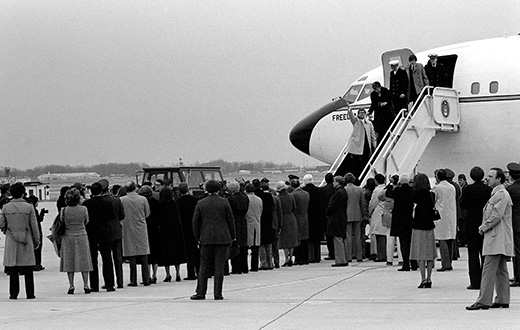

By the end of this section, you will be able to:
* Explain why Gerald Ford lost the election of 1976
* Describe Jimmy Carter’s domestic and foreign policy achievements
* Discuss how the Iranian hostage crisis affected the Carter presidency

At his inauguration in January 1977, President Jimmy Carter began his speech by thanking outgoing president Gerald Ford for all he had done to “heal” the scars left by Watergate. American gratitude had not been great enough to return Ford to the Oval Office, but enthusiasm for the new president was not much greater in the new atmosphere of disillusionment with political leaders. Indeed, Carter won his party’s nomination and the presidency largely because the Democratic leadership had been decimated by assassination and the taint of Vietnam, and he had carefully positioned himself as an outsider who could not be blamed for current policies. Ultimately, Carter’s presidency proved a lackluster one that was marked by economic stagnation at home and humiliation overseas.

# THE ELECTION OF 1976

President Ford won the Republican nomination for the presidency in 1976, narrowly defeating former California governor Ronald Reagan, but he lost the election to his Democratic opponent Jimmy Carter. Carter ran on an “anti-Washington” ticket, making a virtue of his lack of experience in what was increasingly seen as the corrupt politics of the nation’s capital. Accepting his party’s nomination, the former governor of Georgia pledged to combat racism and sexism as well as overhaul the tax structure. He openly proclaimed his faith as a born-again Christian and promised to change the welfare system and provide comprehensive healthcare coverage for neglected citizens who deserved compassion. Most importantly, Jimmy Carter promised that he would “never lie.”

Ford’s pardon of Richard Nixon had alienated many Republicans. That, combined with the stagnant economy, cost him votes, and Jimmy Carter, an engineer and former naval officer who portrayed himself as a humble peanut farmer, prevailed, carrying all the southern states, except Virginia and Oklahoma ([\[link\]](#CNX_History_30_05_1976Elect)). Ford did well in the West, but Carter received 50 percent of the popular vote to Ford’s 48 percent, and 297 electoral votes to Ford’s 240.

  and Democratic challenger Jimmy Carter dueled in Philadelphia in 1976, during the first televised presidential debate since that between Richard Nixon and John F. Kennedy in 1960."){: #CNX_History_30_05_1976Elect}

  
In the mid-1970s, the United States celebrated the two-hundredth anniversary of its independence from Great Britain. Peruse the [collection of patriotic bicentennial memorabilia][1] at the Gerald R. Ford Presidential Library.

# ON THE INSIDE

Making a virtue of his lack of political experience, especially in Washington, Jimmy Carter took office with less practical experience in executive leadership and the workings of the national government than any president since Calvin Coolidge. His first executive act was to fulfill a campaign pledge to grant unconditional amnesty to young men who had evaded the draft during the Vietnam War. Despite the early promise of his rhetoric, within a couple of years of his taking office, liberal Democrats claimed Carter was the most conservative Democratic president since Grover Cleveland.

In trying to manage the relatively high unemployment rate of 7.5 percent and inflation that had risen into the double digits by 1978, Carter was only marginally effective. His tax reform measure of 1977 was weak and failed to close the grossest of loopholes. His deregulation of major industries, such as aviation and trucking, was intended to force large companies to become more competitive. Consumers benefited in some ways: For example, airlines offered cheaper fares to beat their competitors. However, some companies, like Pan American World Airways, instead went out of business. Carter also expanded various social programs, improved housing for the elderly, and took steps to improve workplace safety.

Because the high cost of fuel continued to hinder economic expansion, the creation of an energy program became a central focus of his administration. Carter stressed energy conservation, encouraging people to insulate their houses and rewarding them with tax credits if they did so, and pushing for the use of coal, nuclear power, and alternative energy sources such as solar power to replace oil and natural gas. To this end, Carter created the Department of Energy.

# CARTER AND A NEW DIRECTION IN FOREIGN AFFAIRS

Carter believed that U.S. foreign policy should be founded upon deeply held moral principles and national values. The mission in Vietnam had failed, he argued, because American actions there were contrary to moral values. His dedication to peace and human rights significantly changed the way that the United States conducted its foreign affairs. He improved relations with China, ended military support to Nicaraguan dictator Anastasio Somoza, and helped arrange for the Panama Canal to be returned to Panamanian control in 1999. He agreed to a new round of talks with the Soviet Union (SALT II) and brought Israeli prime minister Menachem Begin and Egyptian president Anwar Sadat to the United States to discuss peace between their countries. Their meetings at Camp David, the presidential retreat in Maryland, led to the signing of the Camp David Accords in September 1978 ([\[link\]](#CNX_History_30_05_SadatBegin)). This in turn resulted in the drafting of a historic peace treaty between Egypt and Israel in 1979.

  and Israel&#x2019;s Menachem Begin (right) at Camp David in 1978. Sadat was assassinated in 1981, partly because of his willingness to make peace with Israel."){: #CNX_History_30_05_SadatBegin}

Despite achieving many successes in the area of foreign policy, Carter made a more controversial decision in response to the Soviet Union’s 1979 invasion of Afghanistan. In January 1980, he declared that if the USSR did not withdraw its forces, the United States would boycott the 1980 Summer Olympic Games in Moscow. The Soviets did not retreat, and the United States did not send a team to Moscow. Only about half of the American public supported this decision, and despite Carter’s call for other countries to join the boycott, very few did so.

# HOSTAGES TO HISTORY

Carter’s biggest foreign policy problem was the Iranian hostage crisis, whose roots lay in the 1950s. In 1953, the United States had assisted Great Britain in the overthrow of Prime Minister Mohammad Mossadegh, a rival of Mohammad Reza Pahlavi, the shah of Iran. Mossadegh had sought greater Iranian control over the nation’s oil wealth, which was claimed by British companies. Following the coup, the shah assumed complete control of Iran’s government. He then disposed of political enemies and eliminated dissent through the use of SAVAK, a secret police force trained by the United States. The United States also supplied the shah’s government with billions of dollars in aid. As Iran’s oil revenue grew, especially after the 1973 oil embargo against the United States, the pace of its economic development and the size of its educated middle class also increased, and the country became less dependent on U.S. aid. Its population increasingly blamed the United States for the death of Iranian democracy and faulted it for its consistent support of Israel.

Despite the shah’s unpopularity among his own people, the result of both his brutal policies and his desire to Westernize Iran, the United States supported his regime. In February 1979, the shah was overthrown when revolution broke out, and a few months later, he departed for the United States for medical treatment. The long history of U.S. support for him and its offer of refuge greatly angered Iranian revolutionaries. On November 4, 1979, a group of Iranian students and activists, including Islamic fundamentalists who wished to end the Westernization and secularization of Iran, invaded the American embassy in Tehran and seized sixty-six embassy employees. The women and African Americans were soon released, leaving fifty-three men as hostages. Negotiations failed to free them, and in April 1980, a rescue attempt fell through when the aircraft sent to transport them crashed. Another hostage was released when he developed serious medical problems. President Carter’s inability to free the other captives hurt his performance in the 1980 elections. The fifty-two men still held in Iran were finally freed on January 20, 1981, the day Ronald Reagan took office as president ([\[link\]](#CNX_History_30_05_Hostages)).

 {: #CNX_History_30_05_Hostages}

Carter’s handling of the crisis appeared even less effective in the way the media portrayed it publicly. This contributed to a growing sense of malaise, a feeling that the United States’ best days were behind it and the country had entered a period of decline. This belief was compounded by continuing economic problems, and the oil shortage and subsequent rise in prices that followed the Iranian Revolution. The president’s decision to import less oil to the United States and remove price controls on oil and gasoline did not help matters. In 1979, Carter sought to reassure the nation and the rest of the world, especially the Soviet Union, that the United States was still able to defend its interests. To dissuade the Soviets from making additional inroads in southwest Asia, he proposed the **Carter Doctrine**{: data-type="term"}, which stated that the United States would regard any attempt to interfere with its interests in the Middle East as an act of aggression to be met with force if necessary.

Carter had failed to solve the nation’s problems. Some blamed these problems on dishonest politicians; others blamed the problems on the Cold War obsession with fighting Communism, even in small nations like Vietnam that had little influence on American national interests. Still others faulted American materialism. In 1980, a small but growing group called the Moral Majority faulted Carter for betraying his southern roots and began to seek a return to traditional values.

# Section Summary

Jimmy Carter’s administration began with great promise, but his efforts to improve the economy through deregulation largely failed. Carter’s attempt at a foreign policy built on the principle of human rights also prompted much criticism, as did his decision to boycott the Summer Olympics in Moscow. On the other hand, he successfully brokered the beginnings of a historic peace treaty between Egypt and Israel. Remaining public faith in Carter was dealt a serious blow, however, when he proved unable to free the American hostages in Tehran.

# Review Questions

During the 1976 election campaign, Jimmy Carter famously promised \_\_\_\_\_\_\_\_.

1.  that he would never start a war
2.  that he would never be unfaithful to his wife
3.  that he had never smoked marijuana
4.  that he would never lie
{: data-number-style="upper-alpha"}

D

Carter deregulated several major American industries in an effort to ensure that \_\_\_\_\_\_\_\_.

1.  companies would become more competitive
2.  airlines would merge
3.  oil prices would rise
4.  consumers would start conserving energy
{: data-number-style="upper-alpha"}

A

What were President Carter’s successes in the area of foreign policy?

Carter succeeded in improving U.S. relations with China and engaged in talks with the Soviet Union regarding limiting nuclear weapons. He called attention to human rights abuses on the parts of foreign governments. Finally, he helped Menachem Begin and Anwar Sadat lay the groundwork for a peace treaty between Israel and Egypt.

# Critical Thinking Questions

What common goals did American Indians, gay and lesbian citizens, and women share in their quests for equal rights? How did their agendas differ? What were the differences and similarities in the tactics they used to achieve their aims?

In what ways were the policies of Richard Nixon different from those of his Democratic predecessors John Kennedy and Lyndon Johnson? How were Jimmy Carter’s policies different from those of Nixon?

To what degree did foreign policy issues affect politics and the economy in the United States in the late 1960s and 1970s?

What events caused voters to lose faith in the political system and the nation’s leaders in the late 1960s and 1970s?

In what ways did the goals of the civil rights movement of the 1950s and 1960s manifest themselves in the identity politics of the 1970s?

## Glossary
{: data-type="glossary-title"}

Carter Doctrine
: Jimmy Carter’s declaration that efforts to interfere with American interests in the Middle East would be considered a act of aggression and be met with force if necessary
{: .definition}

[1]: http://openstaxcollege.org/l/15Bicent
