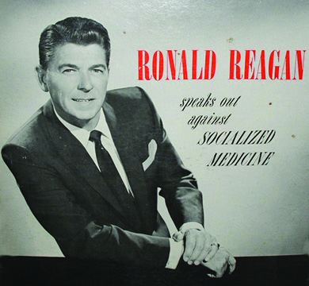
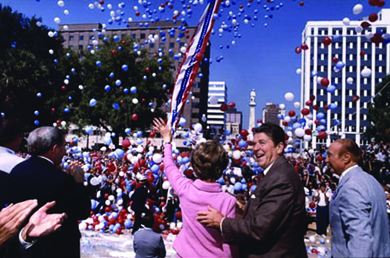
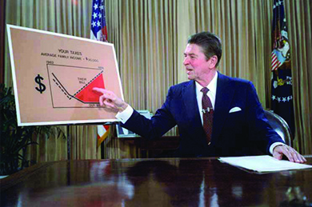

By the end of this section, you will be able to:
* Explain Ronald Reagan’s attitude towards government
* Discuss the Reagan administration’s economic policies and their effects on the nation

 ![A timeline shows important events of the era. In 1980, Ronald Reagan is elected president; a portrait of Reagan is shown. In 1981, President Reagan is wounded in an assassination attempt; a photograph of Reagan lying on the ground surrounded by people is shown. In 1982, the Equal Rights Amendment dies after not achieving the required ratification. In 1987, Reagan addresses the Iran-Contra scandal. In 1989, the Berlin Wall falls; a photograph of a part of the Berlin Wall is shown. In 1991, Operation Desert Storm begins in the Persian Gulf, and the Internet opens to commercial use; a photograph of George H. W. Bush greeting troops in the Persian Gulf is shown. In 1992, William J. Clinton is elected. In 1993, Congress approves the North American Free Trade Agreement. In 1994, Republicans draft the Contract with America. In 1995, Timothy McVeigh bombs a federal building in Oklahoma City; a photograph of the bombed building is shown. In 1998, the U.S. House of Representatives impeaches President Clinton; a photograph of the impeachment proceedings is shown.](../resources/CNX_History_31_01_Timeline.jpg){: #CNX_History_31_01_Timeline}

Ronald Reagan entered the White House in 1981 with strongly conservative values but experience in moderate politics. He appealed to moderates and conservatives anxious about social change and the seeming loss of American power and influence on the world stage. Leading the so-called Reagan Revolution, he appealed to voters with the promise that the principles of conservatism could halt and revert the social and economic changes of the last generation. Reagan won the White House by citing big government and attempts at social reform as the problem, not the solution. He was able to capture the political capital of an unsettled national mood and, in the process, helped set an agenda and policies that would affect his successors and the political landscape of the nation.

# REAGAN’S EARLY CAREER

Although many of his movie roles and the persona he created for himself seemed to represent traditional values, Reagan’s rise to the presidency was an unusual transition from pop cultural significance to political success. Born and raised in the Midwest, he moved to California in 1937 to become a Hollywood actor. He also became a reserve officer in the U.S. Army that same year, but when the country entered World War II, he was excluded from active duty overseas because of poor eyesight and spent the war in the army’s First Motion Picture Unit. After the war, he resumed his film career; rose to leadership in the Screen Actors Guild, a Hollywood union; and became a spokesman for General Electric and the host of a television series that the company sponsored. As a young man, he identified politically as a liberal Democrat, but his distaste for communism, along with the influence of the social conservative values of his second wife, actress Nancy Davis, edged him closer to conservative Republicanism ([\[link\]](#CNX_History_31_01_SocMed)). By 1962, he had formally switched political parties, and in 1964, he actively campaigned for the Republican presidential nominee Barry Goldwater.

 {: #CNX_History_31_01_SocMed}

Reagan launched his own political career in 1966 when he successfully ran for governor of California. His opponent was the incumbent Pat Brown, a liberal Democrat who had already served two terms. Reagan, quite undeservedly, blamed Brown for race riots in California and student protests at the University of California at Berkeley. He criticized the Democratic incumbent’s increases in taxes and state government, and denounced “big government” and the inequities of taxation in favor of free enterprise. As governor, however, he quickly learned that federal and state laws prohibited the elimination of certain programs and that many programs benefited his constituents. He ended up approving the largest budget in the state’s history and approved tax increases on a number of occasions. The contrast between Reagan’s rhetoric and practice made up his political skill: capturing the public mood and catering to it, but compromising when necessary.

# REPUBLICANS BACK IN THE WHITE HOUSE

After two unsuccessful Republican primary bids in 1968 and 1976, Reagan won the presidency in 1980. His victory was the result of a combination of dissatisfaction with the presidential leadership of Gerald Ford and Jimmy Carter in the 1970s and the growth of the **New Right**{: data-type="term"}. This group of conservative Americans included many very wealthy financial supporters and emerged in the wake of the social reforms and cultural changes of the 1960s and 1970s. Many were evangelical Christians, like those who joined Jerry Falwell’s Moral Majority, and opposed the legalization of abortion, the feminist movement, and sex education in public schools. Reagan also attracted people, often dubbed neoconservatives, who would not previously have voted for the same candidate as conservative Protestants did. Many were middle- and working-class people who resented the growth of federal and state governments, especially benefit programs, and the subsequent increase in taxes during the late 1960s and 1970s. They favored the tax revolts that swept the nation in the late 1970s under the leadership of predominantly older, white, middle-class Americans, which had succeeded in imposing radical reductions in local property and state income taxes.

Voter turnout reflected this new conservative swing, which not only swept Reagan into the White House but created a Republican majority in the Senate. Only 52 percent of eligible voters went to the polls in 1980, the lowest turnout for a presidential election since 1948. Those who did cast a ballot were older, whiter, and wealthier than those who did not vote ([\[link\]](#CNX_History_31_01_ReaganCamp)). Strong support among white voters, those over forty-five years of age, and those with incomes over $50,000 proved crucial for Reagan’s victory.

 {: #CNX_History_31_01_ReaganCamp}

# REAGANOMICS

Reagan’s primary goal upon taking office was to stimulate the sagging economy while simultaneously cutting both government programs and taxes. His economic policies, called **Reaganomics**{: data-type="term"} by the press, were based on a theory called supply-side economics, about which many economists were skeptical. Influenced by economist Arthur Laffer of the University of Southern California, Reagan cut income taxes for those at the top of the economic ladder, which was supposed to motivate the rich to invest in businesses, factories, and the stock market in anticipation of high returns. According to Laffer’s argument, this would eventually translate into more jobs further down the socioeconomic ladder. Economic growth would also increase the total tax revenue—even at a lower tax rate. In other words, proponents of “trickle-down economics” promised to cut taxes and balance the budget at the same time. Reaganomics also included the deregulation of industry and higher interest rates to control inflation, but these initiatives preceded Reagan and were conceived in the Carter administration.

Many politicians, including Republicans, were wary of Reagan’s economic program; even his eventual vice president, George H. W. Bush, had referred to it as “voodoo economics” when competing with him for the Republican presidential nomination. When Reagan proposed a 30 percent cut in taxes to be phased in over his first term in office, Congress balked. Opponents argued that the tax cuts would benefit the rich and not the poor, who needed help the most. In response, Reagan presented his plan directly to the people ([\[link\]](#CNX_History_31_01_TaxChart)).

 {: #CNX_History_31_01_TaxChart}

Reagan was an articulate spokesman for his political perspectives and was able to garner support for his policies. Often called “The Great Communicator,” he was noted for his ability, honed through years as an actor and spokesperson, to convey a mixture of folksy wisdom, empathy, and concern while taking humorous digs at his opponents. Indeed, listening to Reagan speak often felt like hearing a favorite uncle recall stories about the “good old days” before big government, expensive social programs, and greedy politicians destroyed the country ([\[link\]](#CNX_History_31_01_Cowboy)). Americans found this rhetorical style extremely compelling. Public support for the plan, combined with a surge in the president’s popularity after he survived an assassination attempt in March 1981, swayed Congress, including many Democrats. On July 29, 1981, Congress passed the Economic Recovery Tax Act, which phased in a 25 percent overall reduction in taxes over a period of three years.

 {: #CNX_History_31_01_Cowboy}

Richard V. Allen on the Assassination Attempt on Ronald Reagan

On March 30, 1981, just months into the Reagan presidency, John Hinckley, Jr. attempted to assassinate the president as he left a speaking engagement at the Washington Hilton Hotel. Hinckley wounded Reagan and three others in the attempt. Here, National Security Adviser Richard V. Allen recalls what happened the day President Reagan was shot:

\> By 2:52 PM I arrived at the White House and went to \[Chief of Staff James\] Baker’s office . . . and we placed a call to Vice President George H. W. Bush. . . .
> * * *
> {: data-type="newline"}
> 
> \[W\]e sent a message with the few facts we knew: the bullets had been fired and press secretary Jim Brady had been hit, as had a Secret Service agent and a DC policeman. At first, the President was thought to be unscathed.
> * * *
> {: data-type="newline"}
> 
> Jerry Parr, the Secret Service Detail Chief, shoved the President into the limousine, codenamed “Stagecoach,” and slammed the doors shut. The driver sped off. Headed back to the safety of the White House, Parr noticed that the red blood at the President’s mouth was frothy, indicating an internal injury, and suddenly switched the route to the hospital. . . . Parr saved the President’s life. He had lost a serious quantity of blood internally and reached \[the emergency room\] just in time. . . .
> * * *
> {: data-type="newline"}
> 
> Though the President never lost his sense of humor throughout, and had actually walked into the hospital under his own power before his knees buckled, his condition became grave.

Why do you think Allen mentions the president’s sense of humor and his ability to walk into the hospital on his own? Why might the assassination attempt have helped Reagan achieve some of his political goals, such as getting his tax cuts through Congress?

  
The largest of the presidential libraries, the [Ronald Reagan Presidential Library][1] contains Reagan’s most important speeches and pictures of Ronald and Nancy Reagan.

Reagan was successful at cutting taxes, but he failed to reduce government spending. Although he had long warned about the dangers of big government, he created a new cabinet-level agency, the Department of Veterans Affairs, and the number of federal employees increased during his time in office. He allocated a smaller share of the federal budget to antipoverty programs like Aid to Families with Dependent Children (AFDC), food stamps, rent subsidies, job training programs, and Medicaid, but Social Security and Medicare entitlements, from which his supporters benefited, were left largely untouched except for an increase in payroll taxes to pay for them. Indeed, in 1983, Reagan agreed to a compromise with the Democrats in Congress on a $165 billion injection of funds to save Social Security, which included this payroll tax increase.

But Reagan seemed less flexible when it came to deregulating industry and weakening the power of labor unions. Banks and savings and loan associations were deregulated. Pollution control was enforced less strictly by the Environmental Protection Agency, and restrictions on logging and drilling for oil on public lands were relaxed. Believing the free market was self-regulating, the Reagan administration had little use for labor unions, and in 1981, the president fired twelve thousand federal air traffic controllers who had gone on strike to secure better working conditions (which would also have improved the public’s safety). His action effectively destroyed the Professional Air Traffic Controllers Organization (PATCO) and ushered in a new era of labor relations in which, following his example, employers simply replaced striking workers. The weakening of unions contributed to the leveling off of real wages for the average American family during the 1980s.

Reagan’s economic policymakers succeeded in breaking the cycle of stagflation that had been plaguing the nation, but at significant cost. In its effort to curb high inflation with dramatically increased interest rates, the Federal Reserve also triggered a deep recession. Inflation did drop, but borrowing became expensive and consumers spent less. In Reagan’s first years in office, bankruptcies increased and unemployment reached about 10 percent, its highest level since the Great Depression. Homelessness became a significant problem in cities, a fact the president made light of by suggesting that the press exaggerated the problem and that many homeless people chose to live on the streets. Economic growth resumed in 1983 and gross domestic product grew at an average of 4.5 percent during the rest of his presidency. By the end of Reagan’s second term in office, unemployment had dropped to about 5.3 percent, but the nation was nearly $3 trillion in debt. An increase in defense spending coupled with $3.6 billion in tax relief for the 162,000 American families with incomes of $200,000 or more made a balanced budget, one of the president’s campaign promises in 1980, impossible to achieve.

The Reagan years were a complicated era of social, economic, and political change, with many trends operating simultaneously and sometimes at cross-purposes. While many suffered, others prospered. The 1970s had been the era of the hippie, and *Newsweek* magazine declared 1984 to be the “year of the **Yuppie**{: data-type="term" .no-emphasis}.” Yuppies, whose name derived from “(y)oung, (u)rban (p)rofessionals,” were akin to hippies in being young people whose interests, values, and lifestyle influenced American culture, economy, and politics, just as the hippies’ credo had done in the late 1960s and 1970s. Unlike hippies, however, yuppies were materialistic and obsessed with image, comfort, and economic prosperity. Although liberal on some social issues, economically they were conservative. Ironically, some yuppies were former hippies or yippies, like Jerry Rubin, who gave up his crusade against “the establishment” to become a businessman.

  
Read more about [yuppie culture][2] and then use the table of contents to access other information about the culture of the 1980s.

# Section Summary

After decades of liberalism and social reform, Ronald Reagan changed the face of American politics by riding a groundswell of conservatism into the White House. Reagan’s superior rhetorical skills enabled him to gain widespread support for his plans for the nation. Implementing a series of economic policies dubbed “Reaganomics,” the president sought to stimulate the economy while shrinking the size of the federal government and providing relief for the nation’s wealthiest taxpayers. During his two terms in office, he cut spending on social programs, while increasing spending on defense. While Reagan was able to break the cycle of stagflation, his policies also triggered a recession, plunged the nation into a brief period of significant unemployment, and made a balanced budget impossible. In the end, Reagan’s policies diminished many Americans’ quality of life while enabling more affluent Americans—the “Yuppies” of the 1980s—to prosper.

# Review Questions

Before becoming a conservative Republican, Ronald Reagan was \_\_\_\_\_\_\_\_. 

a liberal Democrat

a Socialist

politically apathetic

a Herbert Hoover Republican

A

The belief that cutting taxes for the rich will eventually result in economic benefits for the poor is commonly referred to as \_\_\_\_\_\_\_\_. 

socialism

pork barrel politics

Keynesian economics

trickle-down economics

D

What were the elements of Ronald Reagan’s plan for economic reform?

Reagan planned to cut taxes for the wealthy in the hope that these taxpayers would then invest their surplus money in business; this, Reagan believed, would reduce unemployment. Reagan also sought to raise interest rates to curb inflation, cut federal spending on social programs, and deregulate industry. Finally, Reagan hoped—but ultimately failed—to balance the federal budget.

## Glossary
{: data-type="glossary-title"}

New Right
: a loose coalition of American conservatives, consisting primarily of wealthy businesspeople and evangelical Christians, which developed in response to social changes of the 1960s and 1970s
{: .definition}

Reaganomics
: Ronald Reagan’s economic policy, which suggested that lowering taxes on the upper income brackets would stimulate investment and economic growth
{: .definition}

[1]: http://openstaxcollege.org/l/15ReaganLib
[2]: http://openstaxcollege.org/l/15YuppieCult
