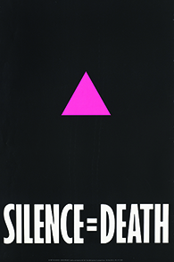

By the end of this section, you will be able to:
* Discuss the culture wars and political conflicts of the Reagan era
* Describe the Religious Right’s response to the issues of the Reagan era

Ronald Reagan’s victory in 1980 suggested to conservatives that the days of liberalism were over and the liberal establishment might be dismantled. Many looked forward to the discontinuation of policies like affirmative action. Conservative Christians sought to outlaw abortion and stop the movement for gay and lesbian rights. Republicans, and some moderate Democrats, demanded a return to “traditional” family values, a rhetorical ploy to suggest that male authority over women and children constituted a natural order that women’s rights and the New Left had subverted since the 1960s. As the conservative message regarding the evils of government permeated society, distrust of the federal government grew, inspiring some to form organizations and communities that sought complete freedom from government control.

# CREATING CONSERVATIVE POLICY

Ronald Reagan’s popularity and effectiveness as a leader drew from his reputation as a man who fought for what he believed in. He was a very articulate spokesperson for a variety of political ideas based on conservative principles and perspectives. Much of the intellectual meat of the Reagan Revolution came from conservative think tanks (policy or advocacy groups) that specifically sought to shape American political and social dialogues. The **Heritage Foundation**{: data-type="term"}, one such group, soon became the intellectual arm of the conservative movement.

Launched in 1973 with a $250,000 contribution from Joseph Coors (of Coors Brewing Company) and support from a variety of corporations and conservative foundations, the Heritage Foundation sought to counteract what conservatives believed to be Richard Nixon’s acceptance of a liberal consensus on too many issues. In producing its policy position papers and political recommendations to conservative candidates and politicians, it helped contribute to a sanitization of U.S. history and a nostalgic glorification of what it deemed to be traditional values, seemingly threatened by the expansion of political and personal freedoms. The foundation had lent considerable support and encouragement to the conservative dialogues that helped carry Ronald Reagan into office in 1980. Just a year later, it produced a document entitled *Mandate for Leadership* that catalogued some two thousand specific recommendations on how to shrink the size and reach of the federal government and implement a more consistent conservative agenda. The newly elected Reagan administration looked favorably on the recommendations and recruited several of the paper’s authors to serve in the White House.

# CONSERVATIVE CHRISTIANS AND FAMILY VALUES

Among the strongest supporters of Ronald Reagan’s campaign for president were members of the Religious Right, including Christian groups like the **Moral Majority**{: data-type="term" .no-emphasis}, 61 percent of whom voted for him. By 1980, evangelical Christians had become an important political and social force in the United States ([\[link\]](#CNX_History_31_02_Bryant)). Some thirteen hundred radio stations in the country were owned and operated by evangelicals. Christian television programs, such as Pat Robertson’s *The 700 Club* and Jim Bakker’s *The PTL* (Praise the Lord) *Club*, proved enormously popular and raised millions of dollars from viewer contributions. For some, evangelism was a business, but most conservative Christians were true believers who were convinced that premarital and extramarital sex, abortion, drug use, homosexuality, and “irreligious” forms of popular and high culture were responsible for a perceived decline in traditional family values that threatened American society.

 {: #CNX_History_31_02_Bryant}

Despite the support he received from Christian conservative and family values voters, Reagan was hardly an ideologue when it came to policy. Indeed, he was often quite careful in using hot button, family-value issues to his greatest political advantage. For example, as governor of California, one of the states that ratified the Equal Rights Amendment (ERA) in its first year, he positioned himself as a supporter of the amendment. When he launched his bid for the Republican nomination in 1976, however, he withdrew his support to gain the backing of more conservative members of his party. This move demonstrated both political savvy and foresight. At the time he withdrew his support, the Republican National Convention was still officially backing the amendment. However, in 1980, the party began to qualify its stance, which dovetailed with Reagan’s candidacy for the White House.

Reagan believed the Fourteenth Amendment to the Constitution was sufficient protection for women against discrimination. Once in office, he took a mostly neutral position, neither supporting nor working against the ERA. Nor did this middle position appear to hurt him at the polls; he attracted a significant number of votes from women in 1980, and in 1984, he polled 56 percent of the women’s vote compared to 44 percent for the Democratic ticket of Walter Mondale and Geraldine Ferraro, the first female candidate for vice president from a major party.

Phyllis Schlafly and the STOP ERA Movement

In 1972, after a large number of states jumped to ratify the Equal Rights Amendment, most observers believed its ultimate ratification by all the necessary states was all but certain. But, a decade later, the amendment died without ever getting the necessary votes. There are many reasons it went down in defeat, but a major one was Phyllis Schlafly.

On the surface, Schlafly’s life might suggest that she would naturally support the ERA. After all, she was a well-educated, professional woman who sought advancement in her field and even aspired to high political office. Yet she is a fascinating historical character, precisely because her life and goals don’t conform to expected norms.

Schlafly’s attack on the ERA was ingenious in its method and effectiveness. Rather than attacking the amendment directly as a gateway to unrestrained and immoral behavior as some had, she couched her opposition in language that was sensitive to both privilege and class. Her instrument was the STOP ERA movement, with the acronym STOP, standing for “Stop Taking our Privileges.” Schlafly argued that women enjoyed special privileges such as gender-specific restrooms and exemption from the military draft. These, she claimed, would be lost should the ERA be ratified. But she also claimed to stand up for the dignity of being a homemaker and lambasted the feminist movement as elitist. In this, she was keenly aware of the power of class interests. Her organization suggested that privileged women could afford to support the ERA. Working women and poor housewives, however, would ultimately bear the brunt of the loss of protection it would bring. In the end, her tactics were successful in achieving exactly what the movement’s name suggested; she stopped the ERA.

Reagan’s political calculations notwithstanding, his belief that traditional values were threatened by a modern wave of immoral popular culture was genuine. He recognized that nostalgia was a powerful force in politics, and he drew a picture for his audiences of the traditional good old days under attack by immorality and decline. “Those of us who are over thirty-five or so years of age grew up in a different America,” he explained in his farewell address. “We were taught, very directly, what it means to be an American. And we absorbed, almost in the air, a love of country and an appreciation of its institutions. . . . The movies celebrated democratic values and implicitly reinforced the idea that America was special.” But this America, he insisted, was being washed away. “I’m warning of an eradication of the American memory that could result, ultimately, in an erosion of the American spirit.”

Concern over a decline in the country’s moral values welled up on both sides of the political aisle. In 1985, anxiety over the messages of the music industry led to the founding of the **Parents Music Resource Center**{: data-type="term" .no-emphasis} (PMRC), a bipartisan group formed by the wives of prominent Washington politicians including Susan Baker, the wife of Reagan’s treasury secretary, James Baker, and Tipper Gore, the wife of then-senator Al Gore, who later became vice president under Bill Clinton. The goal of the PMRC was to limit the ability of children to listen to music with sexual or violent content. Its strategy was to get the recording industry to adopt a voluntary rating system for music and recordings, similar to the Motion Picture Association of America’s system for movies.

The organization also produced a list of particularly offensive recordings known as the “filthy fifteen.” By August 1985, nearly twenty record companies had agreed to put labels on their recordings indicating “explicit lyrics,” but the Senate began hearings on the issue in September ([\[link\]](#CNX_History_31_02_PMRC)). While many parents and a number of witnesses advocated the labels, many in the music industry rejected them as censorship. *Twisted Sister*’s Dee Snider and folk musician John Denver both advised Congress against the restrictions. In the end, the recording industry suggested a voluntary generic label. Its effect on children’s exposure to raw language is uncertain, but musicians roundly mocked the effort.

  Al Gore, at the 1985 Senate hearings into rating labels proposed by the PMRC, of which she was a cofounder."){: #CNX_History_31_02_PMRC}

  
Listen to the testimony of [Dee Snider][1] and [John Denver][2] to learn more about the contours of this debate.

# THE AIDS CRISIS

In the early 1980s, doctors noticed a disturbing trend: Young gay men in large cities, especially San Francisco and New York, were being diagnosed with, and eventually dying from, a rare cancer called Kaposi’s sarcoma. Because the disease was seen almost exclusively in male homosexuals, it was quickly dubbed “gay cancer.” Doctors soon realized it often coincided with other symptoms, including a rare form of pneumonia, and they renamed it “Gay Related Immune Deficiency” (GRID), although people other than gay men, primarily intravenous drug users, were dying from the disease as well. The connection between gay men and GRID—later renamed human immunodeficiency virus/autoimmune deficiency syndrome, or **HIV/AIDS**{: data-type="term"}—led heterosexuals largely to ignore the growing health crisis in the gay community, wrongly assuming they were safe from its effects. The federal government also overlooked the disease, and calls for more money to research and find the cure were ignored.

Even after it became apparent that heterosexuals could contract the disease through blood transfusions and heterosexual intercourse, HIV/AIDS continued to be associated primarily with the gay community, especially by political and religious conservatives. Indeed, the Religious Right regarded it as a form of divine retribution meant to punish gay men for their “immoral” lifestyle. President Reagan, always politically careful, was reluctant to speak openly about the developing crisis even as thousands faced certain death from the disease.

With little help coming from the government, the gay community quickly began to organize its own response. In 1982, New York City men formed the Gay Men’s Health Crisis (GMHC), a volunteer organization that operated an information hotline, provided counseling and legal assistance, and raised money for people with HIV/AIDS. Larry Kramer, one of the original members, left in 1983 and formed his own organization, the AIDS Coalition to Unleash Power (ACT UP), in 1987. ACT UP took a more militant approach, holding demonstrations on Wall Street, outside the U.S. Food and Drug Administration (FDA), and inside the New York Stock Exchange to call attention and shame the government into action. One of the images adopted by the group, a pink triangle paired with the phrase “Silence = Death,” captured media attention and quickly became the symbol of the AIDS crisis ([\[link\]](#CNX_History_31_02_Silence)).

 {: #CNX_History_31_02_Silence}

# THE WAR ON DRUGS AND THE ROAD TO MASS INCARCERATION

As Ronald Reagan took office in 1981, violent crime in the United States was reaching an all-time high. While there were different reasons for the spike, the most important one was demographics: The primary category of offenders, males between the ages of sixteen and thirty-six, reached an all-time peak as the baby-boomer generation came of age. But the phenomenon that most politicians honed in on as a cause for violent crime was the abuse of a new, cheap drug dealt illegally on city streets. Crack cocaine, a smokable type of cocaine popular with poorer addicts, was hitting the streets in the 1980s, frightening middle-class Americans. Reagan and other conservatives led a campaign to “get tough on crime” and promised the nation a “**war on drugs**{: data-type="term"}.” Initiatives like the “Just Say No” campaign led by First Lady Nancy Reagan implied that drug addiction and drug-related crime reflected personal morality.

Nixon had first used the term in 1971, but in the 1980s the “war on drugs” took on an ominous dimension, as politicians scrambled over each other to enact harsher sentences for drug offenses so they could market themselves as tough on crime. State after state switched from variable to mandatory minimum sentences that were exceedingly long and particularly harsh for street drug crimes. The federal government supported the trend with federal sentencing guidelines and additional funds for local law enforcement agencies. This law-and-order movement peaked in the 1990s, when California introduced a “three strikes” law that mandated life imprisonment without parole for any third felony conviction—even nonviolent ones. As a result, prisons became crowded, and states went deep into debt to build more. By the end of the century, the war began to die down as the public lost interest in the problem, the costs of the punishment binge became politically burdensome, and scholars and politicians began to advocate the decriminalization of drug use. By this time, however, hundreds of thousands of people had been incarcerated for drug offenses and the total number of prisoners in the nation had grown four-fold in the last quarter of the century. Particularly glaring were the racial inequities of the new age of mass incarceration, with African Americans being seven times more likely to be in prison ([\[link\]](#CNX_History_31_02_Prison)).

 "){: #CNX_History_31_02_Prison}

# Section Summary

The political conservatism of the 1980s and 1990s was matched by the social conservatism of the period. Conservative politicians wished to limit the size and curb the power of the federal government. Conservative think tanks flourished, the Christian Right defeated the ERA, and bipartisan efforts to add warning labels to explicit music lyrics were the subject of Congressional hearings. HIV/AIDS, which became chiefly and inaccurately associated with the gay community, grew to crisis proportions, as heterosexuals and the federal government failed to act. In response, gay men organized advocacy groups to fight for research on HIV/AIDS. Meanwhile, the so-called war on drugs began a get-tough trend in law enforcement that mandated lengthy sentences for drug-related offenses and hugely increased the American prison population.

# Review Questions

Which statement best describes Reagan’s political style? 

folksy and likeable

conservative and inflexible

liberal and pragmatic

intelligent and elitist

A

What rationale did Phyllis Schlafly and her STOP ERA movement cite when opposing the ratification of the Equal Rights Amendment? 

the ERA would ultimately lead to the legalization of abortion

the ERA provided insufficient civil rights protections for women

mothers could not be feminists

the ERA would end gender-specific privileges women enjoyed

D

What were some of the primary values of the Moral Majority?

Jerry Falwell’s Moral Majority believed the country was drifting ever further toward immorality. The evidence they cited included the legalization of abortion, the feminist movement, and sex education in public schools.

## Glossary
{: data-type="glossary-title"}

Heritage Foundation
: a professional organization conducting research and political advocacy on behalf of its values and perspectives
{: .definition}

HIV/AIDS
: a deadly immune deficiency disorder discovered in 1981, and at first largely ignored by politicians because of its prevalence among gay men
{: .definition}

war on drugs
: a nationwide political campaign to implement harsh sentences for drug crimes, which produced an explosive growth of the prison population
{: .definition}

[1]: http://openstaxcollege.org/l/15DeeSnider
[2]: http://openstaxcollege.org/l/15JohnDenver
