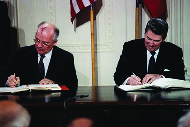
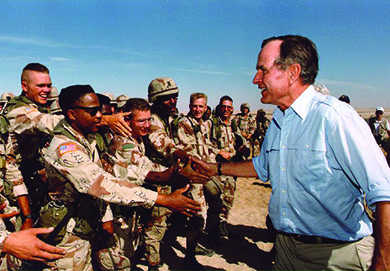

By the end of this section, you will be able to:
* Describe the successes and failures of Ronald Reagan’s foreign policy
* Compare the policies of Ronald Reagan with those of George H. W. Bush
* Explain the causes and results of the Persian Gulf War
* Discuss the events that constituted the end of the Cold War

In addition to reviving the economy and reducing the size of the federal government, Ronald Reagan also wished to restore American stature in the world. He entered the White House a “cold warrior” and referred to the Soviet Union in a 1983 speech as an “evil empire.” Dedicated to upholding even authoritarian governments in foreign countries to keep them safe from Soviet influence, he was also desperate to put to rest **Vietnam Syndrome**{: data-type="term"}, the reluctance to use military force in foreign countries for fear of embarrassing defeat, which had influenced U.S. foreign policy since the mid-1970s.

# THE MIDDLE EAST AND CENTRAL AMERICA

Reagan’s desire to demonstrate U.S. readiness to use military force abroad sometimes had tragic consequences. In 1983, he sent soldiers to Lebanon as part of a multinational force trying to restore order following an Israeli invasion the year before. On October 23, more than two hundred troops were killed in a barracks bombing in Beirut carried out by Iranian-trained militants known as Hezbollah ([\[link\]](#CNX_History_31_03_Beirut)). In February 1984, Reagan announced that, given intensified fighting, U.S. troops were being withdrawn.

  on April 18, 1983, marked the first of a number of attacks on U.S. targets in the region. Less than six months later, a truck bomb leveled the U.S. Marine barracks at the Beirut airport (b), part of a coordinated attack that killed 299 U.S and French members of the multinational peacekeeping force in Lebanon."){: #CNX_History_31_03_Beirut}

Two days after the bombing in Beirut, Reagan and Secretary of State George P. Shultz authorized the invasion of Grenada, a small Caribbean island nation, in an attempt to oust a Communist military junta that had overthrown a moderate regime. Communist Cuba already had troops and technical aid workers stationed on the island and were willing to defend the new regime, but the United States swiftly took command of the situation, and the Cuban soldiers surrendered after two days.

Reagan’s intervention in Grenada was intended to send a message to Marxists in Central America. Meanwhile, however, decades of political repression and economic corruption by certain Latin American governments, sometimes generously supported by U.S. foreign aid, had sown deep seeds of revolutionary discontent. In El Salvador, a 1979 civil-military coup had put a military junta in power that was engaged in a civil war against left-leaning guerillas when Reagan took office. His administration supported the right-wing government, which used death squads to silence dissent.

Neighboring Nicaragua was also governed by a largely Marxist-inspired group, the Sandinistas. This organization, led by Daniel Ortega, had overthrown the brutal, right-wing dictatorship of Anastasio Somoza in 1979. Reagan, however, overlooked the legitimate complaints of the Sandinistas and believed that their rule opened the region to Cuban and Soviet influence. A year into his presidency, convinced it was folly to allow the expansion of Soviet and Communist influence in Latin America, he authorized the Central Intelligence Agency (CIA) to equip and train a group of anti-Sandinista Nicaraguans known as the **Contras**{: data-type="term" .no-emphasis} (*contrarevolucionários* or “counter-revolutionaries”) to oust Ortega.

Reagan’s desire to aid the Contras even after Congress ended its support led him, surprisingly, to Iran. In September 1980, Iraq had invaded neighboring Iran and, by 1982, had begun to gain the upper hand. The Iraqis needed weapons, and the Reagan administration, wishing to assist the enemy of its enemy, had agreed to provide Iraqi president Saddam Hussein with money, arms, and military intelligence. In 1983, however, the capture of Americans by Hezbollah forces in Lebanon changed the president’s plans. In 1985, he authorized the sale of anti-tank and anti-aircraft missiles to Iran in exchange for help retrieving three of the American hostages.

A year later, Reagan’s National Security Council aide, Lieutenant Colonel Oliver North, found a way to sell weapons to Iran and secretly use the proceeds to support the Nicaraguan Contras—in direct violation of a congressional ban on military aid to the anti-Communist guerillas in that Central American nation. Eventually the Senate became aware, and North and others were indicted on various charges, which were all dismissed, overturned on appeal, or granted presidential pardon. Reagan, known for delegating much authority to subordinates and unable to “remember” crucial facts and meetings, escaped the scandal with nothing more than criticism for his lax oversight. The nation was divided over the extent to which the president could go to “protect national interests,” and the limits of Congress’s constitutional authority to oversee the activities of the executive branch have yet to be resolved.

  
Visit the [Brown University site][1] to learn more about the Iran-Contra congressional hearings. Read transcripts of the testimony and watch the video of President Reagan’s address to the nation regarding the operation.

# THE COLD WAR WAXES AND WANES

While trying to shrink the federal budget and the size of government sphere at home, Reagan led an unprecedented military buildup in which money flowed to the Pentagon to pay for expensive new forms of weaponry. The press drew attention to the inefficiency of the nation’s military industrial complex, offering as examples expense bills that included $640 toilet seats and $7,400 coffee machines. One of the most controversial aspects of Reagan’s plan was the Strategic Defense Initiative (SDI), which he proposed in 1983. SDI, or “Star Wars,” called for the development of a defensive shield to protect the United States from a Soviet missile strike. Scientists argued that much of the needed technology had not yet been developed and might never be. Others contended that the plan would violate existing treaties with the Soviet Union and worried about the Soviet response. The system was never built, and the plan, estimated to have cost some $7.5 billion, was finally abandoned.

Anticipating his reelection campaign in 1984, Reagan began to moderate his position toward the Soviet Union, largely at the initiative of his new counterpart, Mikhail Gorbachev. The new and comparatively young Soviet premier did not want to commit additional funds for another arms race, especially since the war in Afghanistan against mujahedeen—Islamic guerilla fighters—had depleted the Soviet Union’s resources severely since its invasion of the central Asian nation in 1979. Gorbachev recognized that economic despair at home could easily result in larger political upheavals like those in neighboring Poland, where the Solidarity movement had taken hold. He withdrew troops from Afghanistan, introduced political reforms and new civil liberties at home—known as *perestroika* and *glasnost*—and proposed arms reduction talks with the United States. In 1985, Gorbachev and Reagan met in Geneva to reduce armaments and shrink their respective military budgets. The following year, meeting in Reykjavík, Iceland, they surprised the world by announcing that they would try to eliminate nuclear weapons by 1996. In 1987, they agreed to eliminate a whole category of nuclear weapons when they signed the Intermediate-Range Nuclear Forces (INF) Treaty at the White House ([\[link\]](#CNX_History_31_03_INF)). This laid the foundation for future agreements limiting nuclear weapons.

 {: #CNX_History_31_03_INF}

  
You can view President Reagan delivering one of his most [memorable addresses][2] in 1987. Standing in front of the Brandenburg Gate in West Berlin, he called on General Secretary Gorbachev to “tear down this wall.”

# “NO NEW TAXES”

Confident they could win back the White House, Democrats mounted a campaign focused on more effective and competent government under the leadership of Massachusetts governor Michael Dukakis. When George H. W. Bush, Reagan’s vice president and Republican nominee, found himself down in the polls, political advisor Lee Atwater launched an aggressively negative media campaign, accusing Dukakis of being soft on crime and connecting his liberal policies to a brutal murder in Massachusetts. More importantly, Bush adopted a largely Reaganesque style on matters of economic policy, promising to shrink government and keep taxes low. These tactics were successful, and the Republican Party retained the White House.

Although he promised to carry on Reagan’s economic legacy, the problems Bush inherited made it difficult to do so. Reagan’s policies of cutting taxes and increasing defense spending had exploded the federal budget deficit, making it three times larger in 1989 than when Reagan took office in 1980. Bush was further constrained by the emphatic pledge he had made at the 1988 Republican Convention—“read my lips: no new taxes”—and found himself in the difficult position of trying to balance the budget and reduce the deficit without breaking his promise. However, he also faced a Congress controlled by the Democrats, who wanted to raise taxes on the rich, while Republicans thought the government should drastically cut domestic spending. In October, after a brief government shutdown when Bush vetoed the budget Congress delivered, he and Congress reached a compromise with the Omnibus Budget Reconciliation Act of 1990. The budget included measures to reduce the deficit by both cutting government expenditures and raising taxes, effectively reneging on the “no new taxes” pledge. These economic constraints are one reason why Bush supported a limited domestic agenda of education reform and antidrug efforts, relying on private volunteers and community organizations, which he referred to as “a thousand points of light,” to address most social problems.

When it came to foreign affairs, Bush’s attitude towards the Soviet Union differed little from Reagan’s. Bush sought to ease tensions with America’s rival superpower and stressed the need for peace and cooperation. The desire to avoid angering the Soviets led him to adopt a hands-off approach when, at the beginning of his term, a series of pro-democracy demonstrations broke out across the Communist Eastern Bloc.

In November 1989, the world—including foreign policy experts and espionage agencies from both sides of the Iron Curtain—watched in surprise as peaceful protesters in East Germany marched through checkpoints at the Berlin Wall. Within hours, people from both East and West Berlin flooded the checkpoints and began tearing down large chunks of the wall. Months of earlier demonstrations in East Germany had called on the government to allow citizens to leave the country. These demonstrations were one manifestation of a larger movement sweeping across East Germany, Poland, Hungary, Czechoslovakia, Bulgaria, and Romania, which swiftly led to revolutions, most of them peaceful, resulting in the collapse of Communist governments in Central and Eastern Europe.

In Budapest in 1956 and in Prague in 1968, the Soviet Union had restored order through a large show of force. That this didn’t happen in 1989 was an indication to all that the Soviet Union was itself collapsing. Bush’s refusal to gloat or declare victory helped him maintain the relationship with Gorbachev that Reagan had established. In July 1991, Gorbachev and Bush signed the Strategic Arms Reduction Treaty, or **START**{: data-type="term"}, which committed their countries to reducing their nuclear arsenals by 25 percent. A month later, attempting to stop the changes begun by Gorbachev’s reforms, Communist Party hardliners tried to remove him from power. Protests arose throughout the Soviet Union, and by December 1991, the nation had collapsed. In January 1992, twelve former Soviet republics formed the Commonwealth of Independent States to coordinate trade and security measures. The Cold War was over.

# AMERICAN GLOBAL POWER IN THE WAKE OF THE COLD WAR

The dust had barely settled on the crumbling Berlin Wall when the Bush administration announced a bold military intervention in Panama in December 1989. Claiming to act on behalf of human rights, U.S. troops deposed the unpopular dictator and drug smuggler Manuel Noriega swiftly, but former CIA connections between President Bush and Noriega, as well as U.S. interests in maintaining control of the Canal Zone, prompted the United Nations and world public opinion to denounce the invasion as a power grab.

As the Soviet Union was ceasing to be a threat, the Middle East became a source of increased concern. In the wake of its eight-year war with Iran from 1980 to 1988, Iraq had accumulated a significant amount of foreign debt. At the same time, other Arab states had increased their oil production, forcing oil prices down and further hurting Iraq’s economy. Iraq’s leader, Saddam Hussein, approached these oil-producing states for assistance, particularly Saudi Arabia and neighboring Kuwait, which Iraq felt directly benefited from its war with Iran. When talks with these countries broke down, and Iraq found itself politically and economically isolated, Hussein ordered the invasion of oil-rich Kuwait in August 1990. Bush faced his first full-scale international crisis.

In response to the invasion, Bush and his foreign policy team forged an unprecedented international coalition of thirty-four countries, including many members of NATO (North Atlantic Treaty Organization) and the Middle Eastern countries of Saudi Arabia, Syria, and Egypt, to oppose Iraqi aggression. Bush hoped that this coalition would herald the beginning of a “new world order” in which the nations of the world would work together to deter belligerence. A deadline was set for Iraq to withdraw from Kuwait by January 15, or face serious consequences. Wary of not having sufficient domestic support for combat, Bush first deployed troops to the area to build up forces in the region and defend Saudi Arabia via Operation Desert Shield ([\[link\]](#CNX_History_31_03_BushTroops)). On January 14, Bush succeeded in getting resolutions from Congress authorizing the use of military force against Iraq, and the U.S. then orchestrated an effective air campaign, followed by **Operation Desert Storm**{: data-type="term"}, a one-hundred-hour land war involving over 500,000 U.S. troops and another 200,000 from twenty-seven other countries, which expelled Iraqi forces from Kuwait by the end of February.

 {: #CNX_History_31_03_BushTroops}

  
Visit the *Frontline* site to read first-person accounts of [U.S. soldiers’ experiences][3] in Operation Desert Storm and view weapons used in battle.

Some controversy arose among Bush’s advisors regarding whether to end the war without removing Saddam Hussein from power, but General Colin Powell, the head of the Joint Chiefs of Staff, argued that to continue to attack a defeated army would be “un-American.” Bush agreed and troops began moving out of the area in March 1991. Although Hussein was not removed from power, the war nevertheless suggested that the United States no longer suffered from “Vietnam Syndrome” and would deploy massive military resources if and when it thought necessary. In April 1991, United Nations (UN) Resolution 687 set the terms of the peace, with long-term implications. Its concluding paragraph authorizing the UN to take such steps as necessary to maintain the peace was later taken as the legal justification for the further use of force, as in 1996 and 1998, when Iraq was again bombed. It was also referenced in the lead-up to the second invasion of Iraq in 2003, when it appeared that Iraq was refusing to comply with other UN resolutions.

# A CHANGING DOMESTIC LANDSCAPE

By nearly every measure, Operation Desert Storm was a resounding success. Through deft diplomatic efforts on the international stage, Bush had ensured that many around the world saw the action as legitimate. By making the goals of the military action both clear and limited, he also reassured an American public still skeptical of foreign entanglements. With the Soviet Union vanishing from the world stage, and the United States demonstrating the extent of its diplomatic influence and military potency with President Bush at the helm, his reelection seemed all but inevitable. Indeed, in March 1991, the president had an approval rating of 89 percent.

Despite Bush’s successes internationally, the domestic situation at home was far more complicated. Unlike Reagan, Bush was not a natural culture warrior. Rather, he was a moderate, Connecticut-born Episcopalian, a pragmatic politician, and a life-long civil servant. He was not adept at catering to post-Reagan conservatives as his predecessor had been. By the same token, he appeared incapable of capitalizing on his history of moderation and pragmatism regarding women’s rights and access to abortion. Together with a Democratic Senate, Bush broke new ground in civil rights with his support of the Americans with Disabilities Act, a far-reaching law that prohibited discrimination based on disability in public accommodations and by employers.

President Bush’s weaknesses as a culture warrior were on full display during the controversy that erupted following his nomination of a new Supreme Court judge. In 1991, Justice Thurgood Marshall, the first African American ever to sit on the Supreme Court, opted to retire, thus opening a position on the court. Thinking he was doing the prudent thing by appealing to multiple interests, Bush nominated Clarence Thomas, another African American but also a strong social conservative. The decision to nominate Thomas, however, proved to be anything but prudent. During Thomas’ confirmation hearings before the Senate Judiciary Committee, Anita Hill, a lawyer who had worked for Thomas when he was chairman of the Equal Employment Opportunity Commission (EEOC), came forward with allegations that he had sexually harassed her when he was her supervisor. Thomas denied the accusations and referred to the televised hearings as a “high tech lynching.” He survived the controversy and was appointed to the Supreme Court by a narrow Senate vote of fifty-two to forty-eight. Hill, also African American, noted later in frustration: “I had a gender, he had a race.” In the aftermath, however, sexual harassment of women in the workplace gained public attention, and harassment complaints made to the EEOC increased 50 percent by the fall of 1992. The controversy also reflected poorly on President Bush and may have hurt him with female voters in 1992.

# Section Summary

While Ronald Reagan worked to restrict the influence of the federal government in people’s lives, he simultaneously pursued interventionist policies abroad as part of a global Cold War strategy. Eager to cure the United States of “Vietnam Syndrome,” he increased the American stockpile of weapons and aided anti-Communist groups in the Caribbean and Central America. The Reagan administration’s secret sales of arms to Iran proved disastrous, however, and resulted in indictments for administration officials. With the end of the Cold War, attention shifted to escalating tensions in the Middle East, where an international coalition assembled by George H. W. Bush drove invading Iraqi forces from Kuwait. As Bush discovered in the last years of his presidency, even this almost-flawless exercise in international diplomatic and military power was not enough to calm a changing cultural and political climate at home.

# Review Questions

The group the Reagan administration encouraged and supported in its fight against the Sandinista government in Nicaragua was known as the \_\_\_\_\_\_\_\_. 

anti-Somozas

Shining Path

Contras

Red Faction

C

The country that Iraq invaded to trigger the crisis that resulted in the Persian Gulf War was \_\_\_\_\_\_\_\_. 

Jordan

Kuwait

Saudi Arabia

Iran

B

What was the Iran-Contra affair about?

After Congress ended support for the Nicaraguan Contras, President Reagan sought other sources of funding for them. Lt. Col. Oliver North then oversaw a plan by which arms would be sold to Iran and the money received from the sales would be sent to fund the Contras.

## Glossary
{: data-type="glossary-title"}

Operation Desert Storm
: the U.S. name of the war waged from January to April 1991, by coalition forces against Iraq in reaction to Iraq’s invasion of Kuwait in August 1990
{: .definition}

START
: a treaty between the United States and the Soviet Union that limited the number of nuclear warheads, ballistic missiles, and strategic bombers held by both sides
{: .definition}

Vietnam Syndrome
: reluctance on the part of American politicians to actively engage U.S. forces in a foreign war for fear of suffering a humiliating defeat
{: .definition}

[1]: http://openstaxcollege.org/l/15IranContra
[2]: http://openstaxcollege.org/l/15BerlinWall
[3]: http://openstaxcollege.org/l/15GulfWar
