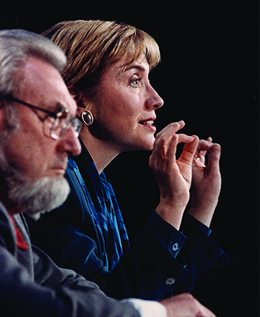
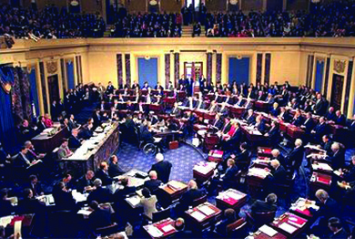

By the end of this section, you will be able to:
* Explain political partisanship, antigovernment movements, and economic developments during the Clinton administration
* Discuss President Clinton’s foreign policy
* Explain how George W. Bush won the election of 2000

By 1992, many had come to doubt that President George H. W. Bush could solve America’s problems. He had alienated conservative Republicans by breaking his pledge not to raise taxes, and some faulted him for failing to remove Saddam Hussein from power during Operation Desert Storm. Furthermore, despite living much of his adult life in Texas, he could not overcome the stereotypes associated with his privileged New England and Ivy League background, which hurt him among working-class Reagan Democrats.

### THE ROAD TO THE WHITE HOUSE

The contrast between George H. W. Bush and William Jefferson Clinton could not have been greater. Bill Clinton was a baby boomer born in 1946 in Hope, Arkansas. His biological father died in a car wreck three months before he was born. When he was a boy, his mother married Roger Clinton, an alcoholic who abused his family. However, despite a troubled home life, Clinton was an excellent student. He took an interest in politics from an early age. On a high school trip to Washington, DC, he met his political idol, President John F. Kennedy. As a student at Georgetown University, he supported both the civil rights and antiwar movements and ran for student council president ([\[link\]](#CNX_History_31_04_Campaign)).

 {: #CNX_History_31_04_Campaign}

In 1968, Clinton received a prestigious Rhodes scholarship to Oxford University. From Oxford he moved on to Yale, where he earned his law degree in 1973. He returned to Arkansas and became a professor at the University of Arkansas’s law school. The following year, he tried his hand at state politics, running for Congress, and was narrowly defeated. In 1977, he became attorney general of Arkansas and was elected governor in 1978. Losing the office to his Republican opponent in 1980, he retook the governor’s mansion in 1982 and remained governor of Arkansas until 1992, when he announced his candidacy for president.

During his campaign, Bill Clinton described himself as a New Democrat, a member of a faction of the Democratic Party that, like the Republicans, favored free trade and deregulation. He tried to appeal to the middle class by promising higher taxes on the rich and reform of the welfare system. Although Clinton garnered only 43 percent of the popular vote, he easily won in the Electoral College with 370 votes to President Bush’s 188. Texas billionaire H. Ross Perot won 19 percent of the popular vote, the best showing by any third-party candidate since 1912. The Democrats took control of both houses of Congress.

### “IT’S THE ECONOMY, STUPID”

Clinton took office towards the end of a recession. His administration’s plans for fixing the economy included limiting spending and cutting the budget to reduce the nation’s $60 billion deficit, keeping interest rates low to encourage private investment, and eliminating protectionist tariffs. Clinton also hoped to improve employment opportunities by allocating more money for education. In his first term, he expanded the Earned Income Tax Credit, which lowered the tax obligations of working families who were just above the poverty line. Addressing the budget deficit, the Democrats in Congress passed the Omnibus Budget Reconciliation Act of 1993 without a single Republican vote. The act raised taxes for the top 1.2 percent of the American people, lowered them for fifteen million low-income families, and offered tax breaks to 90 percent of small businesses.

Clinton also strongly supported ratification of the North American Free Trade Agreement (NAFTA), a treaty that eliminated tariffs and trade restrictions among the United States, Canada, and Mexico. The treaty had been negotiated by the Bush administration, and the leaders of all three nations had signed it in December 1992. However, because of strong opposition from American labor unions and some in Congress who feared the loss of jobs to Mexico, the treaty had not been ratified by the time Clinton took office. To allay the concerns of unions, he added an agreement to protect workers and also one to protect the environment. Congress ratified NAFTA late in 1993. The result was the creation of the world’s largest common market in terms of population, including some 425 million people.

During Clinton’s administration, the nation began to experience the longest period of economic expansion in its history, almost ten consecutive years. Year after year, job growth increased and the deficit shrank. Increased tax revenue and budget cuts turned the annual national budget deficit from close to $290 billion in 1992 to a record budget surplus of over $230 billion in 2000. Reduced government borrowing freed up capital for private-sector use, and lower interest rates in turn fueled more growth. During the Clinton years, more people owned homes than ever before in the country’s history (67.7 percent). Inflation dipped to 2.3 percent and the unemployment rate declined, reaching a thirty-year low of 3.9 percent in 2000.

Much of the prosperity of the 1990s was related to technological change and the advent of new information systems. In 1994, the Clinton administration became the first to launch an official White House website and join the revolution of the electronically mediated world. By the 1990s, a new world of instantaneous global exposure was at the fingertips of billions worldwide.

Hope and Anxiety in the Information Age

While the roots of innovations like personal computers and the Internet go back to the 1960s and massive Department of Defense spending, it was in the 1980s and 90s that these technologies became part of everyday life. Like most technology-driven periods of transformation, the information age was greeted with a mixture of hope and anxiety upon its arrival.

In the late 1970s and early 1980s, computer manufacturers like Apple, Commodore, and Tandy began offering fully assembled personal computers. (Previously, personal computing had been accessible only to those adventurous enough to buy expensive kits that had to be assembled and programmed.) In short order, computers became a fairly common sight in businesses and upper-middle-class homes ([\[link\]](#CNX_History_31_04_AppleAd)). Soon, computer owners, even young kids, were launching their own electronic bulletin board systems, small-scale networks that used modems and phone lines, and sharing information in ways not dreamed of just decades before. Computers, it seemed, held out the promise of a bright, new future for those who knew how to use them.

{: #CNX_History_31_04_AppleAd}

Casting shadows over the bright dreams of a better tomorrow were fears that the development of computer technology would create a dystopian future in which technology became the instrument of society’s undoing. Film audiences watched a teenaged Matthew Broderick hacking into a government computer and starting a nuclear war in *War Games*, Angelina Jolie being chased by a computer genius bent on world domination in *Hackers*, and Sandra Bullock watching helplessly as her life is turned inside out by conspirators who manipulate her virtual identity in *The Net*. Clearly, the idea of digital network connections as the root of our demise resonated in this period of rapid technological change.

### DOMESTIC ISSUES

In addition to shifting the Democratic Party to the moderate center on economic issues, Clinton tried to break new ground on a number of domestic issues and make good on traditional Democratic commitments to the disadvantaged, minority groups, and women. At the same time, he faced the challenge of domestic terrorism when a federal building in Oklahoma City was bombed, killing 168 people and injuring hundreds more.

#### Healthcare Reform

An important and popular part of Clinton’s domestic agenda was healthcare reform that would make universal healthcare a reality. When the plan was announced in September of the president’s first year in office, pollsters and commentators both assumed it would sail through. Many were unhappy with the way the system worked in the United States, where the cost of health insurance seemed increasingly unaffordable for the middle class. Clinton appointed his wife, Hillary Clinton, a Yale Law School graduate and accomplished attorney, to head his Task Force on National Health Care Reform in 1993. The 1,342-page Health Security Act presented to Congress that year sought to offer universal coverage ([\[link\]](#CNX_History_31_04_ClintKoop)). All Americans were to be covered by a healthcare plan that could not reject them based on pre-existing medical conditions. Employers would be required to provide healthcare for their employees. Limits would be placed on the amount that people would have to pay for services; the poor would not have to pay at all.

 {: #CNX_History_31_04_ClintKoop}

The outlook for the plan looked good in 1993; it had the support of a number of institutions like the American Medical Association and the Health Insurance Association of America. But in relatively short order, the political winds changed. As budget battles distracted the administration and the midterm elections of 1994 approached, Republicans began to recognize the strategic benefits of opposing reform. Soon they were mounting fierce opposition to the bill. Moderate conservatives dubbed the reform proposals “**Hillarycare**{: data-type="term" .no-emphasis}” and argued that the bill was an unwarranted expansion of the powers of the federal government that would interfere with people’s ability to choose the healthcare provider they wanted. Those further to the right argued that healthcare reform was part of a larger and nefarious plot to control the public.

To rally Republican opposition to Clinton and the Democrats, Newt Gingrich and Richard “Dick” Armey, two of the leaders of the Republican minority in the House of Representatives, prepared a document entitled **Contract with America**{: data-type="term"}, signed by all but two of the Republican representatives. It listed eight specific legislative reforms or initiatives the Republicans would enact if they gained a majority in Congress in the 1994 midterm elections.

  
View the [Contract with America][1] that the Republican Party drafted to continue the conservative shift begun by Ronald Reagan, which promised to cut waste and spend taxpayer money responsibly.

Lacking support on both sides, the healthcare bill was never passed and died in Congress. The reform effort finally ended in September 1994. Dislike of the proposed healthcare plan on the part of conservatives and the bold strategy laid out in the Contract with America enabled the Republican Party to win seven Senate seats and fifty-two House seats in the November elections. The Republicans then used their power to push for conservative reforms. One such piece of legislation was the Personal Responsibility and Work Opportunity Reconciliation Act, signed into law in August 1996. The act set time limits on welfare benefits and required most recipients to begin working within two years of receiving assistance.

#### Don’t Ask, Don’t Tell

Although Clinton had campaigned as an economically conservative New Democrat, he was thought to be socially liberal and, just days after his victory in the 1992 election, he promised to end the fifty-year ban on gays and lesbians serving in the military. However, in January 1993, after taking the oath of office, Clinton amended his promise in order to appease conservatives. Instead of lifting the longstanding ban, the armed forces would adopt a policy of “don’t ask, don’t tell.” Those on active duty would not be asked their sexual orientation and, if they were gay, they were not to discuss their sexuality openly or they would be dismissed from military service. This compromise satisfied neither conservatives seeking the exclusion of gays nor the gay community, which argued that homosexuals, like heterosexuals, should be able to live without fear of retribution because of their sexuality.

Clinton again proved himself willing to appease political conservatives when he signed into law the Defense of Marriage Act (DOMA) in September 1996, after both houses of Congress had passed it with such wide margins that a presidential veto could easily be overridden. DOMA defined marriage as a heterosexual union and denied federal benefits to same-sex couples. It also allowed states to refuse to recognize same-sex marriages granted by other states. When Clinton signed the bill, he was personally opposed to same-sex marriage. Nevertheless, he disliked DOMA and later called for its repeal. He also later changed his position on same-sex marriage. On other social issues, however, Clinton was more liberal. He appointed openly gay and lesbian men and women to important positions in government and denounced discrimination against people with AIDS. He supported the idea of the ERA and believed that women should receive pay equal to that of men doing the same work. He opposed the use of racial quotas in employment, but he declared affirmative action programs to be necessary.

As a result of his economic successes and his moderate social policies, Clinton defeated Senator Robert Dole in the 1996 presidential election. With 49 percent of the popular vote and 379 electoral votes, he became the first Democrat to win reelection to the presidency since Franklin Roosevelt. Clinton’s victory was partly due to a significant **gender gap**{: data-type="term"} between the parties, with women tending to favor Democratic candidates. In 1992, Clinton won 45 percent of women’s votes compared to Bush’s 38 percent, and in 1996, he received 54 percent of women’s votes while Dole won 38 percent.

#### Domestic Terrorism

The fears of those who saw government as little more than a necessary evil appeared to be confirmed in the spring of 1993, when federal and state law enforcement authorities laid siege to the compound of a religious sect called the Branch Davidians near Waco, Texas. The group, which believed the end of world was approaching, was suspected of weapons violations and resisted search-and-arrest warrants with deadly force. A standoff developed that lasted nearly two months and was captured on television each day. A final assault on the compound was made on April 19, and seventy-six men, women, and children died in a fire probably set by members of the sect. Many others committed suicide or were killed by fellow sect members.

During the siege, many antigovernment and militia types came to satisfy their curiosity or show support for those inside. One was Timothy McVeigh, a former U.S. Army infantry soldier. McVeigh had served in Operation Desert Storm in Iraq, earning a bronze star, but he became disillusioned with the military and the government when he was deemed psychologically unfit for the Army Special Forces. He was convinced that the Branch Davidians were victims of government terrorism, and he and his coconspirator, Terry Nichols, determined to avenge them.

Two years later, on the anniversary of the day that the Waco compound burned to the ground, McVeigh parked a rented truck full of explosives in front of the Alfred P. Murrah Federal Building in Oklahoma City and blew it up ([\[link\]](#CNX_History_31_04_OKCity)). More than 600 people were injured in the attack and 168 died, including nineteen children at the daycare center inside. McVeigh hoped that his actions would spark a revolution against government control. He and Nichols were both arrested and tried, and McVeigh was executed on June 11, 2001, for the worst act of terrorism committed on American soil. Just a few months later, the terrorist attacks of September 11, 2001 broke that dark record.

 . More than three hundred nearby buildings were damaged by the blast, an attack perpetrated at least partly to avenge the Waco siege (b) exactly two years earlier."){: #CNX_History_31_04_OKCity}

### CLINTON AND AMERICAN HEGEMONY

For decades, the contours of the Cold War had largely determined U.S. action abroad. Strategists saw each coup, revolution, and civil war as part of the larger struggle between the United States and the Soviet Union. But with the Soviet Union vanquished, the United States was suddenly free of this paradigm, and President Clinton could see international crises in the Middle East, the Balkans, and Africa on their own terms and deal with them accordingly. He envisioned a post-Cold War role in which the United States used its overwhelming military superiority and influence as global policing tools to preserve the peace. This foreign policy strategy had both success and failure.

One notable success was a level of peace in the Middle East. In September 1993, at the White House, Yitzhak Rabin, prime minister of Israel, and Yasser Arafat, chairman of the Palestine Liberation Organization, signed the Oslo Accords, granting some self-rule to Palestinians living in the Israeli-occupied territories of the Gaza Strip and the West Bank ([\[link\]](#CNX_History_31_04_Oslo)). A year later, the Clinton administration helped facilitate the second settlement and normalization of relations between Israel and Jordan.

  and Yasser Arafat (right), shown with Bill Clinton, signed the Oslo Accords at the White House on September 13, 1993. Rabin was killed two years later by an Israeli who opposed the treaty."){: #CNX_History_31_04_Oslo}

As a small measure of stability was brought to the Middle East, violence erupted in the Balkans. The Communist country of Yugoslavia consisted of six provinces: Serbia, Croatia, Bosnia and Herzegovina, Slovenia, Montenegro, and Macedonia. Each was occupied by a number of ethnic groups, some of which shared a history of hostile relations. In May 1980, the leader of Yugoslavia, Josip Broz Tito, died. Without him to hold the country together, ethnic tensions increased, and this, along with the breakdown of Communism elsewhere in Europe, led to the breakup of Yugoslavia. In 1991, Croatia, Slovenia, and Macedonia declared their independence. In 1992, Bosnia and Herzegovina did as well. Only Serbia and Montenegro remained united as the Serbian-dominated Federal Republic of Yugoslavia.

Almost immediately, ethnic tensions within Bosnia and Herzegovina escalated into war when Yugoslavian Serbs aided Bosnian Serbs who did not wish to live in an independent Bosnia and Herzegovina. These Bosnian Serbs proclaimed the existence of autonomous Serbian regions within the country and attacked Bosnian Muslims and Croats. During the conflict, the Serbs engaged in genocide, described by some as “ethnic cleansing.” The brutal conflict also gave rise to the systematic rape of “enemy” women—generally Muslim women exploited by Serbian military or paramilitary forces. The International Criminal Tribunal of Yugoslavia estimated that between twelve thousand and fifty thousand women were raped during the war.

NATO eventually intervened in 1995, and Clinton agreed to U.S. participation in airstrikes against Bosnian Serbs. That year, the Dayton Accords peace settlement was signed in Dayton, Ohio. Four years later, the United States, acting with other NATO members, launched an air campaign against Serbian-dominated Yugoslavia to stop it from attacking ethnic Albanians in Kosovo. Although these attacks were not sanctioned by the UN and were criticized by Russia and China, Yugoslavia withdrew its forces from Kosovo in June 1999.

The use of force did not always bring positive results. For example, back in December 1992, George H. W. Bush had sent a contingent of U.S. soldiers to Somalia, initially to protect and distribute relief supplies to civilians as part of a UN mission. Without an effective Somali government, however, the warlords who controlled different regions often stole food, and their forces endangered the lives of UN workers. In 1993, the Clinton administration sent soldiers to capture one of the warlords, Mohammed Farah Aidid, in the city of Mogadishu. The resulting battle proved disastrous. A Black Hawk helicopter was shot down, and U.S. Army Rangers and members of Delta Force spent hours battling their way through the streets; eighty-four soldiers were wounded and nineteen died. The United States withdrew, leaving Somalia to struggle with its own anarchy.

The sting of the Somalia failure probably contributed to Clinton’s reluctance to send U.S. forces to end the 1994 genocide in Rwanda. In the days of brutal colonial rule, Belgian administrators had given control to Tutsi tribal chiefs, although Hutus constituted a majority of the population. Resentment over ethnic privileges, and the discrimination that began then and continued after independence in 1962, erupted into civil war in 1980. The Hutu majority began to slaughter the Tutsi minority and their Hutu supporters. In 1998, while visiting Rwanda, Clinton apologized for having done nothing to save the lives of the 800,000 massacred in one hundred days of genocidal slaughter.

### IMPEACHMENT

Public attention was diverted from Clinton’s foreign policing actions by a series of scandals that marked the last few years of his presidency. From the moment he entered national politics, his opponents had attempted to tie Clinton and his First Lady to a number of loosely defined improprieties, even accusing him of murdering his childhood friend and Deputy White House Counsel Vince Foster. One accusation the Clintons could not shake was of possible improper involvement in a failed real estate venture associated with the Whitewater Development Corporation in Arkansas in the 1970s and 1980s. Kenneth Starr, a former federal appeals court judge, was appointed to investigate the matter in August 1994.

While Starr was never able to prove any wrongdoing, he soon turned up other allegations and his investigative authority was expanded. In May 1994, Paula Jones, a former Arkansas state employee, filed a sexual harassment lawsuit against Bill Clinton. Starr’s office began to investigate this case as well. When a federal court dismissed Jones’s suit in 1998, her lawyers promptly appealed the decision and submitted a list of other alleged victims of Clinton’s harassment. That list included the name of Monica Lewinsky, a young White House intern. Both Lewinsky and Clinton denied under oath that they had had a sexual relationship. The evidence, however, indicated otherwise, and Starr began to investigate the possibility that Clinton had committed perjury. Again, Clinton denied any relationship and even went on national television to assure the American people that he had never had sexual relations with Lewinsky.

However, after receiving a promise of immunity, Lewinsky turned over to Starr evidence of her affair with Clinton, and the president admitted he had indeed had inappropriate relations with her. He nevertheless denied that he had lied under oath. In September, Starr reported to the House of Representatives that he believed Clinton had committed perjury. Voting along partisan lines, the Republican-dominated House of Representatives sent articles of impeachment to the Senate, charging Clinton with lying under oath and obstructing justice. In February 1998, the Senate voted forty-five to fifty-five on the perjury charge and fifty-fifty on obstruction of justice ([\[link\]](#CNX_History_31_04_Senate)). Although acquitted, Clinton did become the first president to be found in contempt of court. Nevertheless, although he lost his law license, he remained a popular president and left office at the end of his second term with an approval rating of 66 percent, the highest of any U.S. president.

 {: #CNX_History_31_04_Senate}

### THE ELECTION OF 2000

Despite Clinton’s high approval rating, his vice president and the 2000 Democratic nominee for president, Al Gore, was eager to distance himself from scandal. Unfortunately, he also alienated Clinton loyalists and lost some of the benefit of Clinton’s genuine popularity. Gore’s desire to emphasize his concern for morality led him to select Connecticut senator Joseph I. Lieberman as his running mate. Lieberman had been quick to denounce Clinton’s relationship with Monica Lewinsky. Consumer advocate Ralph Nader ran as the candidate of the **Green Party**{: data-type="term"}, a party devoted to environmental issues and grassroots activism, and Democrats feared that he would attract votes that Gore might otherwise win.

On the Republican side, where strategists promised to “restore honor and dignity” to the White House, voters were divided between George W. Bush, governor of Texas and eldest son of former president Bush, and John McCain, an Arizona senator and Vietnam War veteran. Bush had the robust support of both the Christian Right and the Republican leadership. His campaign amassed large donations that it used to defeat McCain, himself an outspoken critic of the influence of money in politics. The nomination secured, Bush selected Dick Cheney, part of the Nixon and Ford administrations and secretary of defense under George H. W. Bush, as his running mate.

One hundred million votes were cast in the 2000 election, and Gore topped Bush in the popular vote by 540,000 ballots, or 0.5 percent. The race was so close that news reports declared each candidate the winner at various times during the evening. It all came down to Florida, where early returns called the election in Bush’s favor by a mere 527 of 5,825,000 votes. Whoever won Florida would get the state’s twenty-five electoral votes and secure the presidency ([\[link\]](#CNX_History_31_04_Election-01)).

 ![A map shows the results of the 2000 presidential election and the number of electoral votes cast for each candidate. The states that voted for Bush include Alaska (3), Nevada (4), Arizona (8), Utah (5), Idaho (4), Montana (3), Wyoming (3), Colorado (8), North Dakota (3), South Dakota (3), Nebraska (5), Kansas (6), Oklahoma (8), Texas (32), Missouri (11), Arkansas (6), Louisiana (9), Indiana (12), Kentucky (8), Tennessee (11), Mississippi (7), Alabama (9), Georgia (13), Florida (25), South Carolina (8), North Carolina (14), Virginia (13), West Virginia (5), Ohio (21), and New Hampshire (4). The states that voted for Gore include California (54), Oregon (7), Washington (11), New Mexico (5), Minnesota (10), Iowa (7), Wisconsin (11), Illinois (22), Michigan (18), Hawaii (4), Pennsylvania (23), Maryland (10), Delaware (3), New Jersey (15), New York (33), Vermont (3), Maine (4), Massachusetts (12), Rhode Island (4), Connecticut (8), and Washington, D.C. (2).](../resources/CNX_History_31_04_Election-01.jpg "The map shows the results of the 2000 U.S. presidential election. While Bush won in the majority of states, Gore dominated in the more populous ones, winning the popular vote overall."){: #CNX_History_31_04_Election-01}

Because there seemed to be irregularities in four counties traditionally dominated by Democrats, especially in largely African American precincts, Gore called for a recount of the ballots by hand. Florida’s secretary of state, Katherine Harris, set a deadline for the new vote tallies to be submitted, a deadline the counties could not meet. When the Democrats requested an extension, the Florida Supreme Court granted it, but Harris refused to accept the new tallies unless the counties could explain why they had not met the original deadline. When the explanations were submitted, they were rejected. Gore then asked the Florida Supreme Court for an injunction that would prevent Harris from declaring a winner until the recount was finished. On November 26, Harris declared Bush the winner in Florida. Gore protested that not all votes had been recounted by hand. When the Florida Supreme Court ordered the recount to continue, the Republicans appealed to the U.S. Supreme Court, which decided 5–4 to stop the recount. Bush received Florida’s electoral votes and, with a total of 271 votes in the Electoral College to Gore’s 266, became the forty-third president of the United States.

### Section Summary

Bill Clinton’s presidency and efforts at remaking the Democratic Party reflect the long-term effects of the Reagan Revolution that preceded him. Reagan benefited from a resurgent conservatism that moved the American political spectrum several degrees to the right. Clinton managed to remake the Democratic Party in ways that effectively institutionalized some of the major tenets of the so-called Reagan Revolution. A “New Democrat,” he moved the party significantly to the moderate center and supported the Republican call for law and order, and welfare reform—all while maintaining traditional Democratic commitments to minorities, women, and the disadvantaged, and using the government to stimulate economic growth. Nevertheless, Clinton’s legacy was undermined by the shift in the control of Congress to the Republican Party and the loss by his vice president Al Gore in the 2000 presidential election.

### Review Questions

Bill Clinton helped create a large free market among Canada, the United States, and Mexico with ratification of the \_\_\_\_\_\_\_\_ treaty.

1.  NAFTA
2.  NATO
3.  Organization of American States
4.  Alliance for Progress
{: type="A"}

A

The key state in the 2000 election where the U.S. Supreme Court stopped a recount of votes was \_\_\_\_\_\_\_\_.

1.  Florida
2.  Texas
3.  Georgia
4.  Virginia
{: type="A"}

A

What were some of the foreign policy successes of the Clinton administration?

Clinton helped to arrange peace talks between Israel and the Palestinians, and between Israel and Jordan. During his administration, the United States participated in airstrikes that helped to end Serbian aggression in the region of Kosovo and the state of Bosnia and Herzegovina.

### Critical Thinking Questions

What were some of the long-term effects of the Reagan Revolution and the rise of conservatives?

What events led to the end of the Cold War? What impact did the end of the Cold War have on American politics and foreign policy concerns?

Which issues divided Americans most significantly during the culture wars of the 1980s and 1990s?

In what ways was Bill Clinton a traditional Democrat in the style of Kennedy and Johnson? In what ways was he a conservative, like Ronald Reagan and George H. W. Bush?

Describe American involvement in global affairs during this period. How did American foreign policy change and evolve between 1980 and 2000, in both its focus and its approach?

### Glossary
{: data-type="glossary-title"}

Contract with America
: a list of eight specific legislative reforms or initiatives that Republicans representatives promised to enact if they gained a majority in Congress in the 1994 midterm elections
^

gender gap
: the statistical differences between the voting preferences of women and men, with women favoring Democratic candidates
^

Green Party
: a political party founded in 1984 that advocates environmentalism and grassroots democracy

[1]: http://openstaxcollege.org/l/15ContractAm
