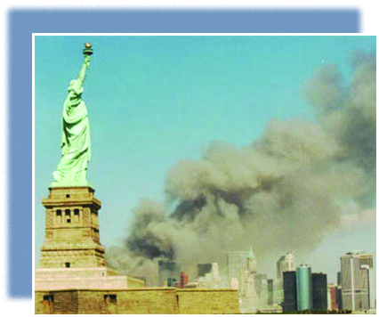

* The War on Terror
* The Domestic Mission
* New Century, Old Disputes
* Hope and Change

<?cnx.eoc class="summary" title="Summary"?>

<?cnx.eoc class="review-questions" title="Review Questions"?>

<?cnx.eoc class="critical-thinking" title="Critical Thinking Questions"?>

<?cnx.eoc class="references" title="References"?>

 {: #Figure_32_00_Liberty}

On the morning of September 11, 2001, hopes that the new century would leave behind the conflicts of the previous one were dashed when two hijacked airliners crashed into the twin towers of New York’s World Trade Center. When the first plane struck the north tower, many assumed that the crash was a horrific accident. But then a second plane hit the south tower less than thirty minutes later. People on the street watched in horror, as some of those trapped in the burning buildings jumped to their deaths and the enormous towers collapsed into dust. In the photo above, the Statue of Liberty appears to look on helplessly, as thick plumes of smoke obscure the Lower Manhattan skyline ([\[link\]](#Figure_32_00_Liberty)). The events set in motion by the September 11 attacks would raise fundamental questions about the United States’ role in the world, the extent to which privacy should be protected at the cost of security, the definition of exactly who is an American, and the cost of liberty.

