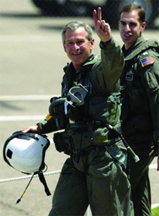

By the end of this section, you will be able to:
* Discuss how the United States responded to the terrorist attacks of September 11, 2001
* Explain why the United States went to war against Afghanistan and Iraq
* Describe the treatment of suspected terrorists by U.S. law enforcement agencies and the U.S. military

 ![In 2001, terrorists hijack four airplanes to attack the U.S., and the U.S. invades Afghanistan; a photograph of soldiers aiming their guns from behind a hill in Afghanistan is shown. In 2002, George W. Bush creates the Department of Homeland Security. In 2003, coalition forces invade Iraq. In 2004, Massachusetts legalizes same-sex marriage, and Mark Zuckerberg founds Facebook; a photograph of Zuckerberg sitting with a laptop computer is shown. In 2005, Hurricane Katrina devastates Alabama, Louisiana, and Mississippi; an aerial photograph of underwater homes and trees is shown. In 2007, Nancy Pelosi becomes the first female Speaker of the House; a photograph of Pelosi is shown. In 2008, the global financial crisis begins, and Barack Obama is elected president; a photograph of Barack Obama taking the oath of office beside Michelle Obama is shown. In 2010, Congress passes the Affordable Care Act. In 2013, terrorists attack the Boston Marathon, and the Supreme Court rules the Defense of Marriage Act unconstitutional; a photograph of bystanders assisting the injured at the finish line of the Boston Marathon is shown.](../resources/CNX_History_32_01_Timeline.jpg "(credit &#x201C;2004&#x201D;: modification of work by Elaine and Priscilla Chan; credit &#x201C;2013&#x201D;: modification of work by Aaron Tang; credit &#x201C;2001&#x201D;: modification of work by &#x201C;DVIDSHUB&#x201D;/Flickr)"){: #Figure_32_01_Timeline}

As a result of the narrow decision of the U.S. Supreme Court in *Bush v. Gore*, Republican George W. Bush was the declared the winner of the 2000 presidential election with a majority in the Electoral College of 271 votes to 266, although he received approximately 540,000 fewer popular votes nationally than his Democratic opponent, Bill Clinton’s vice president, Al Gore. Bush had campaigned with a promise of “compassionate conservatism” at home and nonintervention abroad. These platform planks were designed to appeal to those who felt that the Clinton administration’s initiatives in the Balkans and Africa had unnecessarily entangled the United States in the conflicts of foreign nations. Bush’s 2001 education reform act, dubbed No Child Left Behind, had strong bipartisan support and reflected his domestic interests. But before the president could sign the bill into law, the world changed when terrorists hijacked four American airliners to use them in the deadliest attack on the United States since the Japanese bombing of Pearl Harbor in December 1941. Bush’s domestic agenda quickly took a backseat, as the president swiftly changed course from nonintervention in foreign affairs to a “war on terror.”

# 9/11

Shortly after takeoff on the morning of September 11, 2001, teams of hijackers from the Islamist terrorist group **al-Qaeda**{: data-type="term"} seized control of four American airliners. Two of the airplanes were flown into the twin towers of the World Trade Center in Lower Manhattan. Morning news programs that were filming the moments after the first impact, then assumed to be an accident, captured and aired live footage of the second plane, as it barreled into the other tower in a flash of fire and smoke. Less than two hours later, the heat from the crash and the explosion of jet fuel caused the upper floors of both buildings to collapse onto the lower floors, reducing both towers to smoldering rubble. The passengers and crew on both planes, as well as 2,606 people in the two buildings, all died, including 343 New York City firefighters who rushed in to save victims shortly before the towers collapsed.

The third hijacked plane was flown into the Pentagon building in northern Virginia, just outside Washington, DC, killing everyone on board and 125 people on the ground. The fourth plane, also heading towards Washington, crashed in a field near Shanksville, Pennsylvania, when passengers, aware of the other attacks, attempted to storm the cockpit and disarm the hijackers. Everyone on board was killed ([\[link\]](#Figure_32_01_Hijacked)).

 ![A map shows the flight paths of American Airlines Flight 77, United Airlines Flight 93, American Airlines Flight 11, and United Airlines Flight 175 on September 11, 2001. The map contains a legend which lists chronologically the events of September 11, 2001. At 7:50 a m, American Airlines Flight 11 departs Boston from Logan International Airport. At 8:14 a m, United Airlines Flight 175 departs from the same airport. At 8:20 a m, American Airlines Flight 77 departs Washington D C from Dulles International Airport. At 8:42 a m, United Airlines Flight 93 departs Newark from Newark International Airport. At 8:46 a m, Flight 11 crashes into 1 World Trade Center. At 9:03 a m, Flight 175 slams into 2 World Trade Center. At 9:37 a m, Flight 77 hits the Pentagon. At 9:59 a m, the south tower (2 World Trade Center) collapses. At 10:03 a m, Flight 93 crashes in Shanksville, Pennsylvania. At 10:28 a m, the north tower (1 World Trade Center) collapses.](../resources/CNX_History_32_01_Hijacked.jpg "Three of the four airliners hijacked on September 11, 2001, reached their targets. United 93, presumably on its way to destroy either the Capitol or the White House, was brought down in a field after a struggle between the passengers and the hijackers."){: #Figure_32_01_Hijacked}

That evening, President Bush promised the nation that those responsible for the attacks would be brought to justice. Three days later, Congress issued a joint resolution authorizing the president to use all means necessary against the individuals, organizations, or nations involved in the attacks. On September 20, in an address to a joint session of Congress, Bush declared war on terrorism, blamed al-Qaeda leader Osama bin Laden for the attacks, and demanded that the radical Islamic fundamentalists who ruled Afghanistan, the **Taliban**{: data-type="term"}, turn bin Laden over or face attack by the United States. This speech encapsulated what became known as the **Bush Doctrine**{: data-type="term"}, the belief that the United States has the right to protect itself from terrorist acts by engaging in pre-emptive wars or ousting hostile governments in favor of friendly, preferably democratic, regimes.

  
Read the text of [President Bush’s address][1] to Congress declaring a “war on terror.”

World leaders and millions of their citizens expressed support for the United States and condemned the deadly attacks. Russian president Vladimir Putin characterized them as a bold challenge to humanity itself. German chancellor Gerhard Schroder said the events of that day were “not only attacks on the people in the United States, our friends in America, but also against the entire civilized world, against our own freedom, against our own values, values which we share with the American people.” Yasser Arafat, chairman of the Palestinian Liberation Organization and a veteran of several bloody struggles against Israel, was dumbfounded by the news and announced to reporters in Gaza, “We completely condemn this very dangerous attack, and I convey my condolences to the American people, to the American president and to the American administration.”

  
In May 2014, a Museum dedicated to the memory of the victims was completed. Watch this [video][2] and learn more about the victims and how the country seeks to remember them.

# GOING TO WAR IN AFGHANISTAN

When it became clear that the mastermind behind the attack was Osama bin Laden, a wealthy Saudi Arabian national who ran his terror network from Afghanistan, the full attention of the United States turned towards Central Asia and the Taliban. Bin Laden had deep roots in Afghanistan. Like many others from around the Islamic world, he had come to the country to oust the Soviet army, which invaded Afghanistan in 1979. Ironically, both bin Laden and the Taliban received material support from the United States at that time. By the late 1980s, the Soviets and the Americans had both left, although bin Laden, by that time the leader of his own terrorist organization, al-Qaeda, remained.

The Taliban refused to turn bin Laden over, and the United States began a bombing campaign in October, allying with the **Afghan Northern Alliance**{: data-type="term" .no-emphasis}, a coalition of tribal leaders opposed to the Taliban. U.S. air support was soon augmented by ground troops ([\[link\]](#Figure_32_01_Marines)). By November 2001, the Taliban had been ousted from power in Afghanistan’s capital of Kabul, but bin Laden and his followers had already escaped across the Afghan border to mountain sanctuaries in northern Pakistan.

 "){: #Figure_32_01_Marines}

# IRAQ

At the same time that the U.S. military was taking control of Afghanistan, the Bush administration was looking to a new and larger war with the country of Iraq. Relations between the United States and Iraq had been strained ever since the Gulf War a decade earlier. Economic sanctions imposed on Iraq by the United Nations, and American attempts to foster internal revolts against President Saddam Hussein’s government, had further tainted the relationship. A faction within the Bush administration, sometimes labeled neoconservatives, believed Iraq’s recalcitrance in the face of overwhelming U.S. military superiority represented a dangerous symbol to terrorist groups around the world, recently emboldened by the dramatic success of the al-Qaeda attacks in the United States. Powerful members of this faction, including Vice President Dick Cheney and Secretary of Defense Donald Rumsfeld, believed the time to strike Iraq and solve this festering problem was right then, in the wake of 9/11. Others, like Secretary of State Colin Powell, a highly respected veteran of the Vietnam War and former chair of the Joint Chiefs of Staff, were more cautious about initiating combat.

The more militant side won, and the argument for war was gradually laid out for the American people. The immediate impetus to the invasion, it argued, was the fear that Hussein was stockpiling weapons of mass destruction (**WMDs**{: data-type="term"}): nuclear, chemical, or biological weapons capable of wreaking great havoc. Hussein had in fact used WMDs against Iranian forces during his war with Iran in the 1980s, and against the Kurds in northern Iraq in 1988—a time when the United States actively supported the Iraqi dictator. Following the Gulf War, inspectors from the United Nations Special Commission and International Atomic Energy Agency had in fact located and destroyed stockpiles of Iraqi weapons. Those arguing for a new Iraqi invasion insisted, however, that weapons still existed. President Bush himself told the nation in October 2002 that the United States was “facing clear evidence of peril, we cannot wait for the final proof—the smoking gun—that could come in the form of a mushroom cloud.” The head of the United Nations Monitoring, Verification and Inspection Commission, Hanx Blix, dismissed these claims. Blix argued that while Saddam Hussein was not being entirely forthright, he did not appear to be in possession of WMDs. Despite Blix’s findings and his own earlier misgivings, Powell argued in 2003 before the United Nations General Assembly that Hussein had violated UN resolutions. Much of his evidence relied on secret information provided by an informant that was later proven to be false. On March 17, 2003, the United States cut off all relations with Iraq. Two days later, in a coalition with Great Britain, Australia, and Poland, the United States began “Operation Iraqi Freedom” with an invasion of Iraq.

Other arguments supporting the invasion noted the ease with which the operation could be accomplished. In February 2002, some in the Department of Defense were suggesting the war would be “a cakewalk.” In November, referencing the short and successful Gulf War of 1990–1991, Secretary of Defense Rumsfeld told the American people it was absurd, as some were claiming, that the conflict would degenerate into a long, drawn-out quagmire. “Five days or five weeks or five months, but it certainly isn’t going to last any longer than that,” he insisted. “It won’t be a World War III.” And, just days before the start of combat operations in 2003, Vice President Cheney announced that U.S. forces would likely “be greeted as liberators,” and the war would be over in “weeks rather than months.”

Early in the conflict, these predictions seemed to be coming true. The march into Bagdad went fairly smoothly. Soon Americans back home were watching on television as U.S. soldiers and the Iraqi people worked together to topple statues of the deposed leader Hussein around the capital. The reality, however, was far more complex. While American deaths had been few, thousands of Iraqis had died, and the seeds of internal strife and resentment against the United States had been sown. The United States was not prepared for a long period of occupation; it was also not prepared for the inevitable problems of law and order, or for the violent sectarian conflicts that emerged. Thus, even though Bush proclaimed a U.S. victory in May 2003, on the deck of the USS *Abraham Lincoln* with the banner “Mission Accomplished” prominently displayed behind him, the celebration proved premature by more than seven years ([\[link\]](#Figure_32_01_MissionAcc)).

 {: #Figure_32_01_MissionAcc}

Lt. General James Conway on the Invasion of Baghdad

Lt. General James Conway, who commanded the First Marine Expeditionary Force in Iraq, answers a reporter’s questions about civilian casualties during the 2003 invasion of Baghdad.

\> “As a civilian in those early days, one definitely had the sense that the high command had expected something to happen which didn’t. Was that a correct perception?”
> * * *
> {: data-type="newline"}
> 
> —We were told by our intelligence folks that the enemy is carrying civilian clothes in their packs because, as soon as the shooting starts, they’re going put on their civilian clothes and they’re going go home. Well, they put on their civilian clothes, but not to go home. They put on civilian clothes to blend with the civilians and shoot back at us. . . .
> * * *
> {: data-type="newline"}
> 
> “There’s been some criticism of the behavior of the Marines at the Diyala bridge \[across the Tigris River into Baghdad\] in terms of civilian casualties.”
> * * *
> {: data-type="newline"}
> 
> —Well, after the Third Battalion, Fourth Marines crossed, the resistance was not all gone. . . . They had just fought to take a bridge. They were being counterattacked by enemy forces. Some of the civilian vehicles that wound up with the bullet holes in them contained enemy fighters in uniform with weapons, some of them did not. Again, we’re terribly sorry about the loss of any civilian life where civilians are killed in a battlefield setting. I will guarantee you, it was not the intent of those Marines to kill civilians. \[The civilian casualties happened because the Marines\] felt threatened, \[and\] they were having a tough time distinguishing from an enemy that \[is violating\] the laws of land warfare by going to civilian clothes, putting his own people at risk. All of those things, I think, \[had an\] impact \[on the behavior of the Marines\], and in the end it’s very unfortunate that civilians died.

Who in your opinion bears primary responsibility for the deaths of Iraqi civilians?

# DOMESTIC SECURITY

The attacks of September 11 awakened many to the reality that the end of the Cold War did not mean an end to foreign violent threats. Some Americans grew wary of alleged possible enemies in their midst and hate crimes against Muslim Americans—and those thought to be Muslims—surged in the aftermath. Fearing that terrorists might strike within the nation’s borders again, and aware of the chronic lack of cooperation among different federal law enforcement agencies, Bush created the Office of Homeland Security in October 2001. The next year, Congress passed the **Homeland Security Act**{: data-type="term" .no-emphasis}, creating the Department of Homeland Security, which centralized control over a number of different government functions in order to better control threats at home ([\[link\]](#Figure_32_01_OrgChart)). The Bush administration also pushed the USA Patriot Act through Congress, which enabled law enforcement agencies to monitor citizens’ e-mails and phone conversations without a warrant.

 ![An organizational chart shows the structure of the U.S. Department of Homeland Security. The Secretary and Deputy Secretary are at the top; the Chief of Staff branches from them, and the Executive Secretariat and Military Advisor branch from the Chief of Staff. The second level includes the Management Directorate, from which the Chief Financial Officer branches; the Science and Technology Directorate; the National Protection and Programs Directorate; Policy; General Counsel; Legislative Affairs; Public Affairs; and Inspector General. The third level includes Health Affairs; Intergovernmental Affairs; Intelligence and Analysis; Operations Coordination and Planning; Citizenship and Immigration Services Ombudsman; Chief Privacy Officer; and Civil Rights and Civil Liberties. The fourth level includes the Domestic Nuclear Detection Office and the Federal Law Enforcement Training Center. The fifth level includes U.S. Customs and Border Protection; U.S. Citizenship and Immigration Services; the U.S. Coast Guard; the Federal Emergency Management Agency; U.S. Immigration and Customs Enforcement; the U.S. Secret Service; and the Transportation Security Administration.](../resources/CNX_History_32_01_OrgChart.jpg "The Department of Homeland Security has many duties, including guarding U.S. borders and, as this organizational chart shows, wielding control over the Coast Guard, the Secret Service, U.S. Customs, and a multitude of other law enforcement agencies."){: #Figure_32_01_OrgChart}

The Bush administration was fiercely committed to rooting out threats to the United States wherever they originated, and in the weeks after September 11, the Central Intelligence Agency (CIA) scoured the globe, sweeping up thousands of young Muslim men. Because U.S. law prohibits the use of torture, the CIA transferred some of these prisoners to other nations—a practice known as rendition or extraordinary rendition—where the local authorities can use methods of interrogation not allowed in the United States.

While the CIA operates overseas, the Federal Bureau of Investigation (FBI) is the chief federal law enforcement agency within U.S. national borders. Its activities are limited by, among other things, the Fourth Amendment, which protects citizens against unreasonable searches and seizures. Beginning in 2002, however, the Bush administration implemented a wide-ranging program of warrantless domestic wiretapping, known as the Terrorist Surveillance Program, by the National Security Agency (NSA). The shaky constitutional basis for this program was ultimately revealed in August 2006, when a federal judge in Detroit ordered the program ended immediately.

The use of unconstitutional wire taps to prosecute the war on terrorism was only one way the new threat challenged authorities in the United States. Another problem was deciding what to do with foreign terrorists captured on the battlefields in Afghanistan and Iraq. In traditional conflicts, where both sides are uniformed combatants, the rules of engagement and the treatment of prisoners of war are clear. But in the new war on terror, extracting intelligence about upcoming attacks became a top priority that superseded human rights and constitutional concerns. For that purpose, the United States began transporting men suspected of being members of al-Qaeda to the U.S. naval base at Guantanamo Bay, Cuba, for questioning. The Bush administration labeled the detainees “unlawful combatants,” in an effort to avoid affording them the rights guaranteed to prisoners of war, such as protection from torture, by international treaties such as the Geneva Conventions. Furthermore, the Justice Department argued that the prisoners were unable to sue for their rights in U.S. courts on the grounds that the constitution did not apply to U.S. territories. It was only in 2006 that the Supreme Court ruled in <em>Hamdan v. Rumsfeld </em>that the military tribunals that tried Guantanamo prisoners violated both U.S. federal law and the Geneva Conventions.

# Section Summary

George W. Bush’s first term in office began with al-Qaeda’s deadly attacks on the World Trade Center and the Pentagon on September 11, 2001. Shortly thereafter, the United States found itself at war with Afghanistan, which was accused of harboring the 9/11 mastermind, Osama bin Laden, and his followers. Claiming that Iraq’s president Saddam Hussein was building weapons of mass destruction, perhaps with the intent of attacking the United States, the president sent U.S. troops to Iraq as well in 2003. Thousands were killed, and many of the men captured by the United States were imprisoned and sometimes tortured for information. The ease with which Hussein was deposed led the president to declare that the mission in Iraq had been accomplished only a few months after it began. He was, however, mistaken. Meanwhile, the establishment of the Office of Homeland Security and the passage of the Homeland Security Act and USA Patriot Act created new means and levels of surveillance to identify potential threats.

# Review Questions

The prison operated by the U.S. military for the detention and interrogation of terrorist suspects and “enemy combatants” is located at \_\_\_\_\_\_\_\_.

1.  Kuwait City, Kuwait
2.  Riker’s Island, New York
3.  Guantanamo Bay, Cuba
4.  Lahore, Pakistan
{: data-number-style="upper-alpha"}

C

Unwarranted wiretapping in the United States was conducted by \_\_\_\_\_\_\_\_.

1.  the FBI
2.  the CIA
3.  the *New York Times*
4.  the NSA
{: data-number-style="upper-alpha"}

D

In what ways did the U.S. government attempt to deny the rights of prisoners taken in Afghanistan and Iraq?

The United States denied the rights of prisoners captured in Afghanistan and Iraq by imprisoning and interrogating them outside of the United States, where they were not protected by U.S. law. The U.S. also classified these prisoners as “unlawful combatants,” so that they would not be entitled to the protections of the Geneva Conventions.

[1]: http://openstaxcollege.org/l/15Bush911
[2]: http://openstaxcollege.org/l/15CBSstory
