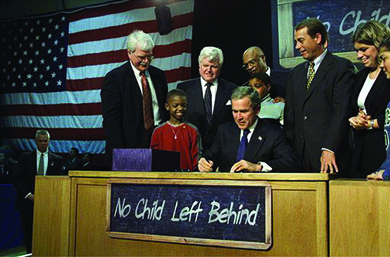
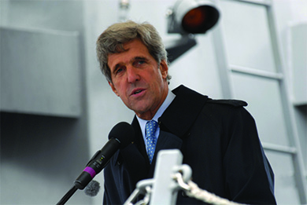
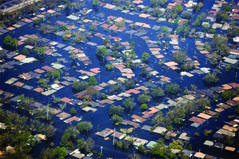

By the end of this section, you will be able to:
* Discuss the Bush administration’s economic theories and tax policies, and their effects on the American economy
* Explain how the federal government attempted to improve the American public education system
* Describe the federal government’s response to Hurricane Katrina
* Identify the causes of the Great Recession of 2008 and its effect on the average citizen

By the time George W. Bush became president, the concept of supply-side economics had become an article of faith within the Republican Party. The oft-repeated argument was that tax cuts for the wealthy would allow them to invest more and create jobs for everyone else. This belief in the self-regulatory powers of competition also served as the foundation of Bush’s education reform. But by the end of 2008, however, Americans’ faith in the dynamics of the free market had been badly shaken. The failure of the homeland security apparatus during Hurricane Katrina and the ongoing challenge of the Iraq War compounded the effects of the bleak economic situation.

### OPENING AND CLOSING THE GAP

The Republican Party platform for the 2000 election offered the American people an opportunity to once again test the rosy expectations of supply-side economics. In 2001, Bush and the Republicans pushed through a $1.35 trillion tax cut by lowering tax rates across the board but reserving the largest cuts for those in the highest tax brackets. This was in the face of calls by Republicans for a balanced budget, which Bush insisted would happen when the so-called job creators expanded the economy by using their increased income to invest in business.

The cuts were controversial; the rich were getting richer while the middle and lower classes bore a proportionally larger share of the nation’s tax burden. Between 1966 and 2001, one-half of the nation’s income gained from increased productivity went to the top 0.01 percent of earners. By 2005, dramatic examples of income inequity were increasing; the chief executive of Wal-Mart earned $15 million that year, roughly 950 times what the company’s average associate made. The head of the construction company K. B. Homes made $150 million, or four thousand times what the average construction worker earned that same year. Even as productivity climbed, workers’ incomes stagnated; with a larger share of the wealth, the very rich further solidified their influence on public policy. Left with a smaller share of the economic pie, average workers had fewer resources to improve their lives or contribute to the nation’s prosperity by, for example, educating themselves and their children.

Another gap that had been widening for years was the education gap. Some education researchers had argued that American students were being left behind. In 1983, a commission established by Ronald Reagan had published a sobering assessment of the American educational system entitled *A Nation at Risk*. The report argued that American students were more poorly educated than their peers in other countries, especially in areas such as math and science, and were thus unprepared to compete in the global marketplace. Furthermore, test scores revealed serious educational achievement gaps between white students and students of color. Touting himself as the “education president,” Bush sought to introduce reforms that would close these gaps.

His administration offered two potential solutions to these problems. First, it sought to hold schools accountable for raising standards and enabling students to meet them. The **No Child Left Behind Act**{: data-type="term" .no-emphasis}, signed into law in January 2002, erected a system of testing to measure and ultimately improve student performance in reading and math at all schools that received federal funds ([\[link\]](#Figure_32_02_NoChild)). Schools whose students performed poorly on the tests would be labeled “in need of improvement.” If poor performance continued, schools could face changes in curricula and teachers, or even the prospect of closure.

 {: #Figure_32_02_NoChild}

The second proposed solution was to give students the opportunity to attend schools with better performance records. Some of these might be **charter schools**{: data-type="term"}, institutions funded by local tax monies in much the same way as public schools, but able to accept private donations and exempt from some of the rules public schools must follow. During the administration of George H. W. Bush, the development of charter schools had gathered momentum, and the American Federation of Teachers welcomed them as places to employ innovative teaching methods or offer specialized instruction in particular subjects. President George W. Bush now encouraged states to grant educational funding vouchers to parents, who could use them to pay for a private education for their children if they chose. These vouchers were funded by tax revenue that would otherwise have gone to public schools.

### THE 2004 ELECTION AND BUSH’S SECOND TERM

In the wake of the 9/11 attacks, Americans had rallied around their president in a gesture of patriotic loyalty, giving Bush approval ratings of 90 percent. Even following the first few months of the Iraq war, his approval rating remained historically high at approximately 70 percent. But as the 2004 election approached, opposition to the war in Iraq began to grow. While Bush could boast of a number of achievements at home and abroad during his first term, the narrow victory he achieved in 2000 augured poorly for his chances for reelection in 2004 and a successful second term.

#### Reelection

As the 2004 campaign ramped up, the president was persistently dogged by rising criticism of the violence of the Iraq war and the fact that his administration’s claims of WMDs had been greatly overstated. In the end, no such weapons were ever found. These criticisms were amplified by growing international concern over the treatment of prisoners at the Guantanamo Bay detention camp and widespread disgust over the torture conducted by U.S. troops at the prison in **Abu Ghraib**{: data-type="term" .no-emphasis}, Iraq, which surfaced only months before the election ([\[link\]](#Figure_32_02_Prisons)).

 . From late 2003 to early 2004, prisoners held in Abu Ghraib, Iraq, were tortured and humiliated in a variety of ways (b). U.S. soldiers jumped on and beat them, led them on leashes, made them pose naked, and urinated on them. The release of photographs of the abuse raised an outcry around the world and greatly diminished the already flagging support for American intervention in Iraq."){: #Figure_32_02_Prisons}

In March 2004, an ambush by Iraqi insurgents of a convoy of private military contractors from Blackwater USA in the town of Fallujah west of Baghdad, and the subsequent torture and mutilation of the four captured mercenaries, shocked the American public. But the event also highlighted the growing insurgency against U.S. occupation, the escalating sectarian conflict between the newly empowered Shia Muslims and the minority of the formerly ruling Sunni, and the escalating costs of a war involving a large number of private contractors that, by conservative estimates, approached $1.7 trillion by 2013. Just as importantly, the American campaign in Iraq had diverted resources from the war against al-Qaeda in Afghanistan, where U.S troops were no closer to capturing Osama bin Laden, the mastermind behind the 9/11 attacks.

With two hot wars overseas, one of which appeared to be spiraling out of control, the Democrats nominated a decorated Vietnam War veteran, Massachusetts senator John Kerry ([\[link\]](#Figure_32_02_Kerry)), to challenge Bush for the presidency. As someone with combat experience, three Purple Hearts, and a foreign policy background, Kerry seemed like the right challenger in a time of war. But his record of support for the invasion of Iraq made his criticism of the incumbent less compelling and earned him the byname “Waffler” from Republicans. The Bush campaign also sought to characterize Kerry as an elitist out of touch with regular Americans—Kerry had studied overseas, spoke fluent French, and married a wealthy foreign-born heiress. Republican supporters also unleashed an attack on Kerry’s Vietnam War record, falsely claiming he had lied about his experience and fraudulently received his medals. Kerry’s reluctance to embrace his past leadership of Vietnam Veterans Against the War weakened the enthusiasm of antiwar Americans while opening him up to criticisms from veterans groups. This combination compromised the impact of his challenge to the incumbent in a time of war.

 {: #Figure_32_02_Kerry}

Urged by the Republican Party to “stay the course” with Bush, voters listened. Bush won another narrow victory, and the Republican Party did well overall, picking up four seats in the Senate and increasing its majority there to fifty-five. In the House, the Republican Party gained three seats, adding to its majority there as well. Across the nation, most governorships also went to Republicans, and Republicans dominated many state legislatures.

Despite a narrow win, the president made a bold declaration in his first news conference following the election. “I earned capital in this campaign, political capital, and now I intend to spend it.” The policies on which he chose to spend this political capital included the partial privatization of Social Security and new limits on court-awarded damages in medical malpractice lawsuits. In foreign affairs, Bush promised that the United States would work towards “ending tyranny in the world.” But at home and abroad, the president achieved few of his second-term goals. Instead, his second term in office became associated with the persistent challenge of pacifying Iraq, the failure of the homeland security apparatus during Hurricane Katrina, and the most severe economic crisis since the Great Depression.

#### A Failed Domestic Agenda

The Bush administration had planned a series of free-market reforms, but corruption, scandals, and Democrats in Congress made these goals hard to accomplish. Plans to convert Social Security into a private-market mechanism relied on the claim that demographic trends would eventually make the system unaffordable for the shrinking number of young workers, but critics countered that this was easily fixed. Privatization, on the other hand, threatened to derail the mission of the New Deal welfare agency and turn it into a fee generator for stock brokers and Wall Street financiers. Similarly unpopular was the attempt to abolish the estate tax. Labeled the “death tax” by its critics, its abolishment would have benefitted only the wealthiest 1 percent. As a result of the 2003 tax cuts, the growing federal deficit did not help make the case for Republicans.

The nation faced another policy crisis when the Republican-dominated House of Representatives approved a bill making the undocumented status of millions of immigrants a felony and criminalizing the act of employing or knowingly aiding illegal immigrants. In response, millions of illegal and legal immigrants, along with other critics of the bill, took to the streets in protest. What they saw as the civil rights challenge of their generation, conservatives read as a dangerous challenge to law and national security. Congress eventually agreed on a massive build-up of the U.S. Border Patrol and the construction of a seven-hundred-mile-long fence along the border with Mexico, but the deep divisions over immigration and the status of up to twelve million undocumented immigrants remained unresolved.

#### Hurricane Katrina

One event highlighted the nation’s economic inequality and racial divisions, as well as the Bush administration’s difficulty in addressing them effectively. On August 29, 2005, Hurricane Katrina came ashore and devastated coastal stretches of Alabama, Mississippi, and Louisiana. The city of New Orleans, no stranger to hurricanes and floods, suffered heavy damage when the levees, embankments designed to protect against flooding, failed during the storm surge, as the Army Corps of Engineers had warned they might. The flooding killed some fifteen hundred people and so overwhelmed parts of the city that tens of thousands more were trapped and unable to evacuate ([\[link\]](#Figure_32_02_Katrina)). Thousands who were elderly, ill, or too poor to own a car followed the mayor’s directions and sought refuge at the Superdome, which lacked adequate food, water, and sanitation. Public services collapsed under the weight of the crisis.

 {: #Figure_32_02_Katrina}

  
See pictures of the aftermath of [Hurricane Katrina][1] and read and view accounts of survivors of the disaster.

Although the U.S. Coast Guard managed to rescue more than thirty-five thousand people from the stricken city, the response by other federal bodies was less effective. The Federal Emergency Management Agency (FEMA), an agency charged with assisting state and local governments in times of natural disaster, proved inept at coordinating different agencies and utilizing the rescue infrastructure at its disposal. Critics argued that FEMA was to blame and that its director, Michael D. Brown, a Bush friend and appointee with no background in emergency management, was an example of cronyism at its worst. The failures of FEMA were particularly harmful for an administration that had made “homeland security” its top priority. Supporters of the president, however, argued that the scale of the disaster was such that no amount of preparedness or competence could have allowed federal agencies to cope.

While there was plenty of blame to go around—at the city, state, and national levels—FEMA and the Bush administration got the lion’s share. Even when the president attempted to demonstrate his concern with a personal appearance, the tactic largely backfired. Photographs of him looking down on a flooded New Orleans from the comfort of Air Force One only reinforced the impression of a president detached from the problems of everyday people. Despite his attempts to give an uplifting speech from Jackson Square, he was unable to shake this characterization, and it underscored the disappointments of his second term. On the eve of the 2006 midterm elections, President Bush’s popularity had reached a new low, as a result of the war in Iraq and Hurricane Katrina, and a growing number of Americans feared that his party’s economic policy benefitted the wealthy first and foremost. Young voters, non-white Americans, and women favored the Democratic ticket by large margins. The elections handed Democrats control of the Senate and House for the first time since 1994, and, in January 2007, California representative Nancy Pelosi became the first female Speaker of the House in the nation’s history.

### THE GREAT RECESSION

For most Americans, the millennium had started with economic woes. In March 2001, the U.S. stock market had taken a sharp drop, and the ensuing recession triggered the loss of millions of jobs over the next two years. In response, the Federal Reserve Board cut interest rates to historic lows to encourage consumer spending. By 2002, the economy seemed to be stabilizing somewhat, but few of the manufacturing jobs lost were restored to the national economy. Instead, the “outsourcing” of jobs to China and India became an increasing concern, along with a surge in corporate scandals. After years of reaping tremendous profits in the deregulated energy markets, Houston-based Enron imploded in 2003 over allegations of massive accounting fraud. Its top executives, Ken Lay and Jeff Skilling, received long prison sentences, but their activities were illustrative of a larger trend in the nation’s corporate culture that embroiled reputable companies like JP Morgan Chase and the accounting firm Arthur Anderson. In 2003, Bernard Ebbers, the CEO of communications giant WorldCom, was discovered to have inflated his company’s assets by as much as $11 billion, making it the largest accounting scandal in the nation’s history. Only five years later, however, Bernard Madoff’s Ponzi scheme would reveal even deeper cracks in the nation’s financial economy.

#### Banks Gone Wild

Notwithstanding economic growth in the 1990s and steadily increasing productivity, wages had remained largely flat relative to inflation since the end of the 1970s; despite the mild recovery, they remained so. To compensate, many consumers were buying on credit, and with interest rates low, financial institutions were eager to oblige them. By 2008, credit card debt had risen to over $1 trillion. More importantly, banks were making high-risk, high-interest mortgage loans called **subprime mortgages**{: data-type="term"} to consumers who often misunderstood their complex terms and lacked the ability to make the required payments.

These subprime loans had a devastating impact on the larger economy. In the past, a prospective home buyer went to a local bank for a mortgage loan. Because the bank expected to make a profit in the form of interest charged on the loan, it carefully vetted buyers for their ability to repay. Changes in finance and banking laws in the 1990s and early 2000s, however, allowed lending institutions to securitize their mortgage loans and sell them as bonds, thus separating the financial interests of the lender from the ability of the borrower to repay, and making highly risky loans more attractive to lenders. In other words, banks could afford to make bad loans, because they could sell them and not suffer the financial consequences when borrowers failed to repay.

Once they had purchased the loans, larger investment banks bundled them into huge packages known as **collateralized debt obligations**{: data-type="term" .no-emphasis} (CDOs) and sold them to investors around the world. Even though CDOs consisted of subprime mortgages, credit card debt, and other risky investments, credit ratings agencies had a financial incentive to rate them as very safe. Making matters worse, financial institutions created instruments called **credit default swaps**{: data-type="term"}, which were essentially a form of insurance on investments. If the investment lost money, the investors would be compensated. This system, sometimes referred to as the securitization food chain, greatly swelled the housing loan market, especially the market for subprime mortgages, because these loans carried higher interest rates. The result was a housing bubble, in which the value of homes rose year after year based on the ease with which people now could buy them.

#### Banks Gone Broke

When the real estate market stalled after reaching a peak in 2007, the house of cards built by the country’s largest financial institutions came tumbling down. People began to default on their loans, and more than one hundred mortgage lenders went out of business. American International Group (AIG), a multinational insurance company that had insured many of the investments, faced collapse. Other large financial institutions, which had once been prevented by federal regulations from engaging in risky investment practices, found themselves in danger, as they either were besieged by demands for payment or found their demands on their own insurers unmet. The prestigious investment firm Lehman Brothers was completely wiped out in September 2008. Some endangered companies, like Wall Street giant Merrill Lynch, sold themselves to other financial institutions to survive. A financial panic ensued that revealed other fraudulent schemes built on CDOs. The biggest among them was a pyramid scheme organized by the New York financier Bernard Madoff, who had defrauded his investors by at least $18 billion.

Realizing that the failure of major financial institutions could result in the collapse of the entire U.S. economy, the chairman of the Federal Reserve, Ben Bernanke, authorized a bailout of the Wall Street firm Bear Stearns, although months later, the financial services firm Lehman Brothers was allowed to file for the largest bankruptcy in the nation’s history. Members of Congress met with Bernanke and Secretary of the Treasury Henry Paulson in September 2008, to find a way to head off the crisis. They agreed to use $700 billion in federal funds to bail out the troubled institutions, and Congress subsequently passed the Emergency Economic Stabilization Act, creating the Troubled Asset Relief Program (TARP). One important element of this program was aid to the auto industry: The Bush administration responded to their appeal with an emergency loan of $17.4 billion—to be executed by his successor after the November election—to stave off the industry’s collapse.

The actions of the Federal Reserve, Congress, and the president prevented the complete disintegration of the nation’s financial sector and warded off a scenario like that of the Great Depression. However, the bailouts could not prevent a severe recession in the U.S. and world economy. As people lost faith in the economy, stock prices fell by 45 percent. Unable to receive credit from now-wary banks, smaller businesses found that they could not pay suppliers or employees. With houses at record prices and growing economic uncertainty, people stopped buying new homes. As the value of homes decreased, owners were unable to borrow against them to pay off other obligations, such as credit card debt or car loans. More importantly, millions of homeowners who had expected to sell their houses at a profit and pay off their adjustable-rate mortgages were now stuck in houses with values shrinking below their purchasing price and forced to make mortgage payments they could no longer afford.

Without access to credit, consumer spending declined. Some European nations had suffered similar speculation bubbles in housing, but all had bought into the mortgage securities market and suffered the losses of assets, jobs, and demand as a result. International trade slowed, hurting many American businesses. As the **Great Recession**{: data-type="term"} of 2008 deepened, the situation of ordinary citizens became worse. During the last four months of 2008, one million American workers lost their jobs, and during 2009, another three million found themselves out of work. Under such circumstances, many resented the expensive federal bailout of banks and investment firms. It seemed as if the wealthiest were being rescued by the taxpayer from the consequences of their imprudent and even corrupt practices.

### Section Summary

When George W. Bush took office in January 2001, he was committed to a Republican agenda. He cut tax rates for the rich and tried to limit the role of government in people’s lives, in part by providing students with vouchers to attend charter and private schools, and encouraging religious organizations to provide social services instead of the government. While his tax cuts pushed the United States into a chronically large federal deficit, many of his supply-side economic reforms stalled during his second term. In 2005, Hurricane Katrina underscored the limited capacities of the federal government under Bush to assure homeland security. In combination with increasing discontent over the Iraq War, these events handed Democrats a majority in both houses in 2006. Largely as a result of a deregulated bond market and dubious innovations in home mortgages, the nation reached the pinnacle of a real estate boom in 2007. The threatened collapse of the nations’ banks and investment houses required the administration to extend aid to the financial sector. Many resented this bailout of the rich, as ordinary citizens lost jobs and homes in the Great Recession of 2008.

### Review Questions

What investment banking firm went bankrupt in 2008, signaling the beginning of a major economic crisis?

1.  CitiBank
2.  Wells Fargo
3.  Lehman Brothers
4.  Price Waterhouse
{: type="A"}

C

A subprime mortgage is \_\_\_\_\_\_\_\_.

1.  a high-risk, high-interest loan
2.  a federal bailout for major banks
3.  a form of insurance on investments
4.  a form of political capital
{: type="A"}

A

What are the pros and cons of school vouchers?

Giving vouchers to public school students enables them to pay to attend better-performing charter or private schools. However, school vouchers take money and good students away from public schools, making it more difficult for those schools to improve.

### Glossary
{: data-type="glossary-title"}

charter schools
: elementary and secondary schools that, although funded by taxpayer money, are allowed to operate independently from some rules and regulations governing public schools
^

credit default swaps
: financial instruments that pay buyers even if a purchased loan defaults; a form of insurance for risky loans
^

Great Recession
: the economic recession that began in 2008, following the collapse of the housing boom, and was driven by risky and misleading subprime mortgages and a deregulated bond market
^

subprime mortgage
: a type of mortgage offered to borrowers with lower credit ratings; subprime loans feature interest rates that are higher (often adjustable) than conventional mortgages to compensate the bank for the increased risk of default

[1]: http://openstax.org/l/15Katrina
