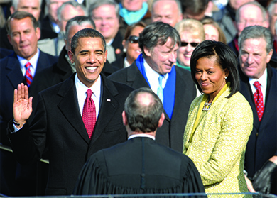

By the end of this section, you will be able to:
* Describe how Barack Obama’s domestic policies differed from those of George W. Bush
* Discuss the important events of the war on terror during Obama’s two administrations
* Discuss some of the specific challenges facing the United States as Obama’s second term draws to a close

In 2008, American voters, tired of war and dispirited by the economic downturn, elected a relative newcomer to the political scene who inspired them and made them believe that the United States could rise above political partisanship. Barack Obama’s story resembled that of many Americans: a multicultural background; a largely absent father; a single working mother; and care provided by maternal grandparents. As president, Obama would face significant challenges, including managing the economic recovery in the wake of the Great Recession, fighting the war on terror inherited from the previous administration, and implementing the healthcare reform upon which he had campaigned.

### OBAMA TAKES OFFICE

Born in Hawaii in 1961 to a Kenyan father and an American woman from Kansas, Obama excelled at school, going on to attend Occidental College in Los Angeles, Columbia University, and finally Harvard Law School, where he became the first African American president of the *Harvard Law Review*. As part of his education, he also spent time in Chicago working as a community organizer to help those displaced by the decline of heavy industry in the early 1980s. Obama first came to national attention when he delivered the keynote address at the 2004 Democratic National Convention while running for his first term in the U.S. Senate. Just a couple of years later, he was running for president himself, the first African American nominee for the office from either major political party.

Obama’s opponent in 2008 was John McCain, a Vietnam veteran and Republican senator with the reputation of a “maverick” who had occasionally broken ranks with his party to support bipartisan initiatives. The senator from Arizona faced a number of challenges. As the Republican nominee, he remained closely associated with the two disastrous foreign wars initiated under the Bush administration. His late recognition of the economic catastrophe on the eve of the election did not help matters and further damaged the Republican brand at the polls. At seventy-one, he also had to fight accusations that he was too old for the job, an impression made even more striking by his energetic young challenger. To minimize this weakness, McCain chose a young but inexperienced running mate, Governor Sarah Palin of Alaska. This tactic backfired, however, when a number of poor performances in television interviews convinced many voters that Palin was not prepared for higher office ([\[link\]](#Figure_32_04_McCain)).

  campaigns with his wife Cindy (in green), Sarah Palin (in black), and Palin&#x2019;s husband Todd. Palin was a controversial choice for running mate. The campaign never succeeded in erasing the charges that she was ignorant of foreign policy&#x2014;an impression she enforced in her own ad-lib statements. (credit: Rachael Dickson)"){: #Figure_32_04_McCain}

Senator Obama, too, was criticized for his lack of experience with foreign policy, a deficit he remedied by choosing experienced politician Joseph Biden as his running mate. Unlike his Republican opponent, however, Obama offered promises of “hope and change.” By sending out voter reminders on Twitter and connecting with supporters on Facebook, he was able to harness social media and take advantage of grassroots enthusiasm for his candidacy. His youthful vigor drew independents and first-time voters, and he won 95 percent of the African American vote and 44 percent of the white vote ([\[link\]](#Figure_32_04_Obama)).

 {: #Figure_32_04_Obama}

Politicking in a New Century

Barack Obama’s campaign seemed to come out of nowhere to overcome the widely supported frontrunner Hillary Clinton in the Democratic primaries. Having won the nomination, Obama shot to the top with an exuberant base of youthful supporters who were encouraged and inspired by his appeal to hope and change. Behind the scenes, the Obama campaign was employing technological innovations and advances in social media to both inform and organize its base.

The Obama campaign realized early that the key to political success in the twenty-first century was to energize young voters by reaching them where they were: online. The organizing potential of platforms like Facebook, YouTube, and Twitter had never before been tapped—and they were free. The results were groundbreaking. Using these social media platforms, the Obama campaign became an organizing and fundraising machine of epic proportions. During his almost two-year-long campaign, Obama accepted 6.5 million donations, totaling $500 million. The vast majority of online donations were less than $100. This accomplishment stunned the political establishment, and they have been quick to adapt. Since 2008, nearly every political campaign has followed in Obama’s footsteps, effecting a revolution in campaigning in the United States.

### ECONOMIC AND HEALTHCARE REFORMS

Barack Obama had been elected on a platform of healthcare reform and a wave of frustration over the sinking economy. As he entered office in 2009, he set out to deal with both. Taking charge of the TARP program instituted under George W. Bush to stabilize the country’s financial institutions, Obama oversaw the distribution of some $7.77 trillion designed to help shore up the nation’s banking system. Recognizing that the economic downturn also threatened major auto manufacturers in the United States, he sought and received congressional authorization for $80 billion to help Chrysler and General Motors. The action was controversial, and some characterized it as a government takeover of industry. The money did, however, help the automakers earn a profit by 2011, reversing the trend of consistent losses that had hurt the industry since 2004. It also helped prevent layoffs and wage cuts. By 2013, the automakers had repaid over $50 billion of bailout funds. Finally, through the 2009 American Recovery and Reinvestment Act (ARRA), the Obama administration pumped almost $800 billion into the economy to stimulate economic growth and job creation.

More important for Obama supporters than his attempts to restore the economy was that he fulfill his promise to enact comprehensive healthcare reform. Many assumed such reforms would move quickly through Congress, since Democrats had comfortable majorities in both houses, and both Obama and McCain had campaigned on healthcare reform. However, as had occurred years before during President Clinton’s first term, opposition groups saw attempts at reform as an opportunity to put the political brakes on the Obama presidency. After months of political wrangling and condemnations of the healthcare reform plan as socialism, the Patient Protection and Affordable Care Act ([\[link\]](#Figure_32_04_ACASigning)) was passed and signed into law.

The act, which created the program known as **Obamacare**{: data-type="term"}, represented the first significant overhaul of the American healthcare system since the passage of Medicaid in 1965. Its goals were to provide all Americans with access to affordable health insurance, to require that everyone in the United States acquire some form of health insurance, and to lower the costs of healthcare. The plan, which made use of government funding, created private insurance company exchanges to market various insurance packages to enrollees.

 "){: #Figure_32_04_ACASigning}

Although the plan implemented the market-based reforms that they had supported for years, Republicans refused to vote for it. Following its passage, they called numerous times for its repeal, and more than twenty-four states sued the federal government to stop its implementation. Discontent over the Affordable Care Act helped the Republicans capture the majority in the House of Representatives in the 2010 midterm elections. It also helped spawn the **Tea Party**{: data-type="term"}, a conservative movement focused primarily on limiting government spending and the size of the federal government.

### THE ELECTION OF 2012

By the 2012 presidential election, the Republicans, convinced Obama was vulnerable because of opposition to his healthcare program and a weak economy, nominated Mitt Romney, a well-known business executive-turned politician who had earlier signed healthcare reform into state law as governor of Massachusetts ([\[link\]](#Figure_32_04_Romney)). Romney had unsuccessfully challenged McCain for the Republican nomination in 2008, but by 2012, he had remade himself politically by moving towards the party’s right wing and its newly created Tea Party faction, which was pulling the traditional conservative base further to the right with its strong opposition to abortion, gun control, and immigration.

 "){: #Figure_32_04_Romney}

Romney appealed to a new attitude within the Republican Party. While the percentage of Democrats who agreed that the government should help people unable to provide for themselves had remained relatively stable from 1987 to 2012, at roughly 75 to 79 percent, the percentage of Republicans who felt the same way had decreased from 62 to 40 percent over the same period, with the greatest decline coming after 2007. Indeed, Romney himself revealed his disdain for people on the lower rungs of the socioeconomic ladder when, at a fundraising event attended by affluent Republicans, he remarked that he did not care to reach the 47 percent of Americans who would always vote for Obama because of their dependence on government assistance. In his eyes, this low-income portion of the population preferred to rely on government social programs instead of trying to improve their own lives.

  
Read the [transcript][1] of “On the 47 percent,” the [secretly recorded speech][2] given by Mitt Romney at a Republican fundraiser.

Starting out behind Obama in the polls, Romney significantly closed the gap in the first of three presidential debates, when he moved towards more centrist positions on many issues. Obama regained momentum in the remaining two debates and used his bailout of the auto industry to appeal to voters in the key states of Michigan and Ohio. Romney’s remarks about the 47 percent hurt his position among both poor Americans and those who sympathized with them. A long-time critic of FEMA who claimed that it should be eliminated, Romney also likely lost votes in the Northeast when, a week before the election, Hurricane Sandy devastated the New England, New York, and New Jersey coasts. Obama and the federal government had largely rebuilt FEMA since its disastrous showing in New Orleans in 2005, and the agency quickly swung into action to assist the 8.5 million people affected by the disaster.

Obama won the election, but the Republicans retained their hold on the House of Representatives and the Democratic majority in the Senate grew razor-thin. Political bickering and intractable Republican resistance, including a 70 percent increase in filibusters over the 1980s, a refusal to allow a vote on some legislation, such as the 2012 “jobs bill,” and the glacial pace at which the Senate confirmed the President’s judicial nominations, created political gridlock in Washington, interfering with Obama’s ability to secure any important legislative victories.

### ONGOING CHALLENGES

As Obama entered his second term in office, the economy remained stagnant in many areas. On average, American students continued to fall behind their peers in the rest of the world, and the cost of a college education became increasingly unaffordable for many. Problems continued overseas in Iraq and Afghanistan, and another act of terrorism took place on American soil when bombs exploded at the 2013 Boston Marathon. At the same time, the cause of same-sex marriage made significant advances, and Obama was able to secure greater protection for the environment. He raised fuel-efficiency standards for automobiles to reduce the emissions of greenhouse gases and required coal-burning power plants to capture their carbon emissions.

#### Learning and Earning

The quality of American education remains a challenge. The global economy is dominated by those nations with the greatest number of “knowledge workers:” people with specialized knowledge and skills like engineers, scientists, doctors, teachers, financial analysts, and computer programmers. Furthermore, American students’ reading, math, and critical thinking skills are less developed than those of their peers in other industrialized nations, including small countries like Estonia.

The Obama administration sought to make higher education more accessible by increasing the amount that students could receive under the federally funded Pell Grant Program, which, by the 2012–13 academic year, helped 9.5 million students pay for their college education. Obama also worked out a compromise with Congress in 2013, which lowered the interest rates charged on student loans. However, college tuition is still growing at a rate of 2 to 3 percent per year, and the debt burden has surpassed the $1 trillion mark and is likely to increase. With debt upon graduation averaging about $29,000, students may find their economic options limited. Instead of buying cars or paying for housing, they may have to join the **boomerang generation**{: data-type="term"} and return to their parents’ homes in order to make their loan payments. Clearly, high levels of debt will affect their career choices and life decisions for the foreseeable future.

Many other Americans continue to be challenged by the state of the economy. Most economists calculate that the Great Recession reached its lowest point in 2009, and the economy has gradually improved since then. The stock market ended 2013 at historic highs, having experienced its biggest percentage gain since 1997. However, despite these gains, the nation struggled to maintain a modest annual growth rate of 2.5 percent after the Great Recession, and the percentage of the population living in poverty continues to hover around 15 percent. Income has decreased ([\[link\]](#Figure_32_04_Income)), and, as late as 2011, the unemployment rate was still high in some areas. Eight million full-time workers have been forced into part-time work, whereas 26 million seem to have given up and left the job market.

 {: #Figure_32_04_Income}

#### LGBT Rights

During Barack Obama’s second term in office, courts began to counter efforts by conservatives to outlaw same-sex marriage. A series of decisions declared nine states’ prohibitions against same-sex marriage to be unconstitutional, and the Supreme Court rejected an attempt to overturn a federal court ruling to that effect in California in June 2013. Shortly thereafter, the Supreme Court also ruled that the **Defense of Marriage Act**{: data-type="term" .no-emphasis} of 1996 was unconstitutional, because it violated the Equal Protection Clause of the Fourteenth Amendment. These decisions seem to allow legal challenges in all the states that persist in trying to block same-sex unions.

The struggle against discrimination based on gender identity has also won some significant victories. In 2014, the U.S. Department of Education ruled that schools receiving federal funds may not discriminate against transgender students, and a board within the Department of Health and Human Services decided that Medicare should cover sexual reassignment surgery. Although very few people eligible for Medicare are transgender, the decision is still important, because private insurance companies often base their coverage on what Medicare considers appropriate and necessary forms of treatment for various conditions. Undoubtedly, the fight for greater rights for LGBT (lesbian, gay, bisexual, transsexual) individuals will continue.

#### Violence

Another running debate questions the easy accessibility of firearms. Between the spring of 1999, when two teens killed twelve of their classmates, a teacher, and themselves at their high school in Columbine, Colorado, and the early summer of 2014, fifty-two additional shootings or attempted shootings had occurred at schools ([\[link\]](#Figure_32_04_Memorial)). Nearly always, the violence was perpetrated by young people with severe mental health problems, as at Sandy Hook elementary school in Newtown, Connecticut, in 2012. After killing his mother at home, twenty-year-old Adam Lanza went to the school and fatally shot twenty six- and seven-year-old students, along with six adult staff members, before killing himself. Advocates of stricter gun control noted a clear relationship between access to guns and mass shootings. Gun rights advocates, however, disagreed. They argued that access to guns is merely incidental.

 "){: #Figure_32_04_Memorial}

Another shocking act of violence was the attack on the Boston Marathon. On April 15, 2013, shortly before 3:00 p.m., two bombs made from pressure cookers exploded near the finish line ([\[link\]](#Figure_32_04_Marathon)). Three people were killed, and more than 250 were injured. Three days later, two suspects were identified, and a manhunt began. Later that night, the two young men, brothers who had immigrated to the United States from Chechnya, killed a campus security officer at the Massachusetts Institute of Technology, stole a car, and fled. The older, Tamerlan Tsarnaev, was killed in a fight with the police, and Dzhokhar Tsarnaev was captured the next day. In his statements to the police, Dzhokhar Tsarnaev reported that he and his brother, who he claimed had planned the attacks, had been influenced by the actions of fellow radical Islamists in Afghanistan and Iraq, but he denied they had been affiliated with any larger terrorist group.

 "){: #Figure_32_04_Marathon}

#### America and the World

In May 2014, President Obama announced that, for the most part, U.S. combat operations in Afghanistan were over. Although a residual force of ninety-eight hundred soldiers will remain to continue training the Afghan army, by 2016, all U.S. troops will have left the country, except for a small number to defend U.S. diplomatic posts.

The years of warfare have brought the United States few rewards. In Iraq, 4,475 American soldiers died and 32,220 were wounded. In Afghanistan, the toll through February 2013 was 2,165 dead and 18,230 wounded. By some estimates, the total monetary cost of the wars in Iraq and Afghanistan could easily reach $4 trillion, and the Congressional Budget Office believes that the cost of providing medical care for the veterans might climb to $8 billion by 2020.

In Iraq, the coalition led by then-Prime Minister Nouri al-Maliki was able to win 92 of the 328 seats in parliament in May 2014, and he seemed poised to begin another term as the country’s ruler. The elections, however, did not stem the tide of violence in the country. In June 2014, the Islamic State of Iraq and Syria (ISIS), a radical Islamist militant group consisting of mostly Sunni Muslims and once affiliated with al-Qaeda, seized control of Sunni-dominated areas of Iraq and Syria. On June 29, 2014, it proclaimed the formation of the Islamic State with Abu Bakr al-Baghdadi as caliph, the state’s political and religious leader.

### Section Summary

Despite Republican resistance and political gridlock in Washington during his first term in office, President Barack Obama oversaw the distribution of the TARP program’s $7.77 trillion to help shore up the nation’s banking system, and Congress authorized $80 billion to help Chrysler and General Motors. The goals of Obama’s Patient Protection and Affordable Care Act (Obamacare) were to provide all Americans with access to affordable health insurance, to require that everyone in the United States had some form of health insurance, and to lower the costs of healthcare. During his second term, the nation struggled to grow modestly, the percentage of the population living in poverty remained around 15 percent, and unemployment was still high in some areas. Acceptance of same-sex marriage grew, and the United States sharply reduced its military commitments in Iraq and Afghanistan.

### Review Questions

The U.S. Supreme Court ruled the Defense of Marriage Act unconstitutional in \_\_\_\_\_\_\_\_.

1.  2007
2.  2009
3.  2013
4.  2014
{: type="A"}

C

Which of the following is *not* a goal of Obamacare (the Patient Protection and Affordable Care Act)?

1.  to provide all Americans with access to affordable health insurance
2.  to require that everyone in the United States acquire some form of health insurance
3.  to lower the costs of healthcare
4.  to increase employment in the healthcare industry
{: type="A"}

D

What has Barack Obama done to make college education more accessible?

The Obama administration has sought to make higher education more accessible by increasing the amount of money that students can receive under the federally funded Pell Grant Program, which helps millions pay for college. Obama also worked out a compromise with Congress in 2013 that lowered the interest rates charged on student loans.

### Critical Thinking Questions

What factors led to the Great Recession?

How have conservatives fared in their efforts to defend “American” culture against an influx of immigrants in the twenty-first century?

In what ways are Barack Obama’s ideas regarding the economy, education, and the environment similar to those of Bush, his Republican predecessor? In what ways are they different?

How successful has the United States been in achieving its goals in Iraq and Afghanistan?

In what ways has the United States become a more heterogeneous and inclusive place in the twenty-first century? In what ways has it become more homogenous and exclusive?

### Glossary
{: data-type="glossary-title"}

boomerang generation
: young people who must return to their parents’ home in order to make ends meet
^

Obamacare
: the Patient Protection and Affordable Care Act
^

Tea Party
: a conservative movement focused primarily on limiting government spending and the size of the federal government

[1]: http://openstaxcollege.org/l/1547percent2
[2]: http://openstaxcollege.org/l/1547percent
